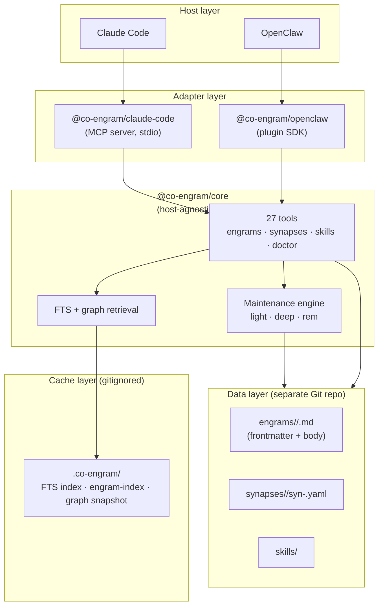

# Co-Engram

**Team memory with neuroscience-inspired plasticity.**
English | [中文](./README.zh-CN.md)

Co-Engram is a self-evolving memory system for AI agents and teams. Unlike traditional vector stores that only retrieve, Co-Engram models memory after the brain: engrams strengthen with use, weaken when they fail, consolidate during sleep, and verify themselves through metacognition.

Works with **Claude Code** (via MCP) and **OpenClaw** (via plugin SDK), with a host-agnostic TypeScript core you can embed anywhere.

## Why Co-Engram

| Differentiator                      | What it means                                                                                                                                                                                                                                             |
| ----------------------------------- | --------------------------------------------------------------------------------------------------------------------------------------------------------------------------------------------------------------------------------------------------------- |
| **Stable IDs + single-file layout** | Every memory is one Markdown file with YAML frontmatter. The engram has a ULID that never changes, so renames, moves, and rewrites don't break references — while content diffs stay clean in Git.                                                        |
| **Per-edge synapses**               | Connections between memories live as independent files keyed by a deterministic hash of `(from, to, kind)`. No duplicate edges, trivial dedupe, and pruning a stale edge is a single file delete.                                                         |
| **Self-maintaining**                | A maintenance engine runs `light` (RPE-based reinforcement), `deep` (consolidation + decay), and `rem` (metacognition upgrade/refute) stages automatically — no manual tagging required.                                                                  |
| **Two-layer proposal filter**       | Implicit memory proposals pass through a rule-based prefilter (Layer 1, zero-cost) plus a necessity evaluator (Layer 2 — rule-based by default, optional LLM) — mechanical repetition gets rejected, only genuinely reusable decisions become candidates. |
| **Host-agnostic core**              | `@co-engram/core` has zero host dependencies. Same memory, same tools, whether you use Claude Code, OpenClaw, or your own agent.                                                                                                                          |

## Quickstart

Three commands to get Co-Engram working inside Claude Code:

```bash
# 1. Install the MCP server globally
npm install -g @co-engram/claude-code

# 2. Initialize the data repo (a separate Git repo, not inside this project)
mkdir -p ~/team-memory && cd ~/team-memory && git init

# 3. Wire into Claude Code
claude mcp add co-engram \
  -e CO_ENGRAM_DATA_ROOT=$HOME/team-memory \
  -e CO_ENGRAM_MAINTENANCE=1 \
  --scope user \
  -- co-engram-mcp
```

Restart Claude Code, run `/mcp` in a new session, and you should see the `co-engram` tools loaded.

**Zero-install alternative** (skip step 1): replace `co-engram-mcp` in step 3 with `npx -y @co-engram/claude-code`.

### OpenClaw

```bash
# 1. Install the plugin from npm
openclaw plugins install @co-engram/openclaw --dangerously-force-unsafe-install

# 2. Switch the memory slot to Co-Engram
openclaw config set plugins.slots.memory co-engram

# 3. Restart the gateway
openclaw gateway restart
```

> The `--dangerously-force-unsafe-install` flag is required because `scripts/setup.mjs` uses `child_process` to auto-configure the merge driver. This is safe for this plugin. Once install is complete, the Co-Engram tools (memory_search, memory_get) are available to your agents.

For detailed configuration, see [docs/host-openclaw.md](./docs/host-openclaw.md).

## Using Co-Engram

Once installed, Co-Engram works **through conversation** — there is no dashboard, no manual tagging, no configuration file to edit. You talk to your AI agent, and it decides when to capture, search, or update memories. Below are the patterns that emerge naturally.

### Typical scenarios

**"Remember this" — capture a decision or lesson**

> You: "Remember that we decided to use PostgreSQL for the analytics pipeline because it handles JSONB queries better than the MySQL in the rest of the stack."
>
> Agent calls `engram_create(title="Analytics pipeline: PostgreSQL over MySQL", kind="pattern", domainTags=["backend","analytics"])` → returns an engram ID.

**"What did we say about..." — recall later**

> You: "What database did we pick for analytics?"
>
> Agent calls `engram_search(query="analytics database")` → finds the engram and quotes it.

**"Anything new I should know?" — browse recent context**

> You: "List what we captured this week."
>
> Agent calls `engram_list(filter={freshness:["fresh"]})` or `engram_list_paths` → shows recent engrams grouped by domain.

**Connecting ideas — the agent finds patterns**

> When two engrams relate, the agent may call `synapse_create` to link them. Later searches traverse these links, so a query about "database choices" also surfaces the "migration strategy" engram that `extends` it.

**Self-maintenance — no manual curation**

> If `CO_ENGRAM_MAINTENANCE=1` is set, the engine periodically:
> - **Light**: reinforces frequently-used engrams (LTP), depresses stale ones (LTD)
> - **Deep**: consolidates fragmented engrams, recalculates importance
> - **REM**: upgrades verification status (`unverified` → `plausible` → `probable`) or marks contradicted engrams as `refuted`

### Access the web viewer

Co-Engram ships a built-in SPA to browse engrams, inspect the synapse graph, check audit logs, and view maintenance health. Enable it with environment variables:

```bash
# Claude Code (MCP) — add these when wiring
-e CO_ENGRAM_VIEWER_ENABLED=1
-e CO_ENGRAM_VIEWER_PORT=18899
```

For OpenClaw, set `startViewer: true` and `viewerConfig.port` in the plugin manifest (see [docs/host-openclaw.md](./docs/host-openclaw.md)).

Once enabled, open **http://127.0.0.1:18899** in your browser. The viewer shows:

| Tab        | What you see                                                 |
| ---------- | ------------------------------------------------------------ |
| **Engrams**  | Filterable table of all memories with tags, importance, status |
| **Graph**    | Force-directed synapse graph — click a node to open its engram |
| **Audit**    | Chronological log of every tool call (create/update/delete)   |
| **Health**   | Maintenance stage reports, verification status distribution   |

### What value does this give me?

| Concern                 | Without Co-Engram                                        | With Co-Engram                                                       |
| ----------------------- | -------------------------------------------------------- | -------------------------------------------------------------------- |
| **Reusing decisions**   | Re-litigate the same tradeoffs every sprint              | Agent retrieves the rationale and builds on it                       |
| **Finding old context** | grep chat logs, hope the right person is online          | `engram_search` returns ranked results in milliseconds               |
| **Knowledge drift**     | Outdated advice stays in docs until someone notices      | REM stage auto-upgrades or refutes engrams based on usage outcomes   |
| **Connecting dots**     | Insights stay isolated in separate conversations         | Synapses link related engrams, creating a navigable knowledge graph  |
| **Team onboarding**     | "Read the wiki" (which is 6 months stale)                | New agents query the team's active, verified memory                  |

For a deeper walkthrough, see [docs/concepts.md](./docs/concepts.md) and [docs/tool-reference.md](./docs/tool-reference.md).

## Architecture



## Data Layout (Single-File Model)

Every engram is one file. The path is derived from `domainTags + slug(title)`, but the **id** is a ULID that never changes — so renaming a title, moving folders, or rewriting the body never breaks synapse references.

```
~/team-memory/
├── engineering/typescript/strict-mode-gotcha.md     # one engram = one file
├── engineering/react/hooks-useeffect-patterns.md
├── ops/linux/ssh-tunnel-bastion.md
├── synapses/
│   ├── extends/
│   │   └── syn-<hash>.yaml                          # one edge = one file
│   ├── contradicts/
│   │   └── syn-<hash>.yaml
│   └── similar_to/
│       └── syn-<hash>.yaml
├── skills/                                          # procedural memory
├── .co-engram/                                      # derived caches (gitignored)
│   ├── engram-index.json                            # {ULID → path/title/...}
│   ├── digest.jsonl                                 # one-line-per-engram catalog
│   └── graph.json                                   # synapse graph snapshot
└── .trash/                                          # recycle bin (opt-in)
```

Each `.md` file has YAML frontmatter (id, title, importance, retrieval stats, etc.) and a Markdown body. See [docs/data-format.md](./docs/data-format.md) for the full schema.

## Engram Schema

Every engram is one Markdown file with YAML frontmatter. Fields are grouped by role:

| Group               | Field                                 | Type                   | Notes                                                                                                                                                     |
| ------------------- | ------------------------------------- | ---------------------- | --------------------------------------------------------------------------------------------------------------------------------------------------------- |
| **Identity**        | `id`                                  | ULID string            | 26-char stable id; decoupled from path. Survives renames and moves.                                                                                       |
|                     | `title`                               | string                 | Human-readable title; slugified into the filename unless `slug` is locked.                                                                                |
|                     | `slug`                                | string (optional)      | Explicit filename; if absent, derived from `title`.                                                                                                       |
|                     | `domainTags`                          | string[]               | Domain hierarchy (`[engineering, typescript]`); derived from path if absent.                                                                              |
|                     | `kind`                                | enum                   | `observation` \| `fact` \| `pattern` \| `procedure` \| `hypothesis`.                                                                                      |
|                     | `kinds`                               | enum[] (optional)      | Secondary kinds for multi-faceted engrams.                                                                                                                |
|                     | `tags`                                | string[] (optional)    | Free-form context tags.                                                                                                                                   |
| **Content**         | `summary`                             | string (optional)      | One-line digest shown in `tier=digest`.                                                                                                                   |
|                     | `contentHash`                         | string                 | SHA-256 of the body; drives search-index rebuild.                                                                                                         |
|                     | `contentSize`                         | integer                | Body size in bytes.                                                                                                                                       |
| **Authorship**      | `createdBy` / `createdAt`             | string / ISO timestamp | Original author and creation time.                                                                                                                        |
|                     | `updatedBy` / `updatedAt`             | string / ISO timestamp | Last modifier and modification time.                                                                                                                      |
|                     | `version`                             | integer                | Monotonically increments on `engram_update`.                                                                                                              |
| **Value**           | `importance`                          | number `[0, 1]`        | Composite importance score; drives ranking and decay.                                                                                                     |
|                     | `importanceVector`                    | object (optional)      | Per-audience weights: `personal/team/project/network/temporal/composite`.                                                                                 |
|                     | `confidence`                          | number `[0, 1]`        | Initial confidence derived from `sourceType` (`firsthand=0.8` / `secondhand=0.65` / `inferred=0.5`).                                                      |
|                     | `sourceType`                          | enum                   | `firsthand` \| `secondhand` \| `inferred`.                                                                                                                |
|                     | `emotionalValence`                    | enum (optional)        | `positive` \| `neutral` \| `negative`.                                                                                                                    |
|                     | `evidenceCount`                       | integer                | Number of supporting synapses/evidence entries.                                                                                                           |
| **Retrieval stats** | `retrievalCount`                      | integer                | Total times returned by `engram_search`.                                                                                                                  |
|                     | `effectiveRetrievals`                 | integer                | Times the caller reported success (via `engram_reinforce` or `close_learning_loop`).                                                                      |
|                     | `failedUses`                          | integer                | Times the caller reported failure (via `engram_report_failure`). At 3 → archive suggestion; at 5 → forget suggestion.                                     |
|                     | `reinforcementScore`                  | number                 | Accumulated RPE-driven reinforcement.                                                                                                                     |
|                     | `lastRetrievedAt` / `lastEffectiveAt` | ISO timestamp          | Last retrieval / last effective use.                                                                                                                      |
|                     | `lastRetrievalScore`                  | number `[0, 1]`        | Most recent relevance score; RPE baseline.                                                                                                                |
| **Lifecycle**       | `status`                              | enum                   | `draft` \| `active` \| `archived` \| `forgotten`.                                                                                                         |
|                     | `forcedFreshness`                     | enum (optional)        | `fresh` \| `aging` \| `stale` \| `forgotten`. Set by lifecycle tools to override derived freshness.                                                       |
|                     | `decayHalfLifeDays`                   | number or null         | Ebbinghaus half-life in days. `null` = never decays.                                                                                                      |
|                     | `visibility`                          | enum                   | `private` \| `team` \| `public`.                                                                                                                          |
| **Verification**    | `verificationStatus`                  | enum                   | `unverified` \| `plausible` \| `probable` \| `verified` \| `refuted`. Upgraded by the REM maintenance stage; can be force-set via `upgrade_verification`. |
| **Context**         | `encodingContext`                     | string (optional)      | What the agent was doing when this engram was recorded.                                                                                                   |
|                     | `perspective`                         | string (optional)      | Viewpoint label (multi-perspective retention).                                                                                                            |
|                     | `contextTags`                         | string[] (optional)    | Additional context tags.                                                                                                                                  |

### Example engram file

```markdown
---
id: 01J6XQK5P7R2V8Y3M4N6ZH0WQT
title: TypeScript strict mode readonly gotcha
slug: strict-mode-gotcha
domainTags:
  - engineering
  - typescript
kind: pattern
tags:
  - gotcha
summary: Use Object.assign({}, ...parts) to merge readonly configs
importance: 0.62
confidence: 0.85
sourceType: firsthand
status: active
verificationStatus: unverified
decayHalfLifeDays: 30
visibility: team
createdBy: claude-code
createdAt: 2026-06-21T10:30:00.000Z
updatedBy: claude-code
updatedAt: 2026-06-21T11:45:00.000Z
version: 3
contentHash: sha256:2c26b46b68ffc68ff99b453c1d30413413422d706483bfa0f98a5e886266e7ae
contentSize: 412
retrievalCount: 12
effectiveRetrievals: 9
failedUses: 1
reinforcementScore: 0.42
---

In TS strict mode, readonly fields cannot be directly assigned. Use the
`Object.assign({}, ...parts)` pattern to merge partial configs:

\`\`\`typescript
const merged = Object.assign({}, ...parts)
\`\`\`
```

## Synapse Schema

Each synapse is one YAML file at `synapses/<kind>/syn-<hash>.yaml`. The hash is `syn-` + first 16 hex chars of `SHA-256("${a}|${b}|${kind}")` where `[a, b]` are the endpoints (sorted for `bidirectional`, order preserved for `directional`). `direction` is **not** part of the hash, so each `(from, to, kind)` triple maps to at most one synapse file.

### Synapse kinds (12 across 5 families)

| Family         | Kind             | Semantics                                       | Typical direction |
| -------------- | ---------------- | ----------------------------------------------- | ----------------- |
| **structural** | `extends`        | A is a generalization / superset of B           | directional       |
|                | `part_of`        | A is a component of B                           | directional       |
|                | `similar_to`     | A and B cover the same topic differently        | bidirectional     |
| **causal**     | `depends_on`     | A requires B                                    | directional       |
|                | `causes`         | A produces B                                    | directional       |
|                | `follows`        | A precedes B sequentially                       | directional       |
| **evidential** | `derives_from`   | A is derived from B (evidence chain)            | directional       |
|                | `contradicts`    | A and B disagree (triggers metacognition check) | bidirectional     |
|                | `exemplifies`    | A is a concrete instance of B                   | directional       |
| **temporal**   | `supersedes`     | A replaces B (newer version)                    | directional       |
|                | `consolidates`   | A reinforces / merges into B                    | directional       |
| **modulatory** | `contextualizes` | A provides context for B                        | directional       |

### Synapse fields

| Field                                   | Type                   | Notes                                                                                                |
| --------------------------------------- | ---------------------- | ---------------------------------------------------------------------------------------------------- |
| `id`                                    | string                 | Deterministic hash (see above).                                                                      |
| `from` / `to`                           | ULID                   | Endpoint engram ids.                                                                                 |
| `kind`                                  | enum                   | One of the 12 kinds above.                                                                           |
| `weight`                                | number `[0, 1]`        | Edge strength (default `0.5`).                                                                       |
| `direction`                             | enum                   | `directional` or `bidirectional` (default `directional`).                                            |
| `evidence`                              | array                  | Supporting evidence: `{ description, source?, confidence?, addedAt, addedBy }`.                      |
| `sourceSemantic` / `targetSemantic`     | string (optional)      | Semantic role labels on each endpoint; used by retrieval to weight traversals.                       |
| `resolutionState`                       | object (optional)      | Only on `contradicts` synapses — tracks the pending/auto_resolved/escalated/contested/resolved flow. |
| `createdBy` / `createdAt` / `updatedAt` | string / ISO timestamp | Authorship.                                                                                          |
| `retrievalWeight`                       | number                 | System-computed weight used at retrieval time.                                                       |

### Example synapse file

```yaml
# synapses/extends/syn-a1b2c3d4e5f6a7b8.yaml
id: syn-a1b2c3d4e5f6a7b8
from: 01J6XQK5P7R2V8Y3M4N6ZH0WQT
to: 01J7TRY9F8G7H6J5K4L3M2N1O0P
kind: extends
weight: 0.8
direction: directional
evidence:
  - description: Both cover TS strict-mode patterns
    addedBy: claude-code
    confidence: 0.9
    addedAt: 2026-06-21T10:35:00.000Z
createdBy: claude-code
createdAt: 2026-06-21T10:35:00.000Z
updatedAt: 2026-06-21T10:35:00.000Z
retrievalWeight: 0.8
```

## Packages

| Package                                                | What it does                                             | Install                              |
| ------------------------------------------------------ | -------------------------------------------------------- | ------------------------------------ |
| [`@co-engram/core`](./packages/core)                   | Host-agnostic memory engine + tools + maintenance engine | `npm install @co-engram/core`        |
| [`@co-engram/claude-code`](./packages/claude-code-mcp) | MCP server adapter for Claude Code                       | `npm install @co-engram/claude-code` |
| [`@co-engram/openclaw`](./packages/openclaw-plugin)    | Plugin SDK adapter for OpenClaw                          | `npm install @co-engram/openclaw`    |
| [`@co-engram/e2e`](./packages/e2e)                     | Cross-host end-to-end tests (private, not published)     | workspace only                       |

## Tool Catalog

Co-Engram exposes **27 native tools** grouped into five concerns, plus 2 OpenClaw-compatible `memory_*` wrappers (registered only under `@co-engram/openclaw`).

**Engrams** (12) — the core memory units
`engram_create` · `engram_get` · `engram_update` · `engram_delete` · `engram_search` · `engram_list` · `engram_reinforce` · `engram_report_failure` · `engram_archive` · `engram_restore` · `engram_forget` · `engram_recompute_importance`

**Synapses** (4) — typed connections between engrams
`synapse_create` · `synapse_get` · `synapse_list` · `synapse_delete`

**Skills** (2) — procedural memory
`skill_get` · `skill_invoke`

**Learning loop** (4) — verification, contradiction, evolution
`close_learning_loop` · `contradiction_resolve` · `upgrade_verification` · `get_evolution_lineage`

**Memory proposals** (3) — implicit capture from conversations
`engram_list_proposals` · `engram_accept_proposal` · `engram_dismiss_proposal`

**Repository health** (2) — diagnostics and browsing
`engram_doctor` · `engram_list_paths`

**OpenClaw memory protocol** (2) — host-compatible wrappers, registered only under `@co-engram/openclaw`
`memory_search` · `memory_get`

> The `memory_*` tools declare `kind: "memory"` in `openclaw.plugin.json` so OpenClaw treats Co-Engram as the primary memory plugin (mutually exclusive with `memory-core`). They are thin adapters over `engram_search` / `engram_get` that hide Co-Engram internal terminology and inject a self-evolving prompt section via `registerMemoryCapability.promptBuilder`.

For full signatures, inputs, and examples, see [docs/tool-reference.md](./docs/tool-reference.md).

## Tool Examples

The fastest way to understand Co-Engram is to read what the LLM actually sends and receives. Below are six common flows. All examples assume you've wired the MCP server into Claude Code (or the plugin into OpenClaw) — the agent calls these tools directly; you don't need to write any code.

### 1. Create an engram (with dedup)

When the LLM encounters a reusable insight, it calls `engram_create`. With `dedupe: true` (default), creating an engram whose content closely matches an existing one returns `verdict: "DUPLICATE"` and strengthens the original instead of writing a duplicate file.

```json
// tool input
{
  "title": "SSH tunnel through a bastion host",
  "content": "Use `ssh -L 5432:db.internal:5432 user@bastion` to forward a local port through the bastion.",
  "kind": "procedure",
  "domainTags": ["ops", "linux"],
  "confidence": 0.85,
  "sourceType": "firsthand"
}

// tool output
{
  "id": "01J7TRY9F8G7H6J5K4L3M2N1O0P",
  "verdict": "NEW"
}
```

If you call it again with near-identical content:

```json
// tool output
{
  "id": "01J7TRY9F8G7H6J5K4L3M2N1O0P", // the existing engram's id
  "verdict": "DUPLICATE",
  "targetId": "01J7TRY9F8G7H6J5K4L3M2N1O0P",
  "reason": "cosine similarity 0.94 > threshold 0.88",
  "confidence": 0.94,
  "candidatesConsidered": 3
}
```

### 2. Search with filters

`engram_search` runs an in-memory FTS query (bigram tokenizer for CJK, word tokenizer for English) plus graph expansion via `extends` / `consolidates` edges. Use `filter` to narrow the result set.

```json
// tool input
{
  "query": "readonly merge typescript",
  "filter": {
    "domainTags": ["engineering"],
    "kinds": ["pattern"],
    "status": ["active"],
    "minImportance": 0.4
  },
  "limit": 10
}

// tool output
{
  "results": [
    { "id": "01J6XQK5P7R2V8Y3M4N6ZH0WQT", "score": 0.91 },
    { "id": "01J6XR2...": "score": 0.78 }
  ],
  "total": 2
}
```

### 3. Read with tiered disclosure

`engram_get` supports `tier` so the LLM can pay only for what it needs. `tier: "auto"` plus a `contextBudget` picks the deepest tier that fits.

```json
// tier=catalog (cheapest — identity only)
{ "id": "01J6XQK5P7R2V8Y3M4N6ZH0WQT", "tier": "catalog" }
// → { entry: { id, title, kind, domainTags } }

// tier=content (full body)
{ "id": "01J6XQK5P7R2V8Y3M4N6ZH0WQT", "tier": "content" }
// → { entry: { ...all frontmatter, content: "..." } }

// tier=auto, pick the deepest tier that fits 500 tokens
{ "id": "01J6XQK5P7R2V8Y3M4N6ZH0WQT", "tier": "auto", "contextBudget": { "totalTokens": 500 } }
```

### 4. Connect two engrams with a synapse

`synapse_create` writes one YAML file under `synapses/<kind>/`. The endpoints + kind are hashed into the filename, so the same edge created twice merges evidence into the existing file instead of duplicating.

```json
// tool input
{
  "from": "01J6XQK5P7R2V8Y3M4N6ZH0WQT",
  "to":   "01J7TRY9F8G7H6J5K4L3M2N1O0P",
  "kind": "extends",
  "weight": 0.8,
  "direction": "directional",
  "evidence": [
    { "description": "Both cover TS strict-mode patterns", "confidence": 0.9 }
  ]
}

// tool output
{ "id": "syn-a1b2c3d4e5f6a7b8", "created": true }
```

### 5. Close the learning loop

After using an engram in a real task, the LLM (or your code) calls `close_learning_loop` to feed the outcome back. `success` triggers long-term potentiation (LTP) and Hebbian neighbor boost; `failure` triggers long-term depression (LTD) and may archive/forget the engram.

```json
// tool input
{
  "engramId": "01J6XQK5P7R2V8Y3M4N6ZH0WQT",
  "outcome": "success",
  "effectiveness": 0.9,
  "reason": "Applied the Object.assign pattern and it merged the readonly configs correctly."
}

// tool output
{
  "engramId": "01J6XQK5P7R2V8Y3M4N6ZH0WQT",
  "outcome": "success",
  "importance": 0.71,
  "importanceDelta": 0.09,
  "hebbianTriggered": true,
  "provenanceTriggered": false,
  "shouldArchive": false,
  "shouldForget": false
}
```

### 6. Doctor: self-healing scan

`engram_doctor` audits the data repo, auto-fixes what it safely can, and lists the rest for manual review. Run it after external edits (e.g. resolving Git conflicts by hand) or just periodically.

```json
// tool input
{ "incremental": true }

// tool output
{
  "startedAt": "2026-06-21T10:30:00.000Z",
  "finishedAt": "2026-06-21T10:30:02.000Z",
  "totalEngrams": 142,
  "totalSynapses": 38,
  "autoFixesApplied": 2,
  "pendingManualReview": 1,
  "issues": [
    { "kind": "moved_file", "path": "eng/typescript/x.md", "autoFixed": true,
      "message": "File path changed; index re-pointed." },
    { "kind": "dangling_synapse", "autoFixed": false,
      "message": "Synapse references engram 01J...XYZ that no longer exists." }
  ]
}
```

### Common patterns

| Goal                              | Call sequence                                                                                     |
| --------------------------------- | ------------------------------------------------------------------------------------------------- |
| Capture a decision                | `engram_create` → use it → `close_learning_loop(success)`                                         |
| Two memories disagree             | `synapse_create(contradicts)` → `contradiction_resolve(keep_new \| keep_old \| merge \| archive)` |
| Verify a hypothesis               | `engram_create(kind=hypothesis)` → gather evidence → `upgrade_verification(probable \| verified)` |
| Browse where work is concentrated | `engram_list_paths` → `engram_search(filter.domainTags=[...])`                                    |
| Heal drift after external edits   | `engram_doctor(incremental=true)`                                                                 |
| Triage implicit candidates        | `engram_list_proposals` → `engram_accept_proposal` or `engram_dismiss_proposal`                   |

> For the full state machine — creation, dedup branches, verification transitions, contradiction arbitration, auto-decay, and host-specific triggers — see **[docs/lifecycle.md](./docs/lifecycle.md)**.

## Configuration

### Environment variables (Claude Code MCP server)

All optional. Set them in `claude mcp add -e KEY=value` or your shell.

| Variable                                  | Default              | Purpose                                                                                                                             |
| ----------------------------------------- | -------------------- | ----------------------------------------------------------------------------------------------------------------------------------- |
| `CO_ENGRAM_DATA_ROOT`                     | `$HOME/team-memory`  | Absolute path to the data Git repo                                                                                                  |
| `CO_ENGRAM_DEFAULT_CREATED_BY`            | `unknown`            | Default author for new engrams                                                                                                      |
| `CO_ENGRAM_LANGUAGE`                      | `en`                 | Language for tool descriptions / viewer UI / prompts (`en` \| `zh`). Falls back to `~/team-memory/.co-engram/config.json` if unset. |
| `CO_ENGRAM_MAINTENANCE`                   | `0`                  | Set to `1` to start the maintenance engine                                                                                          |
| `CO_ENGRAM_MAINTENANCE_ENABLED_STAGES`    | `light,deep,rem`     | Comma-separated stage list                                                                                                          |
| `CO_ENGRAM_MAINTENANCE_LIGHT_INTERVAL_MS` | `300000` (5 min)     | Light stage interval                                                                                                                |
| `CO_ENGRAM_MAINTENANCE_DEEP_INTERVAL_MS`  | `3600000` (1 hour)   | Deep stage interval                                                                                                                 |
| `CO_ENGRAM_MAINTENANCE_REM_INTERVAL_MS`   | `604800000` (7 days) | REM stage interval                                                                                                                  |
| `CO_ENGRAM_MAINTENANCE_LEARNING_RATE`     | `0.1`                | RPE learning rate                                                                                                                   |
| `CO_ENGRAM_TRASH_ENABLED`                 | `0`                  | Set to `1` to move forgotten engrams to `.trash/` instead of deleting                                                               |
| `CO_ENGRAM_TRASH_AFTER_DAYS`              | `30`                 | Days after `forgotten` before an engram enters `.trash/`                                                                            |
| `CO_ENGRAM_TRASH_PURGE_AFTER_DAYS`        | `365`                | Days in `.trash/` before physical purge (`0` = never)                                                                               |

### OpenClaw manifest config

For OpenClaw, configuration goes in the plugin manifest. See [docs/host-openclaw.md](./docs/host-openclaw.md) for the full schema.

## Comparisons

| Feature              | Co-Engram                                    | mem0               | Letta            | LangChain Memory   |
| -------------------- | -------------------------------------------- | ------------------ | ---------------- | ------------------ |
| Storage model        | Single-file Git-friendly + per-edge synapses | Vector + graph     | Vector + state   | Vector / key-value |
| Stable IDs (ULID)    | Yes — survives rename / move                 | No                 | No               | No                 |
| Plasticity (LTP/LTD) | Yes (RPE-driven)                             | Manual API         | Manual API       | Manual API         |
| Auto maintenance     | Yes (light/deep/rem)                         | No                 | No               | No                 |
| Metacognition        | Yes (5-dim truth score)                      | No                 | No               | No                 |
| Host coupling        | None (host-agnostic core)                    | Tight (Python SDK) | Tight (REST API) | Tight (Python SDK) |
| License              | MIT                                          | Apache-2.0         | Apache-2.0       | MIT                |

## Roadmap

See [GitHub Issues](https://github.com/co-engram/co-engram/issues) for the live roadmap. Highlights:

- **TypeDoc-generated tool reference** — replace hand-written `docs/tool-reference.md` with auto-generated API docs
- **Provider-backed abstraction layer** — LLM-driven REM stage for narrative abstraction
- **Web UI** — browse engrams, inspect synapse graph, trigger maintenance manually
- **More host adapters** — Continue.dev, Cursor, Aider
- **1.0 release** — once API is stable and we have real production users

## Contributing

Contributions are welcome. See [CONTRIBUTING.md](./CONTRIBUTING.md) for development setup, test commands, and PR conventions. For security reports, see [SECURITY.md](./SECURITY.md).

## License

[MIT](./LICENSE) — © 2026 Yang Yang
