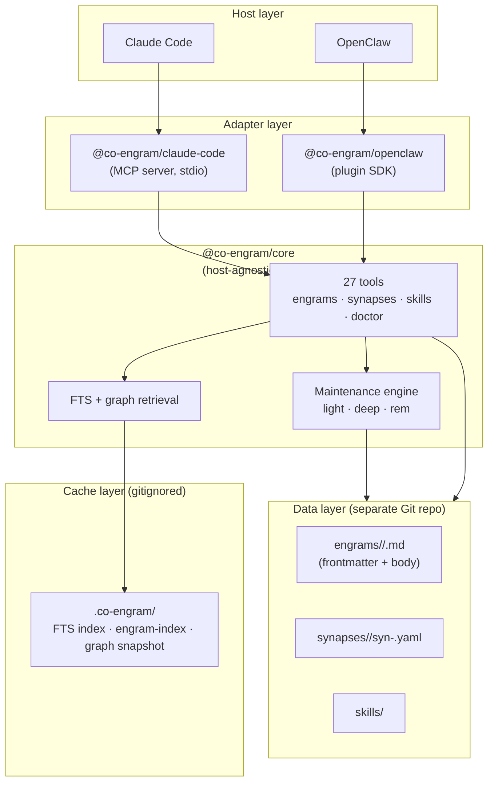

<div align="center">
  <picture>
    <source media="(prefers-color-scheme: dark)" srcset="docs/images/co-engram-logo-dark.svg">
    
  </picture>
  <h1>Co-Engram: Self-evolving Team Memory</h1>
  <p>English | <a href="./README.zh-CN.md">中文</a></p>
</div>

Co-Engram is a self-evolving memory system for AI agents and teams. Unlike traditional vector stores that only retrieve, Co-Engram models memory after the brain: engrams strengthen with use, weaken when they fail, consolidate during sleep, and verify themselves through metacognition.

Works with **Claude Code** (via MCP) and **OpenClaw** (via plugin SDK), with a host-agnostic TypeScript core you can embed anywhere.

## Why Co-Engram

| Differentiator                      | What it means                                                                                                                                                                                                                                             |
| ----------------------------------- | --------------------------------------------------------------------------------------------------------------------------------------------------------------------------------------------------------------------------------------------------------- |
| **Stable IDs + single-file layout** | Every memory is one Markdown file with YAML frontmatter. The engram has a ULID that never changes, so renames, moves, and rewrites don't break references — while content diffs stay clean in Git.                                                        |
| **Per-edge synapses**               | Connections between memories live as independent files keyed by a deterministic hash of `(from, to, kind)`. No duplicate edges, trivial dedupe, and pruning a stale edge is a single file delete.                                                         |
| **Self-maintaining**                | A maintenance engine runs `light` (RPE-based reinforcement), `deep` (consolidation + decay), and `rem` (metacognition upgrade/refute) stages automatically — no manual tagging required.                                                                  |
| **Two-layer proposal filter**       | Implicit memory proposals pass through a rule-based prefilter (Layer 1, zero-cost) plus a necessity evaluator (Layer 2 — rule-based by default, optional LLM) — mechanical repetition gets rejected, only genuinely reusable decisions become candidates. |
| **Host-agnostic core**              | `@co-engram/core` has zero host dependencies. Same memory, same tools, whether you use Claude Code, OpenClaw, or your own agent.                                                                                                                          |

## Quickstart

Three commands to get Co-Engram working inside Claude Code:

```bash
# 1. Install the MCP server globally
npm install -g @co-engram/claude-code

# 2. Initialize the data repo (a separate Git repo, not inside this project)
mkdir -p ~/team-memory && cd ~/team-memory && git init

# 3. Point co-engram at the data repo (writes ~/.co-engram/config.json)
co-engram config data-root $HOME/team-memory

# 4. Wire into Claude Code
claude mcp add co-engram \
  --scope user \
  -- co-engram-mcp
```

Restart Claude Code, run `/mcp` in a new session, and you should see the `co-engram` tools loaded.

**Zero-install alternative** (skip step 1): replace `co-engram-mcp` in step 4 with `npx -y @co-engram/claude-code`.

### OpenClaw

```bash
# 1. Install the plugin from npm
openclaw plugins install @co-engram/openclaw --dangerously-force-unsafe-install

# 2. Switch the memory slot to Co-Engram
openclaw config set plugins.slots.memory co-engram

# 3. Restart the gateway
openclaw gateway restart
```

> The `--dangerously-force-unsafe-install` flag is required because `scripts/setup.mjs` uses `child_process` to auto-configure the merge driver. This is safe for this plugin. Once install is complete, the Co-Engram tools (memory_search, memory_get) are available to your agents.

For detailed configuration, see [docs/host-openclaw.md](./docs/host-openclaw.md).

## Using Co-Engram

Co-Engram works **through conversation** — you talk to your AI agent, and it decides when to capture, search, or update memories. Every interaction below happens in natural language; the tool calls shown are what the agent executes transparently under the hood.

### Install through conversation

For new projects you don't need to leave the chat. Ask the agent:

> "Globally install co-engram from npm and set up the memory store under my home directory."

Agent responds by running: `npm install -g @co-engram/claude-code` → `mkdir -p ~/team-memory && cd ~/team-memory && git init` → `co-engram config data-root $HOME/team-memory` → `claude mcp add co-engram --scope user -- co-engram-mcp`. For OpenClaw: `openclaw plugins install @co-engram/openclaw --dangerously-force-unsafe-install` → `openclaw config set plugins.slots.memory co-engram` → `openclaw gateway restart`. Everything is done in one conversation — no manual steps. See [Quickstart](#quickstart) for the explicit commands.

### Dedup prevents knowledge noise

When you capture overlapping content, Co-Engram doesn't create a duplicate — it **strengthens the original** and tells the agent what matched.

> You: "We're using Zod v4 for runtime validation."
> *Weeks later…*
> You: "Remember: we standardized on Zod v4 for all input parsing."
>
> Agent calls `engram_create` → returns `verdict: "DUPLICATE"`, targets the existing engram, and boosts its importance. No stale clones, no conflicting copies.

Behind the scenes, `engram_create` hashes the content and compares it against existing engrams via cosine similarity (`dedupe: true` is on by default). A `DUPLICATE` outcome triggers a **reinforcement boost** on the original — this is the same RPE-driven plasticity that `close_learning_loop` uses. `engram_create` also returns `UPDATE` when new content meaningfully extends an existing engram (different enough to be worth merging, similar enough to belong together).

### The system learns what matters to you

You don't need to decide what's worth remembering. Co-Engram **watches your conversations** and notices when a topic keeps coming up without a saved memory.

> Over three sessions, you keep discussing the same CI pipeline timeout issue. You never explicitly said "remember this."
>
> Co-Engram's proposal engine detects the repeated pattern and suggests a candidate engram. The agent tells you: "I noticed we've discussed the CI timeout issue several times. Should I save it?"
>
> You say yes → `engram_accept_proposal` → it becomes a permanent engram with `kind=pattern` and domain tags inferred from context.

Behind this: a **two-layer filter** blocks noise. Layer 1 (zero-cost rules) rejects greetings, one-word answers, and mechanical repetition. Layer 2 (configurable: rule-based by default, optional LLM) checks "is this reusable knowledge, or just conversation filler?" Only proposals that pass both layers reach you.

You can also browse pending candidates anytime: ask "any memory suggestions?" and the agent calls `engram_list_proposals`. Approve with `engram_accept_proposal`, dismiss with `engram_dismiss_proposal`.

### Synapse graph: one recall pulls in related context

When the agent links two engrams with `synapse_create`, later `engram_search` **traverses those edges automatically** — so recalling one memory surfaces the others that extend, depend on, or contextualize it.

> Agent calls `synapse_create(from="01J...PostgreSQL", to="01J...migration", kind="extends")`
>
> Later: "What do we know about the analytics database?"
>
> `engram_search("analytics database")` returns the PostgreSQL engram, and because the `extends` edge exists, the migration strategy engram appears nearby in the results — even though its content never mentioned "analytics."

Twelve synapse kinds are available (see [Synapse Schema](#synapse-schema)). Searching also follows `consolidates` edges (for merged engrams) and suppresses `contradicts` neighbors (flagged for review). Edges are **deterministic** — the same `(from, to, kind)` triple always hashes to the same file, so re-creating it merges evidence rather than duplicating.

### Tiered disclosure: pay only for what you need

The LLM's context window is finite and expensive. Co-Engram's `tier` system lets the agent request the cheapest representation that answers the question, then deepen only when necessary.

| Tier | Returns | Use when |
|------|---------|----------|
| `catalog` | `id`, `title`, `kind`, `domainTags` | Browsing a list, checking if a memory exists |
| `digest` | catalog + `summary`, `importance`, `status` | Skimming search results, deciding which to open |
| `content` | full frontmatter + Markdown body | Answering a detailed question with the original text |
| `auto` | deepest tier that fits `contextBudget.totalTokens` | Agent doesn't know how large the memory is — let the system decide |

> Agent calls `engram_get(id="01J...", tier="auto", contextBudget={totalTokens:800})` → the system measures the JSON size and picks the deepest tier that fits within budget.

This is transparent to the user — the agent learns to use `tier=auto` by default and only switches to `content` when it needs the body.

### Close the learning loop: feedback changes importance

After using a memory, the agent reports whether it **helped** or **misled**.

> Agent retrieves the "PostgreSQL JSONB migration" engram, applies the pattern, and confirms it worked.
>
> Calls `close_learning_loop(engramId="01J...", outcome="success", effectiveness=0.9)`.
>
> The engram's `importance` rises. Neighboring engrams connected by `extends` or `consolidates` edges get a **Hebbian boost** (weighted by edge strength). A `failure` outcome depresses weight and, after repeated failures (5 by default), suggests forgetting the engram.

This is the **RPE loop** (reinforcement-prediction-error): `engram_search` return sets the prediction, `close_learning_loop` delivers the outcome, and the delta adjusts importance. Over time, frequently effective memories self-elevate; stale or wrong ones decay without anyone filing a ticket.

### How memories strengthen and decay

Co-Engram models memory plasticity after the brain — not as a static store, but as a **living system** where every interaction nudges importance up or down. This is the core differentiator from key-value or vector memory: **memories that help you succeed grow stronger; memories that mislead or go unused fade away.**

#### Strengthening: LTP (Long-Term Potentiation)

Every successful use reinforces the engram along multiple pathways:

| Trigger | Effect | Accumulates in field |
|---------|--------|---------------------|
| `engram_search` returns engram | Retrieval count +1; last score recorded | `retrievalCount`, `lastRetrievalScore` |
| `engram_create` returns `DUPLICATE` | Original engram gets a reinforcement bump (same RPE math as `close_learning_loop`) | `reinforcementScore` |
| `close_learning_loop(outcome="success")` | Importance rises by `Δ = learningRate × effectiveness × (1 - oldImportance)` | `importance`, `reinforcementScore`, `effectiveRetrievals` |
| `synapse_create(kind="extends"\|"consolidates")` | Neighbors get Hebbian boost proportional to edge weight on each `close_learning_loop(success)` of the connected engram | `importance` on neighbor |
| `engram_reinforce` (direct call) | Manual boost, same RPE math as success loop | `reinforcementScore` |

The **RPE delta** is bounded: a single success moves importance by at most `learningRate` (default 0.1). This prevents wild swings from one interaction while letting sustained use compound: an engram returned 12 times and confirmed effective 9 of those times will reach a high importance plateau naturally.

#### Decay: LTD (Long-Term Depression)

The reverse side is equally important — **unlearning**:

| Trigger | Effect | Threshold |
|---------|--------|-----------|
| `close_learning_loop(outcome="failure")` | Importance drops; `failedUses` counter increments | — |
| `failedUses >= 3` | System suggests archiving: status → `archived`, excluded from default search results | 3 failures |
| `failedUses >= 5` | System suggests forgetting: status → `forgotten`, moved to `.trash/` (if trash is enabled) after `CO_ENGRAM_TRASH_AFTER_DAYS` | 5 failures |
| Ebbinghaus decay (Deep stage) | `importance *= e^(-Δt / halfLife)` — engrams that haven't been retrieved in `halfLife` days lose ~63% of their importance | `decayHalfLifeDays` (default varies by kind; `null` = never decays) |
| `engram_report_failure` | Mark a specific retrieval as harmful; increments `failedUses` | — |

The **forgetting pipeline** has two paths:

```
active ──(failedUses>=3)──→ archived ──(engram_restore)──→ active
active ──(failedUses>=5)──→ forgotten ──(CO_ENGRAM_TRASH_AFTER_DAYS)──→ .trash/ ──(CO_ENGRAM_TRASH_PURGE_AFTER_DAYS)──→ deleted
                    forgotten ──(engram_restore)──→ active
```

Archiving is soft removal (excluded from search by default, but keeps all data). Forgetting is hard removal (moves to trash, then purges after the configured window). Both are reversible via `engram_restore` before the purge deadline.

#### Hebbian spread: "neurons that fire together, wire together"

When `close_learning_loop(success)` fires on engram A, every engram B connected to A via `extends` or `consolidates` synapse gets a **proportional boost**:

```
boost(B) = edgeWeight(A→B) × Δ_importance(A) × hebbianDecay
```

where `hebbianDecay` (default ~0.5) prevents infinite propagation chains. This means a well-used pattern engram gradually elevates all the concrete examples linked to it — and vice versa. Over weeks of use, the synapse graph reflects not just what was stated, but **what was useful together**.

#### Observing the cycle in the viewer

Open the **Health** tab in the [web viewer](#access-the-web-viewer). You'll see:

- **RPE score distribution** — histogram of `reinforcementScore` across all engrams; a healthy graph has most engrams in the 0.3–0.9 range
- **Verification pie** — `verified` / `probable` / `plausible` / `unverified` / `refuted` proportions
- **Maintenance stage reports** — what Light / Deep / REM did in their last run, and when the next run is scheduled

### Is this memory trustworthy?

Not all memories are equally reliable. Co-Engram gives every engram a **verification badge** that evolves with evidence:

```
unverified → plausible → probable → verified
                                    ↘ refuted
```

New engrams start as `unverified` — "someone said this, we haven't checked." As the memory is used successfully, referenced by other engrams, and survives contradiction checks, the REM maintenance stage automatically upgrades it. A memory that is consistently contradicted moves to `refuted` — it stays in the repository (you may still want to know it was once believed), but is clearly marked as unreliable.

At the **REM stage** (every 7 days by default), the system evaluates each engram across five dimensions:

| Dimension | What it checks |
|-----------|---------------|
| **Consistency** | Does this agree or conflict with other engrams (via `contradicts` synapses)? |
| **Longevity** | How long has this engram survived without being refuted? |
| **Usage** | How often has it been retrieved and confirmed effective? |
| **Source** | Was it firsthand experience, secondhand relay, or inference? |
| **Executability** | (For procedures) Has anyone actually followed these steps and succeeded? |

Each dimension contributes to a composite truth score. You don't need to track any of this — the system updates the badge automatically. When you ask "is that reliable?," the agent can check `engram_get(tier=digest)` and report the current `verificationStatus`.

### Auto-maintenance: light → deep → REM

No one has time to curate a knowledge base. If `CO_ENGRAM_MAINTENANCE=1` is set, Co-Engram runs three stages on background timers:

| Stage | Interval (default) | What it does |
|-------|--------------------|--------------|
| **Light** | 5 min | Applies RPE to recently-returned engrams, boosts retrieval stats |
| **Deep** | 1 hour | Merges fragmented engrams, recalculates composite importance, applies Ebbinghaus decay |
| **REM** | 7 days | Runs metacognition: upgrades `verificationStatus` (`unverified`→`plausible`→`probable`→`verified`), detects contradictions across synapses, suggests engrams for archival or refutation |

All three are **zero-intervention** — the engine reads usage statistics from the engram frontmatter, applies mathematical models (RPE, Ebbinghaus forgetting curve, Hebbian plasticity), and writes back updated fields. See [docs/maintenance-engine.md](./docs/maintenance-engine.md) for the math.

### Access the web viewer

Co-Engram ships a built-in SPA for visual exploration. Enable it when wiring:

```bash
# Claude Code (MCP) — viewer defaults to 18899
claude mcp add co-engram \
  -e CO_ENGRAM_VIEWER_ENABLED=1 \
  ... -- co-engram-mcp
```

For OpenClaw, set `startViewer: true` in the plugin manifest — viewer also defaults to 18899.

Open **http://127.0.0.1:18899** in your browser. Override per-process with `CO_ENGRAM_VIEWER_PORT`.

| Tab | What you see |
|-----|-------------|
| **Engrams** | Filterable table — sort by importance, filter by tags/status/verification, click to read full content |
| **Graph** | Interactive force-directed synapse graph — nodes are engrams, edges are typed connections; click a node to jump to its content |
| **Audit** | Chronological log of every `engram_create` / `engram_update` / `engram_delete` / `close_learning_loop` call — who, when, what changed |
| **Health** | Per-stage maintenance reports, verification status pie chart, RPE score distribution |

For a deeper walkthrough, see [docs/concepts.md](./docs/concepts.md) and [docs/tool-reference.md](./docs/tool-reference.md).

### Obsidian integration (graph view via derived wikilinks)

Co-Engram appends a `## Synapses (derived)` section to the body of every engram whose synapses touch it. The section lists outgoing (`→`) and incoming (`←`) connections as wikilinks:

```
- → [[co-engram-foo|Some Title · extends]]
- ← [[co-engram-bar|Other Title · derives_from]]
```

The wikilink **target is the filename** (without `.md`), so Obsidian resolves it natively — no `aliases` field needed. The **display shows the target engram's title plus the synapse kind**, so you can read the network at a glance without leaving the file. `contradicts` edges sort first as a visual warning.

Open the team memory directory in [Obsidian](https://obsidian.md/) (`Open vault → ~/AIOS/team-memory/team-memory/` or wherever your `dataRoot` points) and the **Graph View** renders the full memory network with backlinks, file shift-click navigation, and global structure at a glance. The YAML source of truth stays in `synapses/*.yaml`; the derived section is rebuilt on every synapse write, so manual edits to it are safe to revert.

**Self-healing:** `engram_doctor` checks every engram's derived section against the authoritative synapse yaml (e.g. you hand-edited the wikilinks, a write was interrupted, or a file was renamed) and regenerates the stale view. Idempotent — running it on a clean repo reports zero fixes. Run it whenever the Obsidian graph looks wrong, or after bulk imports / Git merges.

**Tradeoff:** Obsidian edges are undirected and untyped — all 12 synapse kinds collapse to one visual line. Kind info survives in the wikilink display text (`[[...|Some Title · extends]]`). For kind-aware filtering, use the in-app **Graph** tab.

### Save and sync to remote (`engram_sync`)

Memories mark the repo dirty on every write; the host commits at appropriate moments. When you want **explicit control over timing** — e.g. before closing a session, before switching machines, or to pull teammate updates first — invoke the `engram_sync` tool from the agent:

```
engram_sync({ message?: string, dryRun?: boolean, pull?: boolean, push?: boolean })
```

The tool runs a full **pull → commit → push** pipeline:

1. `ensureGitignore` — creates `.gitignore` if missing (excludes the entire `.co-engram/` cache directory; only `*.md` + `synapses/*.yaml` get tracked).
2. `git fetch` + compare with upstream — if remote has no new commits, the pull phase short-circuits to `upToDate: true`.
3. `git pull --rebase --autostash` — keeps history linear; local uncommitted changes are auto-stashed and reapplied.
4. `git add -A` + `git commit` — skipped automatically when there's nothing to commit (no empty commits).
5. `git push` — **degrades to commit-only when no remote is configured** (no error).

**Conflict policy:** rebase conflicts are *not* auto-resolved. The tool runs `git rebase --abort` to return to the pre-pull state and returns the list of conflicting files in `pulled.conflicts` for human review — rerun `engram_sync` once resolved.

**Works across corporate and public git hosts** (GitHub / GitLab / Gerrit / internal):

- Invokes system `git` directly, inheriting the user's SSH config, credentials, and HTTP proxy. No hostnames or URLs hardcoded.
- Does **not** write `Change-Id` itself. If you've installed the Gerrit `commit-msg` hook (`gitdir/hooks/commit-msg`), it adds `Change-Id` automatically.
- Respects the user's `.git/config` `push` refspec. If you configured `push = refs/heads/*:refs/for/*` for Gerrit review, pushes go to review; otherwise they go straight to the tracked branch.
- Pure-local repos work fine — sync just stops at the commit phase.

Use `dryRun: true` to preview which files `git status` reports before touching anything.

## Architecture



## Data Layout (Single-File Model)

Every engram is one file. The path is derived from `domainTags + slug(title)`, but the **id** is a ULID that never changes — so renaming a title, moving folders, or rewriting the body never breaks synapse references.

```
~/team-memory/
├── engineering/typescript/strict-mode-gotcha.md     # one engram = one file
├── engineering/react/hooks-useeffect-patterns.md
├── ops/linux/ssh-tunnel-bastion.md
├── synapses/
│   ├── extends/
│   │   └── syn-<hash>.yaml                          # one edge = one file
│   ├── contradicts/
│   │   └── syn-<hash>.yaml
│   └── similar_to/
│       └── syn-<hash>.yaml
├── skills/                                          # procedural memory
├── .co-engram/                                      # derived caches (gitignored)
│   ├── engram-index.json                            # {ULID → path/title/...}
│   ├── digest.jsonl                                 # one-line-per-engram catalog
│   └── graph.json                                   # synapse graph snapshot
└── .trash/                                          # recycle bin (opt-in)
```

Each `.md` file has YAML frontmatter (id, title, importance, retrieval stats, etc.) and a Markdown body. See [docs/data-format.md](./docs/data-format.md) for the full schema.

## Engram Schema

Every engram is one Markdown file with YAML frontmatter. Fields are grouped by role:

| Group               | Field                                 | Type                   | Notes                                                                                                                                                     |
| ------------------- | ------------------------------------- | ---------------------- | --------------------------------------------------------------------------------------------------------------------------------------------------------- |
| **Identity**        | `id`                                  | ULID string            | 26-char stable id; decoupled from path. Survives renames and moves.                                                                                       |
|                     | `title`                               | string                 | Human-readable title; slugified into the filename unless `slug` is locked.                                                                                |
|                     | `slug`                                | string (optional)      | Explicit filename; if absent, derived from `title`.                                                                                                       |
|                     | `domainTags`                          | string[]               | Domain hierarchy (`[engineering, typescript]`); derived from path if absent.                                                                              |
|                     | `kind`                                | enum                   | `observation` \| `fact` \| `pattern` \| `procedure` \| `hypothesis`.                                                                                      |
|                     | `kinds`                               | enum[] (optional)      | Secondary kinds for multi-faceted engrams.                                                                                                                |
|                     | `tags`                                | string[] (optional)    | Free-form context tags.                                                                                                                                   |
| **Content**         | `summary`                             | string (optional)      | One-line digest shown in `tier=digest`.                                                                                                                   |
|                     | `contentHash`                         | string                 | SHA-256 of the body; drives search-index rebuild.                                                                                                         |
|                     | `contentSize`                         | integer                | Body size in bytes.                                                                                                                                       |
| **Authorship**      | `createdBy` / `createdAt`             | string / ISO timestamp | Original author and creation time.                                                                                                                        |
|                     | `updatedBy` / `updatedAt`             | string / ISO timestamp | Last modifier and modification time.                                                                                                                      |
|                     | `version`                             | integer                | Monotonically increments on `engram_update`.                                                                                                              |
| **Value**           | `importance`                          | number `[0, 1]`        | Composite importance score; drives ranking and decay.                                                                                                     |
|                     | `importanceVector`                    | object (optional)      | Per-audience weights: `personal/team/project/network/temporal/composite`.                                                                                 |
|                     | `confidence`                          | number `[0, 1]`        | Initial confidence derived from `sourceType` (`firsthand=0.8` / `secondhand=0.65` / `inferred=0.5`).                                                      |
|                     | `sourceType`                          | enum                   | `firsthand` \| `secondhand` \| `inferred`.                                                                                                                |
|                     | `emotionalValence`                    | enum (optional)        | `positive` \| `neutral` \| `negative`.                                                                                                                    |
|                     | `evidenceCount`                       | integer                | Number of supporting synapses/evidence entries.                                                                                                           |
| **Retrieval stats** | `retrievalCount`                      | integer                | Total times returned by `engram_search`.                                                                                                                  |
|                     | `effectiveRetrievals`                 | integer                | Times the caller reported success (via `engram_reinforce` or `close_learning_loop`).                                                                      |
|                     | `failedUses`                          | integer                | Times the caller reported failure (via `engram_report_failure`). At 3 → archive suggestion; at 5 → forget suggestion.                                     |
|                     | `reinforcementScore`                  | number                 | Accumulated RPE-driven reinforcement.                                                                                                                     |
|                     | `lastRetrievedAt` / `lastEffectiveAt` | ISO timestamp          | Last retrieval / last effective use.                                                                                                                      |
|                     | `lastRetrievalScore`                  | number `[0, 1]`        | Most recent relevance score; RPE baseline.                                                                                                                |
| **Lifecycle**       | `status`                              | enum                   | `draft` \| `active` \| `archived` \| `forgotten`.                                                                                                         |
|                     | `forcedFreshness`                     | enum (optional)        | `fresh` \| `aging` \| `stale` \| `forgotten`. Set by lifecycle tools to override derived freshness.                                                       |
|                     | `decayHalfLifeDays`                   | number or null         | Ebbinghaus half-life in days. `null` = never decays.                                                                                                      |
|                     | `visibility`                          | enum                   | `private` \| `team` \| `public`. The LLM proactively asks before storing credential / personal / internal / sensitive content; see [Memory visibility & risk recognition](#memory-visibility--risk-recognition). |
| **Verification**    | `verificationStatus`                  | enum                   | `unverified` \| `plausible` \| `probable` \| `verified` \| `refuted`. Upgraded by the REM maintenance stage; can be force-set via `upgrade_verification`. |
| **Context**         | `encodingContext`                     | string (optional)      | What the agent was doing when this engram was recorded.                                                                                                   |
|                     | `perspective`                         | string (optional)      | Viewpoint label (multi-perspective retention).                                                                                                            |
|                     | `contextTags`                         | string[] (optional)    | Additional context tags.                                                                                                                                  |

### Example engram file

```markdown
---
id: 01J6XQK5P7R2V8Y3M4N6ZH0WQT
title: TypeScript strict mode readonly gotcha
slug: strict-mode-gotcha
domainTags:
  - engineering
  - typescript
kind: pattern
tags:
  - gotcha
summary: Use Object.assign({}, ...parts) to merge readonly configs
importance: 0.62
confidence: 0.85
sourceType: firsthand
status: active
verificationStatus: unverified
decayHalfLifeDays: 30
visibility: team
createdBy: claude-code
createdAt: 2026-06-21T10:30:00.000Z
updatedBy: claude-code
updatedAt: 2026-06-21T11:45:00.000Z
version: 3
contentHash: sha256:2c26b46b68ffc68ff99b453c1d30413413422d706483bfa0f98a5e886266e7ae
contentSize: 412
retrievalCount: 12
effectiveRetrievals: 9
failedUses: 1
reinforcementScore: 0.42
---

In TS strict mode, readonly fields cannot be directly assigned. Use the
`Object.assign({}, ...parts)` pattern to merge partial configs:

\`\`\`typescript
const merged = Object.assign({}, ...parts)
\`\`\`
```

## Memory visibility & risk recognition

Every engram has a `visibility` field:

- **`public`** (default): enters the team repo, shared with all teammates.
- **`team`**: visible to the team but treated separately when filtering.
- **`private`**: local only — written under `private/<domainTags>/`, which `.gitignore` excludes from the team repo. Use for credentials, personal paths, device-specific info (ADB serials, host names, tokens).
- **`restricted`**: policy-limited access (e.g., security-sensitive memories).

Switching visibility is atomic and preserves the stableId; co-engram migrates the file path for you.

**LLM risk recognition.** co-engram injects a "Visibility Risk Recognition" section into the LLM system prompt. Before calling `engram_create` / `engram_accept_proposal` / `engram_update`, the LLM checks the content for:

- Credentials — API keys (`ghp_*`, `sk-*`, `xoxb-*`, `npm_*`, `AKIA*`, `AIza*`), password assignments (`password=`, `pwd:`), JWT (`eyJ...`), PEM private key headers.
- Personal identity — email, phone, ID number, home address.
- Internal info — intranet IPs (`10.*`, `172.16-31.*`, `192.168.*`), internal domains (e.g. `*.zte.intra`), internal project codenames.
- Sensitive info — person names (especially in negative evaluations), customer codenames, business-sensitive data (revenue, user counts, unreleased roadmaps).
- Usernames in absolute paths — `/home/<user>/`, `/Users/<user>/`, `C:\Users\<user>\`.

When any signal is present, the LLM asks first: *"This memory contains [category] (example: ...). Suggest setting visibility: private (local-only, not in team repo). Approve?"* The principle is **better to over-ask than under-detect** — one redundant ask costs far less than one credential leak.

The same content is available in the viewer Help tab under "Memory visibility & risk recognition".

## Synapse Schema

Each synapse is one YAML file at `synapses/<kind>/syn-<hash>.yaml`. The hash is `syn-` + first 16 hex chars of `SHA-256("${a}|${b}|${kind}")` where `[a, b]` are the endpoints (sorted for `bidirectional`, order preserved for `directional`). `direction` is **not** part of the hash, so each `(from, to, kind)` triple maps to at most one synapse file.

### Synapse kinds (12 across 5 families)

| Family         | Kind             | Semantics                                       | Typical direction |
| -------------- | ---------------- | ----------------------------------------------- | ----------------- |
| **structural** | `extends`        | A is a generalization / superset of B           | directional       |
|                | `part_of`        | A is a component of B                           | directional       |
|                | `similar_to`     | A and B cover the same topic differently        | bidirectional     |
| **causal**     | `depends_on`     | A requires B                                    | directional       |
|                | `causes`         | A produces B                                    | directional       |
|                | `follows`        | A precedes B sequentially                       | directional       |
| **evidential** | `derives_from`   | A is derived from B (evidence chain)            | directional       |
|                | `contradicts`    | A and B disagree (triggers metacognition check) | bidirectional     |
|                | `exemplifies`    | A is a concrete instance of B                   | directional       |
| **temporal**   | `supersedes`     | A replaces B (newer version)                    | directional       |
|                | `consolidates`   | A reinforces / merges into B                    | directional       |
| **modulatory** | `contextualizes` | A provides context for B                        | directional       |

### Synapse fields

| Field                                   | Type                   | Notes                                                                                                |
| --------------------------------------- | ---------------------- | ---------------------------------------------------------------------------------------------------- |
| `id`                                    | string                 | Deterministic hash (see above).                                                                      |
| `from` / `to`                           | ULID                   | Endpoint engram ids.                                                                                 |
| `kind`                                  | enum                   | One of the 12 kinds above.                                                                           |
| `weight`                                | number `[0, 1]`        | Edge strength (default `0.5`).                                                                       |
| `direction`                             | enum                   | `directional` or `bidirectional` (default `directional`).                                            |
| `evidence`                              | array                  | Supporting evidence: `{ description, source?, confidence?, addedAt, addedBy }`.                      |
| `sourceSemantic` / `targetSemantic`     | string (optional)      | Semantic role labels on each endpoint; used by retrieval to weight traversals.                       |
| `resolutionState`                       | object (optional)      | Only on `contradicts` synapses — tracks the pending/auto_resolved/escalated/contested/resolved flow. |
| `createdBy` / `createdAt` / `updatedAt` | string / ISO timestamp | Authorship.                                                                                          |
| `retrievalWeight`                       | number                 | System-computed weight used at retrieval time.                                                       |

### Example synapse file

```yaml
# synapses/extends/syn-a1b2c3d4e5f6a7b8.yaml
id: syn-a1b2c3d4e5f6a7b8
from: 01J6XQK5P7R2V8Y3M4N6ZH0WQT
to: 01J7TRY9F8G7H6J5K4L3M2N1O0P
kind: extends
weight: 0.8
direction: directional
evidence:
  - description: Both cover TS strict-mode patterns
    addedBy: claude-code
    confidence: 0.9
    addedAt: 2026-06-21T10:35:00.000Z
createdBy: claude-code
createdAt: 2026-06-21T10:35:00.000Z
updatedAt: 2026-06-21T10:35:00.000Z
retrievalWeight: 0.8
```

## Packages

| Package                                                | What it does                                             | Install                              |
| ------------------------------------------------------ | -------------------------------------------------------- | ------------------------------------ |
| [`@co-engram/core`](./packages/core)                   | Host-agnostic memory engine + tools + maintenance engine | `npm install @co-engram/core`        |
| [`@co-engram/viewer`](./packages/viewer)               | Built-in web viewer (SPA) with engram table, synapse graph, audit log, and health dashboard | `npm install @co-engram/viewer` |
| [`@co-engram/claude-code`](./packages/claude-code-mcp) | MCP server adapter for Claude Code                       | `npm install @co-engram/claude-code` |
| [`@co-engram/openclaw`](./packages/openclaw-plugin)    | Plugin SDK adapter for OpenClaw                          | `npm install @co-engram/openclaw`    |
| [`@co-engram/e2e`](./packages/e2e)                     | Cross-host end-to-end tests (private, not published)     | workspace only                       |

## Tool Catalog

Co-Engram exposes **27 native tools** grouped into five concerns, plus 2 OpenClaw-compatible `memory_*` wrappers (registered only under `@co-engram/openclaw`).

**Engrams** (12) — the core memory units
`engram_create` · `engram_get` · `engram_update` · `engram_delete` · `engram_search` · `engram_list` · `engram_reinforce` · `engram_report_failure` · `engram_archive` · `engram_restore` · `engram_forget` · `engram_recompute_importance`

**Synapses** (4) — typed connections between engrams
`synapse_create` · `synapse_get` · `synapse_list` · `synapse_delete`

**Skills** (2) — procedural memory
`skill_get` · `skill_invoke`

**Learning loop** (4) — verification, contradiction, evolution
`close_learning_loop` · `contradiction_resolve` · `upgrade_verification` · `get_evolution_lineage`

**Memory proposals** (3) — implicit capture from conversations
`engram_list_proposals` · `engram_accept_proposal` · `engram_dismiss_proposal`

**Repository health** (2) — diagnostics and browsing
`engram_doctor` · `engram_list_paths`

**OpenClaw memory protocol** (2) — host-compatible wrappers, registered only under `@co-engram/openclaw`
`memory_search` · `memory_get`

> The `memory_*` tools declare `kind: "memory"` in `openclaw.plugin.json` so OpenClaw treats Co-Engram as the primary memory plugin (mutually exclusive with `memory-core`). They are thin adapters over `engram_search` / `engram_get` that hide Co-Engram internal terminology and inject a self-evolving prompt section via `registerMemoryCapability.promptBuilder`.

For full signatures, inputs, and examples, see [docs/tool-reference.md](./docs/tool-reference.md).

## Tool Examples

The fastest way to understand Co-Engram is to read what the LLM actually sends and receives. Below are six common flows. All examples assume you've wired the MCP server into Claude Code (or the plugin into OpenClaw) — the agent calls these tools directly; you don't need to write any code.

### 1. Create an engram (with dedup)

When the LLM encounters a reusable insight, it calls `engram_create`. With `dedupe: true` (default), creating an engram whose content closely matches an existing one returns `verdict: "DUPLICATE"` and strengthens the original instead of writing a duplicate file.

```json
// tool input
{
  "title": "SSH tunnel through a bastion host",
  "content": "Use `ssh -L 5432:db.internal:5432 user@bastion` to forward a local port through the bastion.",
  "kind": "procedure",
  "domainTags": ["ops", "linux"],
  "confidence": 0.85,
  "sourceType": "firsthand"
}

// tool output
{
  "id": "01J7TRY9F8G7H6J5K4L3M2N1O0P",
  "verdict": "NEW"
}
```

If you call it again with near-identical content:

```json
// tool output
{
  "id": "01J7TRY9F8G7H6J5K4L3M2N1O0P", // the existing engram's id
  "verdict": "DUPLICATE",
  "targetId": "01J7TRY9F8G7H6J5K4L3M2N1O0P",
  "reason": "cosine similarity 0.94 > threshold 0.88",
  "confidence": 0.94,
  "candidatesConsidered": 3
}
```

### 2. Search with filters

`engram_search` runs an in-memory FTS query (bigram tokenizer for CJK, word tokenizer for English) plus graph expansion via `extends` / `consolidates` edges. Use `filter` to narrow the result set.

```json
// tool input
{
  "query": "readonly merge typescript",
  "filter": {
    "domainTags": ["engineering"],
    "kinds": ["pattern"],
    "status": ["active"],
    "minImportance": 0.4
  },
  "limit": 10
}

// tool output
{
  "results": [
    { "id": "01J6XQK5P7R2V8Y3M4N6ZH0WQT", "score": 0.91 },
    { "id": "01J6XR2...": "score": 0.78 }
  ],
  "total": 2
}
```

### 3. Read with tiered disclosure

`engram_get` supports `tier` so the LLM can pay only for what it needs. `tier: "auto"` plus a `contextBudget` picks the deepest tier that fits.

```json
// tier=catalog (cheapest — identity only)
{ "id": "01J6XQK5P7R2V8Y3M4N6ZH0WQT", "tier": "catalog" }
// → { entry: { id, title, kind, domainTags } }

// tier=content (full body)
{ "id": "01J6XQK5P7R2V8Y3M4N6ZH0WQT", "tier": "content" }
// → { entry: { ...all frontmatter, content: "..." } }

// tier=auto, pick the deepest tier that fits 500 tokens
{ "id": "01J6XQK5P7R2V8Y3M4N6ZH0WQT", "tier": "auto", "contextBudget": { "totalTokens": 500 } }
```

### 4. Connect two engrams with a synapse

`synapse_create` writes one YAML file under `synapses/<kind>/`. The endpoints + kind are hashed into the filename, so the same edge created twice merges evidence into the existing file instead of duplicating.

```json
// tool input
{
  "from": "01J6XQK5P7R2V8Y3M4N6ZH0WQT",
  "to":   "01J7TRY9F8G7H6J5K4L3M2N1O0P",
  "kind": "extends",
  "weight": 0.8,
  "direction": "directional",
  "evidence": [
    { "description": "Both cover TS strict-mode patterns", "confidence": 0.9 }
  ]
}

// tool output
{ "id": "syn-a1b2c3d4e5f6a7b8", "created": true }
```

### 5. Close the learning loop

After using an engram in a real task, the LLM (or your code) calls `close_learning_loop` to feed the outcome back. `success` triggers long-term potentiation (LTP) and Hebbian neighbor boost; `failure` triggers long-term depression (LTD) and may archive/forget the engram.

```json
// tool input
{
  "engramId": "01J6XQK5P7R2V8Y3M4N6ZH0WQT",
  "outcome": "success",
  "effectiveness": 0.9,
  "reason": "Applied the Object.assign pattern and it merged the readonly configs correctly."
}

// tool output
{
  "engramId": "01J6XQK5P7R2V8Y3M4N6ZH0WQT",
  "outcome": "success",
  "importance": 0.71,
  "importanceDelta": 0.09,
  "hebbianTriggered": true,
  "provenanceTriggered": false,
  "shouldArchive": false,
  "shouldForget": false
}
```

### 6. Doctor: self-healing scan

`engram_doctor` audits the data repo, auto-fixes what it safely can, and lists the rest for manual review. Run it after external edits (e.g. resolving Git conflicts by hand) or just periodically.

```json
// tool input
{ "incremental": true }

// tool output
{
  "startedAt": "2026-06-21T10:30:00.000Z",
  "finishedAt": "2026-06-21T10:30:02.000Z",
  "totalEngrams": 142,
  "totalSynapses": 38,
  "autoFixesApplied": 2,
  "pendingManualReview": 1,
  "issues": [
    { "kind": "moved_file", "path": "eng/typescript/x.md", "autoFixed": true,
      "message": "File path changed; index re-pointed." },
    { "kind": "dangling_synapse", "autoFixed": false,
      "message": "Synapse references engram 01J...XYZ that no longer exists." }
  ]
}
```

### Common patterns

| Goal                              | Call sequence                                                                                     |
| --------------------------------- | ------------------------------------------------------------------------------------------------- |
| Capture a decision                | `engram_create` → use it → `close_learning_loop(success)`                                         |
| Two memories disagree             | `synapse_create(contradicts)` → `contradiction_resolve(keep_new \| keep_old \| merge \| archive)` |
| Verify a hypothesis               | `engram_create(kind=hypothesis)` → gather evidence → `upgrade_verification(probable \| verified)` |
| Browse where work is concentrated | `engram_list_paths` → `engram_search(filter.domainTags=[...])`                                    |
| Heal drift after external edits   | `engram_doctor(incremental=true)`                                                                 |
| Triage implicit candidates        | `engram_list_proposals` → `engram_accept_proposal` or `engram_dismiss_proposal`                   |

> For the full state machine — creation, dedup branches, verification transitions, contradiction arbitration, auto-decay, and host-specific triggers — see **[docs/lifecycle.md](./docs/lifecycle.md)**.

## Configuration

### Data root (single source of truth)

The data root is the absolute path to the data Git repo where memories live. It is read from `~/.co-engram/config.json` (a bootstrap config file outside the data root, so it survives data-root switches). Two ways to change it:

**CLI**(supports `--force` for taking over non-empty non-co-engram directories):

```bash
co-engram config data-root                     # print current data root
co-engram config data-root /path/to/repo       # set data root
co-engram config data-root --reset             # reset to $HOME/team-memory
co-engram config data-root /path --force       # take over a non-empty dir
```

**Viewer web UI**: open the viewer (see ports below), go to the Config tab. On first open (no data root set), a welcome card offers `~/team-memory` and `~/.co-engram-data` as one-click suggestions, plus a custom path field. If you point at a directory that already has files, the UI lists them and asks for confirmation — co-engram only creates a `.co-engram/` subfolder; existing files stay untouched. CLI with `--force` skips the confirmation prompt. Restart the host (Claude Code or `openclaw gateway restart`) for any change to take effect.

If `~/.co-engram/config.json` is missing or its `dataRoot` field is unset, co-engram falls back to `$HOME/team-memory` and prints a one-time stderr hint. The env var `CO_ENGRAM_DATA_ROOT` and the old `desiredDataRoot` config field are no longer honored (a stderr warning is printed if either is set).

### Viewer ports (per host)

The viewer runs on a unified default port (`18899`) shared by both hosts since 2026-07. The earlier host-specific defaults (Claude Code=18799 / OpenClaw=18899) are deprecated — they caused confusion when the holder-process flipped between hosts (users bookmarked `18799` but the viewer was on `18899`, or vice versa, and got `connection refused`). The unified port makes the URL a property of the dataRoot, not of whichever host won the holder lock.

| Host             | Default port |
| ---------------- | ------------ |
| Claude Code MCP  | 18899        |
| OpenClaw plugin  | 18899        |

Override both hosts with the `CO_ENGRAM_VIEWER_PORT` env var (e.g., `CO_ENGRAM_VIEWER_PORT=19000 co-engram-mcp`) — useful when running two separate dataRoots side-by-side. The persisted `viewer.port` field in `~/team-memory/.co-engram/config.json` is deprecated and ignored — both hosts share the same persisted config, so a shared port would conflict.

### Environment variables (Claude Code MCP server)

All optional. Set them in `claude mcp add -e KEY=value` or your shell.

| Variable                                  | Default              | Purpose                                                                                                                             |
| ----------------------------------------- | -------------------- | ----------------------------------------------------------------------------------------------------------------------------------- |
| `CO_ENGRAM_DEFAULT_CREATED_BY`            | `unknown`            | Default author for new engrams                                                                                                      |
| `CO_ENGRAM_LANGUAGE`                      | `en`                 | Language for tool descriptions / viewer UI / prompts (`en` \| `zh`). Falls back to `~/team-memory/.co-engram/config.json` if unset. |
| `CO_ENGRAM_MAINTENANCE`                   | `0`                  | Set to `1` to start the maintenance engine                                                                                          |
| `CO_ENGRAM_MAINTENANCE_ENABLED_STAGES`    | `light,deep,rem`     | Comma-separated stage list                                                                                                          |
| `CO_ENGRAM_MAINTENANCE_LIGHT_INTERVAL_MS` | `300000` (5 min)     | Light stage interval                                                                                                                |
| `CO_ENGRAM_MAINTENANCE_DEEP_INTERVAL_MS`  | `3600000` (1 hour)   | Deep stage interval                                                                                                                 |
| `CO_ENGRAM_MAINTENANCE_REM_INTERVAL_MS`   | `604800000` (7 days) | REM stage interval                                                                                                                  |
| `CO_ENGRAM_MAINTENANCE_LEARNING_RATE`     | `0.1`                | RPE learning rate                                                                                                                   |
| `CO_ENGRAM_TRASH_ENABLED`                 | `0`                  | Set to `1` to move forgotten engrams to `.trash/` instead of deleting                                                               |
| `CO_ENGRAM_TRASH_AFTER_DAYS`              | `30`                 | Days after `forgotten` before an engram enters `.trash/`                                                                            |
| `CO_ENGRAM_TRASH_PURGE_AFTER_DAYS`        | `365`                | Days in `.trash/` before physical purge (`0` = never)                                                                               |
| `CO_ENGRAM_DAEMON`                        | `1`                  | Single-daemon mode: each Claude Code session connects to a shared long-lived daemon (one `ToolContext` for all sessions). Set to `0` to fall back to one-process-per-session. |
| `CO_ENGRAM_DAEMON_IDLE_TIMEOUT_MS`        | `1800000` (30 min)   | Daemon auto-shutdown when no clients are connected for this long                                                                     |
| `CO_ENGRAM_DAEMON_SOCKET_DIR`             | `<tmpdir>/co-engram` | Override directory for daemon unix socket files                                                                                     |
| `CO_ENGRAM_AUTO_MEMORY_SYNC`              | `1`                  | Claude Code only. `0` disables the watcher that mirrors `~/.claude/projects/*/memory/*.md` into **proposals** (pending your accept; see [host-claude-code.md](./docs/host-claude-code.md#auto-memory-sync-claude-code--co-engram-proposals)) |
| `CO_ENGRAM_CLAUDE_PROJECTS_ROOT`          | `~/.claude/projects` | Override the auto-memory projects root (Claude Code only)                                                                           |
| `CO_ENGRAM_SEARCH_ENGINE`                 | `sqlite`             | Search backend. `sqlite` = derived SQLite index with FTS5 trigram + LIKE fallback (default; scales to 5k+ engrams; requires Node 22.17+ — auto-falls back to `memory` on older Node or filesystem errors). `memory` = in-process FTS over digest lines (scales poorly past ~1k engrams; opt-out for restricted / read-only-fs / embedded deployments). Unknown values fall back to `sqlite` (fail-safe toward the stronger engine). See [docs/architecture.md](./docs/architecture.md#search-engine). |

### OpenClaw manifest config

For OpenClaw, configuration goes in the plugin manifest. See [docs/host-openclaw.md](./docs/host-openclaw.md) for the full schema.

## Comparisons

| Feature              | Co-Engram                                    | mem0               | Letta            | LangChain Memory   |
| -------------------- | -------------------------------------------- | ------------------ | ---------------- | ------------------ |
| Storage model        | Single-file Git-friendly + per-edge synapses | Vector + graph     | Vector + state   | Vector / key-value |
| Stable IDs (ULID)    | Yes — survives rename / move                 | No                 | No               | No                 |
| Plasticity (LTP/LTD) | Yes (RPE-driven)                             | Manual API         | Manual API       | Manual API         |
| Auto maintenance     | Yes (light/deep/rem)                         | No                 | No               | No                 |
| Metacognition        | Yes (5-dim truth score)                      | No                 | No               | No                 |
| Host coupling        | None (host-agnostic core)                    | Tight (Python SDK) | Tight (REST API) | Tight (Python SDK) |
| License              | MIT                                          | Apache-2.0         | Apache-2.0       | MIT                |

## Roadmap

See [GitHub Issues](https://github.com/co-engram/co-engram/issues) for the live roadmap. Highlights:

- **TypeDoc-generated tool reference** — replace hand-written `docs/tool-reference.md` with auto-generated API docs
- **Provider-backed abstraction layer** — LLM-driven REM stage for narrative abstraction
- **Web UI** — browse engrams, inspect synapse graph, trigger maintenance manually
- **More host adapters** — Continue.dev, Cursor, Aider
- **1.0 release** — once API is stable and we have real production users

## Contributing

Contributions are welcome. See [CONTRIBUTING.md](./CONTRIBUTING.md) for development setup, test commands, and PR conventions. For security reports, see [SECURITY.md](./SECURITY.md).

## License

[MIT](./LICENSE) — © 2026 Yang Yang
