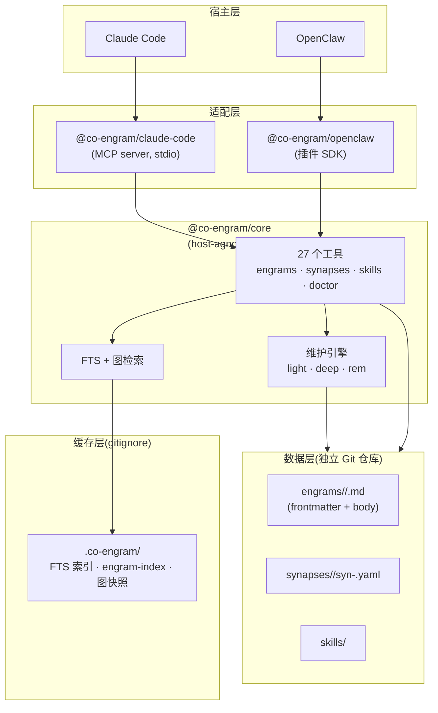

# Co-Engram

**基于神经科学的协同进化团队记忆系统。**
[English](./README.md) | 中文

Co-Engram 是一个面向 AI agent 和团队的**自进化记忆系统**。与传统只做检索的向量库不同,Co-Engram 仿照大脑建模记忆:engram 在使用中被强化、在失效时被削弱、在"睡眠"中自动巩固、并通过元认知自我验证。

已接入 **Claude Code**(通过 MCP)和 **OpenClaw**(通过插件 SDK),并提供 host-agnostic 的 TypeScript 核心,可嵌入任何环境。

## 为什么用 Co-Engram

| 差异化                   | 含义                                                                                                                                             |
| ------------------------ | ------------------------------------------------------------------------------------------------------------------------------------------------ |
| **稳定 ID + 单文件布局** | 每条记忆是一个带 YAML frontmatter 的 Markdown 文件。engram 使用 ULID 永久标识,重命名、移动、重写都不会破坏引用,同时内容 diff 在 Git 中保持干净。 |
| **Per-edge synapse**     | 记忆之间的连接是独立文件,以 `(from, to, kind)` 的确定性哈希为键。无重复边、去重 trivial、清理陈旧连接只需删一个文件。                            |
| **自维护**               | 维护引擎自动运行 `light`(RPE 强化)、`deep`(巩固)、`rem`(元认知升级/反驳)三阶段,无需人工标注。                                                    |
| **双层提案过滤**         | 隐式记忆提案经过规则预过滤(Layer 1,零成本)+ 必要性评估(Layer 2 — 默认规则版,可选 LLM)—— 机械重复被拒,只有真正可复用的决策才成为候选。            |
| **核心 host-agnostic**   | `@co-engram/core` 零宿主依赖。无论用 Claude Code、OpenClaw 还是自己的 agent,记忆和工具完全一致。                                                 |

## 快速开始

三条命令让 Co-Engram 在 Claude Code 里跑起来:

```bash
# 1. 全局安装 MCP server
npm install -g @co-engram/claude-code

# 2. 初始化数据仓库(独立 Git 仓库,不嵌入本项目)
mkdir -p ~/team-memory && cd ~/team-memory && git init

# 3. 接入 Claude Code
claude mcp add co-engram \
  -e CO_ENGRAM_DATA_ROOT=$HOME/team-memory \
  -e CO_ENGRAM_MAINTENANCE=1 \
  --scope user \
  -- co-engram-mcp
```

重启 Claude Code,在新会话中运行 `/mcp`,应该看到 `co-engram` 工具已加载。

**零安装变体**(跳过步骤 1):把步骤 3 的 `co-engram-mcp` 换成 `npx -y @co-engram/claude-code`。

### OpenClaw

```bash
# 1. 从 npm 安装插件
openclaw plugins install @co-engram/openclaw --dangerously-force-unsafe-install

# 2. 将 memory slot 切换为 Co-Engram
openclaw config set plugins.slots.memory co-engram

# 3. 重启 gateway
openclaw gateway restart
```

> `--dangerously-force-unsafe-install` 参数必填,因为 `scripts/setup.mjs` 使用 `child_process` 自动配置 git merge driver。对插件本身是安全的。安装完成后,Co-Engram 工具(memory_search、memory_get)即可被 agent 使用。

详细配置参见 [docs/host-openclaw.md](./docs/host-openclaw.md)。

## 架构



## 数据布局(单文件模型)

每条 engram 就是一个文件。路径由 `domainTags + slug(title)` 派生,但 **id** 是 ULID,永不变化 —— 所以重命名标题、移动目录、重写正文都不会破坏 synapse 引用。

```
~/team-memory/
├── engineering/typescript/strict-mode-gotcha.md     # 一条 engram = 一个文件
├── engineering/react/hooks-useeffect-patterns.md
├── ops/linux/ssh-tunnel-bastion.md
├── synapses/
│   ├── extends/
│   │   └── syn-<hash>.yaml                          # 一条边 = 一个文件
│   ├── contradicts/
│   │   └── syn-<hash>.yaml
│   └── similar_to/
│       └── syn-<hash>.yaml
├── skills/                                          # 程序性记忆
├── .co-engram/                                      # 派生缓存(gitignore)
│   ├── engram-index.json                            # {ULID → path/title/...}
│   ├── digest.jsonl                                 # 每行一个 engram 的目录快照
│   └── graph.json                                   # synapse 图快照
└── .trash/                                          # 回收站(可选)
```

每个 `.md` 文件包含 YAML frontmatter(id、title、importance、retrieval 统计等)和 Markdown 正文。完整 schema 见 [docs/data-format.md](./docs/data-format.md)。

## Engram Schema

每条 engram 是一个带 YAML frontmatter 的 Markdown 文件。字段按职责分组:

| 分组         | 字段                                  | 类型                | 说明                                                                                                                                    |
| ------------ | ------------------------------------- | ------------------- | --------------------------------------------------------------------------------------------------------------------------------------- |
| **标识**     | `id`                                  | ULID 字符串         | 26 字符稳定 id;与路径解耦。重命名、移动都不变。                                                                                         |
|              | `title`                               | 字符串              | 人类可读标题;未锁定 `slug` 时被 slugify 成文件名。                                                                                      |
|              | `slug`                                | 字符串(可选)        | 显式文件名;未设置则由 `title` 派生。                                                                                                    |
|              | `domainTags`                          | 字符串数组          | 领域层级(`[engineering, typescript]`);未设置则从路径推断。                                                                              |
|              | `kind`                                | 枚举                | `observation` \| `fact` \| `pattern` \| `procedure` \| `hypothesis`。                                                                   |
|              | `kinds`                               | 枚举数组(可选)      | 多面 engram 的次级类型。                                                                                                                |
|              | `tags`                                | 字符串数组(可选)    | 自由格式上下文标签。                                                                                                                    |
| **内容**     | `summary`                             | 字符串(可选)        | 一行摘要,在 `tier=digest` 时返回。                                                                                                      |
|              | `contentHash`                         | 字符串              | 正文的 SHA-256;驱动搜索索引重建。                                                                                                       |
|              | `contentSize`                         | 整数                | 正文字节数。                                                                                                                            |
| **作者**     | `createdBy` / `createdAt`             | 字符串 / ISO 时间戳 | 原始作者与创建时间。                                                                                                                    |
|              | `updatedBy` / `updatedAt`             | 字符串 / ISO 时间戳 | 最近修改者与时间。                                                                                                                      |
|              | `version`                             | 整数                | `engram_update` 时单调递增。                                                                                                            |
| **价值**     | `importance`                          | 数值 `[0, 1]`       | 综合重要性;驱动排序与衰减。                                                                                                             |
|              | `importanceVector`                    | 对象(可选)          | 按受众的权重:`personal/team/project/network/temporal/composite`。                                                                       |
|              | `confidence`                          | 数值 `[0, 1]`       | 由 `sourceType` 派生的初始置信度(`firsthand=0.8` / `secondhand=0.65` / `inferred=0.5`)。                                                |
|              | `sourceType`                          | 枚举                | `firsthand` \| `secondhand` \| `inferred`。                                                                                             |
|              | `emotionalValence`                    | 枚举(可选)          | `positive` \| `neutral` \| `negative`。                                                                                                 |
|              | `evidenceCount`                       | 整数                | 支持性 synapse/evidence 数量。                                                                                                          |
| **检索统计** | `retrievalCount`                      | 整数                | `engram_search` 命中的总次数。                                                                                                          |
|              | `effectiveRetrievals`                 | 整数                | 调用方上报成功的次数(`engram_reinforce` 或 `close_learning_loop`)。                                                                     |
|              | `failedUses`                          | 整数                | 调用方上报失败的次数(`engram_report_failure`)。达 3 → 建议归档;达 5 → 建议遗忘。                                                        |
|              | `reinforcementScore`                  | 数值                | RPE 累积强化分。                                                                                                                        |
|              | `lastRetrievedAt` / `lastEffectiveAt` | ISO 时间戳          | 最近一次检索 / 最近一次有效使用。                                                                                                       |
|              | `lastRetrievalScore`                  | 数值 `[0, 1]`       | 最近一次相关性分数;RPE 基准。                                                                                                           |
| **生命周期** | `status`                              | 枚举                | `draft` \| `active` \| `archived` \| `forgotten`。                                                                                      |
|              | `forcedFreshness`                     | 枚举(可选)          | `fresh` \| `aging` \| `stale` \| `forgotten`。由 lifecycle 工具显式覆盖派生值。                                                         |
|              | `decayHalfLifeDays`                   | 数值或 null         | Ebbinghaus 半衰期(天)。`null` = 永不衰减。                                                                                              |
|              | `visibility`                          | 枚举                | `private` \| `team` \| `public`。                                                                                                       |
| **验证**     | `verificationStatus`                  | 枚举                | `unverified` \| `plausible` \| `probable` \| `verified` \| `refuted`。REM 维护阶段会自动升级;也可通过 `upgrade_verification` 强制设置。 |
| **上下文**   | `encodingContext`                     | 字符串(可选)        | 记录该 engram 时 agent 在做什么。                                                                                                       |
|              | `perspective`                         | 字符串(可选)        | 视角标签(多视角保留)。                                                                                                                  |
|              | `contextTags`                         | 字符串数组(可选)    | 额外上下文标签。                                                                                                                        |

### Engram 文件示例

```markdown
---
id: 01J6XQK5P7R2V8Y3M4N6ZH0WQT
title: TypeScript strict mode readonly gotcha
slug: strict-mode-gotcha
domainTags:
  - engineering
  - typescript
kind: pattern
tags:
  - gotcha
summary: Use Object.assign({}, ...parts) to merge readonly configs
importance: 0.62
confidence: 0.85
sourceType: firsthand
status: active
verificationStatus: unverified
decayHalfLifeDays: 30
visibility: team
createdBy: claude-code
createdAt: 2026-06-21T10:30:00.000Z
updatedBy: claude-code
updatedAt: 2026-06-21T11:45:00.000Z
version: 3
contentHash: sha256:2c26b46b68ffc68ff99b453c1d30413413422d706483bfa0f98a5e886266e7ae
contentSize: 412
retrievalCount: 12
effectiveRetrievals: 9
failedUses: 1
reinforcementScore: 0.42
---

TS strict 模式下,readonly 字段不能直接赋值。
用 `Object.assign({}, ...parts)` 合并 partial config:

\`\`\`typescript
const merged = Object.assign({}, ...parts)
\`\`\`
```

## Synapse Schema

每条 synapse 是 `synapses/<kind>/syn-<hash>.yaml` 中的一个 YAML 文件。哈希为 `syn-` + `SHA-256("${a}|${b}|${kind}")` 的前 16 个十六进制字符,其中 `[a, b]` 是两端点的 id(`bidirectional` 排序后哈希,`directional` 保留顺序)。`direction` **不**参与哈希,所以每个 `(from, to, kind)` 三元组最多映射到一个 synapse 文件。

### Synapse 类型(5 族 12 种)

| 族         | 类型             | 语义                         | 典型方向      |
| ---------- | ---------------- | ---------------------------- | ------------- |
| **结构族** | `extends`        | A 是 B 的泛化 / 超集         | directional   |
|            | `part_of`        | A 是 B 的组成部分            | directional   |
|            | `similar_to`     | A 和 B 覆盖同一主题,视角不同 | bidirectional |
| **因果族** | `depends_on`     | A 依赖于 B                   | directional   |
|            | `causes`         | A 导致 B                     | directional   |
|            | `follows`        | A 在 B 之前顺序发生          | directional   |
| **证据族** | `derives_from`   | A 由 B 派生(证据链)          | directional   |
|            | `contradicts`    | A 与 B 矛盾(触发元认知检查)  | bidirectional |
|            | `exemplifies`    | A 是 B 的具体实例            | directional   |
| **时间族** | `supersedes`     | A 取代 B(更新版本)           | directional   |
|            | `consolidates`   | A 强化 / 合并入 B            | directional   |
| **调节族** | `contextualizes` | A 为 B 提供情境              | directional   |

### Synapse 字段

| 字段                                    | 类型                | 说明                                                                                           |
| --------------------------------------- | ------------------- | ---------------------------------------------------------------------------------------------- |
| `id`                                    | 字符串              | 确定性哈希(见上)。                                                                             |
| `from` / `to`                           | ULID                | 端点 engram id。                                                                               |
| `kind`                                  | 枚举                | 上述 12 种之一。                                                                               |
| `weight`                                | 数值 `[0, 1]`       | 边的强度(默认 `0.5`)。                                                                         |
| `direction`                             | 枚举                | `directional` 或 `bidirectional`(默认 `directional`)。                                         |
| `evidence`                              | 数组                | 支持性证据:`{ description, source?, confidence?, addedAt, addedBy }`。                         |
| `sourceSemantic` / `targetSemantic`     | 字符串(可选)        | 两端点的语义角色标签;检索时用于加权图遍历。                                                    |
| `resolutionState`                       | 对象(可选)          | 仅 `contradicts` synapse 使用 — 跟踪 pending/auto_resolved/escalated/contested/resolved 流程。 |
| `createdBy` / `createdAt` / `updatedAt` | 字符串 / ISO 时间戳 | 作者信息。                                                                                     |
| `retrievalWeight`                       | 数值                | 系统在检索时使用的权重。                                                                       |

### Synapse 文件示例

```yaml
# synapses/extends/syn-a1b2c3d4e5f6a7b8.yaml
id: syn-a1b2c3d4e5f6a7b8
from: 01J6XQK5P7R2V8Y3M4N6ZH0WQT
to: 01J7TRY9F8G7H6J5K4L3M2N1O0P
kind: extends
weight: 0.8
direction: directional
evidence:
  - description: Both cover TS strict-mode patterns
    addedBy: claude-code
    confidence: 0.9
    addedAt: 2026-06-21T10:35:00.000Z
createdBy: claude-code
createdAt: 2026-06-21T10:35:00.000Z
updatedAt: 2026-06-21T10:35:00.000Z
retrievalWeight: 0.8
```

## 包

| 包                                                     | 用途                                     | 安装                                 |
| ------------------------------------------------------ | ---------------------------------------- | ------------------------------------ |
| [`@co-engram/core`](./packages/core)                   | Host-agnostic 记忆引擎 + 工具 + 维护引擎 | `npm install @co-engram/core`        |
| [`@co-engram/claude-code`](./packages/claude-code-mcp) | Claude Code 的 MCP server 适配器         | `npm install @co-engram/claude-code` |
| [`@co-engram/openclaw`](./packages/openclaw-plugin)    | OpenClaw 的插件 SDK 适配器               | `npm install @co-engram/openclaw`    |
| [`@co-engram/e2e`](./packages/e2e)                     | 跨宿主端到端测试(私有,不发布)            | 仅 workspace                         |

## 工具目录

Co-Engram 暴露 **27 个原生工具**,按五个关注点分组;此外 `@co-engram/openclaw` 还会注册 2 个 OpenClaw 兼容的 `memory_*` 包装工具。

**Engrams**(12 个)— 核心记忆单元
`engram_create` · `engram_get` · `engram_update` · `engram_delete` · `engram_search` · `engram_list` · `engram_reinforce` · `engram_report_failure` · `engram_archive` · `engram_restore` · `engram_forget` · `engram_recompute_importance`

**Synapses**(4 个)— engram 之间的有类型连接
`synapse_create` · `synapse_get` · `synapse_list` · `synapse_delete`

**Skills**(2 个)— 程序性记忆
`skill_get` · `skill_invoke`

**学习回路**(4 个)— 验证、矛盾、进化
`close_learning_loop` · `contradiction_resolve` · `upgrade_verification` · `get_evolution_lineage`

**候选提案**(3 个)— 从对话中隐式捕获
`engram_list_proposals` · `engram_accept_proposal` · `engram_dismiss_proposal`

**仓库健康**(2 个)— 诊断和浏览
`engram_doctor` · `engram_list_paths`

**OpenClaw memory 协议**(2 个)— 宿主兼容包装,仅 `@co-engram/openclaw` 注册
`memory_search` · `memory_get`

> `memory_*` 工具在 `openclaw.plugin.json` 中声明 `kind: "memory"`,使 OpenClaw 将 Co-Engram 视为主记忆插件(与 `memory-core` 互斥)。它们是 `engram_search` / `engram_get` 之上的薄适配层,隐藏 Co-Engram 内部术语,并通过 `registerMemoryCapability.promptBuilder` 注入自进化的 prompt 段落。

完整签名、输入参数、示例见 [docs/tool-reference.md](./docs/tool-reference.md)。

## 工具示例

理解 Co-Engram 最快的方式是看 LLM 实际发送和接收什么。下面是六个常见流程。所有示例假设你已把 MCP server 接入 Claude Code(或把插件接入 OpenClaw)—— agent 直接调用这些工具,你不需要写任何代码。

### 1. 创建 engram(带 dedup)

LLM 遇到可复用的洞察时会调用 `engram_create`。当 `dedupe: true`(默认)时,创建与现有 engram 内容高度相似的新 engram 会返回 `verdict: "DUPLICATE"`,并强化原 engram 而非写一个重复文件。

```json
// 工具输入
{
  "title": "SSH 隧道穿透堡垒机",
  "content": "用 `ssh -L 5432:db.internal:5432 user@bastion` 把本地端口通过堡垒机转发。",
  "kind": "procedure",
  "domainTags": ["ops", "linux"],
  "confidence": 0.85,
  "sourceType": "firsthand"
}

// 工具输出
{
  "id": "01J7TRY9F8G7H6J5K4L3M2N1O0P",
  "verdict": "NEW"
}
```

再次调用,内容近似时:

```json
// 工具输出
{
  "id": "01J7TRY9F8G7H6J5K4L3M2N1O0P", // 原 engram 的 id
  "verdict": "DUPLICATE",
  "targetId": "01J7TRY9F8G7H6J5K4L3M2N1O0P",
  "reason": "cosine similarity 0.94 > threshold 0.88",
  "confidence": 0.94,
  "candidatesConsidered": 3
}
```

### 2. 带过滤的搜索

`engram_search` 跑一次内存 FTS 查询(CJK 用 bigram 分词,英文用 word 分词),再通过 `extends` / `consolidates` 边做图扩展。用 `filter` 缩小结果集。

```json
// 工具输入
{
  "query": "readonly merge typescript",
  "filter": {
    "domainTags": ["engineering"],
    "kinds": ["pattern"],
    "status": ["active"],
    "minImportance": 0.4
  },
  "limit": 10
}

// 工具输出
{
  "results": [
    { "id": "01J6XQK5P7R2V8Y3M4N6ZH0WQT", "score": 0.91 },
    { "id": "01J6XR2...", "score": 0.78 }
  ],
  "total": 2
}
```

### 3. 按层级渐进读取

`engram_get` 支持 `tier`,LLM 只为自己需要的层级付费。`tier: "auto"` 配 `contextBudget` 自动选择能装下的最深层级。

```json
// tier=catalog(最省 — 仅标识)
{ "id": "01J6XQK5P7R2V8Y3M4N6ZH0WQT", "tier": "catalog" }
// → { entry: { id, title, kind, domainTags } }

// tier=content(完整正文)
{ "id": "01J6XQK5P7R2V8Y3M4N6ZH0WQT", "tier": "content" }
// → { entry: { ...全部 frontmatter, content: "..." } }

// tier=auto,挑能装进 500 token 的最深层级
{ "id": "01J6XQK5P7R2V8Y3M4N6ZH0WQT", "tier": "auto", "contextBudget": { "totalTokens": 500 } }
```

### 4. 用 synapse 连接两个 engram

`synapse_create` 在 `synapses/<kind>/` 下写一个 YAML 文件。端点 + kind 被哈希进文件名,所以同一条边创建两次会把 evidence 合并进现有文件而非复制。

```json
// 工具输入
{
  "from": "01J6XQK5P7R2V8Y3M4N6ZH0WQT",
  "to":   "01J7TRY9F8G7H6J5K4L3M2N1O0P",
  "kind": "extends",
  "weight": 0.8,
  "direction": "directional",
  "evidence": [
    { "description": "Both cover TS strict-mode patterns", "confidence": 0.9 }
  ]
}

// 工具输出
{ "id": "syn-a1b2c3d4e5f6a7b8", "created": true }
```

### 5. 闭合学习回路

在真实任务中用过一条 engram 后,LLM(或你的代码)调用 `close_learning_loop` 反馈结果。`success` 触发长时程增强(LTP)与 Hebbian 邻居加成;`failure` 触发长时程抑制(LTD),可能会归档或遗忘该 engram。

```json
// 工具输入
{
  "engramId": "01J6XQK5P7R2V8Y3M4N6ZH0WQT",
  "outcome": "success",
  "effectiveness": 0.9,
  "reason": "应用了 Object.assign 模式,成功合并了 readonly config。"
}

// 工具输出
{
  "engramId": "01J6XQK5P7R2V8Y3M4N6ZH0WQT",
  "outcome": "success",
  "importance": 0.71,
  "importanceDelta": 0.09,
  "hebbianTriggered": true,
  "provenanceTriggered": false,
  "shouldArchive": false,
  "shouldForget": false
}
```

### 6. Doctor:自愈扫描

`engram_doctor` 审计数据仓库,自动修复能安全修复的,把剩余的列为待人工审查。在外部编辑后(比如手解 Git 冲突)或定期跑一次。

```json
// 工具输入
{ "incremental": true }

// 工具输出
{
  "startedAt": "2026-06-21T10:30:00.000Z",
  "finishedAt": "2026-06-21T10:30:02.000Z",
  "totalEngrams": 142,
  "totalSynapses": 38,
  "autoFixesApplied": 2,
  "pendingManualReview": 1,
  "issues": [
    { "kind": "moved_file", "path": "eng/typescript/x.md", "autoFixed": true,
      "message": "File path changed; index re-pointed." },
    { "kind": "dangling_synapse", "autoFixed": false,
      "message": "Synapse references engram 01J...XYZ that no longer exists." }
  ]
}
```

### 常见模式

| 目标               | 调用顺序                                                                                          |
| ------------------ | ------------------------------------------------------------------------------------------------- |
| 捕获一个决策       | `engram_create` → 用一下 → `close_learning_loop(success)`                                         |
| 两条记忆冲突       | `synapse_create(contradicts)` → `contradiction_resolve(keep_new \| keep_old \| merge \| archive)` |
| 验证假设           | `engram_create(kind=hypothesis)` → 收集证据 → `upgrade_verification(probable \| verified)`        |
| 浏览工作集中在哪里 | `engram_list_paths` → `engram_search(filter.domainTags=[...])`                                    |
| 外部编辑后修复漂移 | `engram_doctor(incremental=true)`                                                                 |
| 分诊隐式候选       | `engram_list_proposals` → `engram_accept_proposal` 或 `engram_dismiss_proposal`                   |

> 完整状态机——创建、去重分支、verification 迁移、矛盾裁决、自动衰减、宿主触发点——见 **[docs/lifecycle.zh-CN.md](./docs/lifecycle.zh-CN.md)**。

## 配置

### 环境变量(Claude Code MCP server)

全部可选。通过 `claude mcp add -e KEY=value` 或 shell 设置。

| 变量                                      | 默认值              | 用途                                                                                                                    |
| ----------------------------------------- | ------------------- | ----------------------------------------------------------------------------------------------------------------------- |
| `CO_ENGRAM_DATA_ROOT`                     | `$HOME/team-memory` | 数据 Git 仓库的绝对路径                                                                                                 |
| `CO_ENGRAM_DEFAULT_CREATED_BY`            | `unknown`           | 新建 engram 的默认作者                                                                                                  |
| `CO_ENGRAM_LANGUAGE`                      | `en`                | 工具描述 / 查看器 UI / 提示词的语言(`en` \| `zh`)。未设置时回退到 `~/team-memory/.co-engram/config.json` 中持久化的值。 |
| `CO_ENGRAM_MAINTENANCE`                   | `0`                 | 设为 `1` 启动维护引擎                                                                                                   |
| `CO_ENGRAM_MAINTENANCE_ENABLED_STAGES`    | `light,deep,rem`    | 逗号分隔的阶段列表                                                                                                      |
| `CO_ENGRAM_MAINTENANCE_LIGHT_INTERVAL_MS` | `300000`(5 分钟)    | light 阶段间隔                                                                                                          |
| `CO_ENGRAM_MAINTENANCE_DEEP_INTERVAL_MS`  | `3600000`(1 小时)   | deep 阶段间隔                                                                                                           |
| `CO_ENGRAM_MAINTENANCE_REM_INTERVAL_MS`   | `604800000`(7 天)   | rem 阶段间隔                                                                                                            |
| `CO_ENGRAM_MAINTENANCE_LEARNING_RATE`     | `0.1`               | RPE 学习率                                                                                                              |
| `CO_ENGRAM_TRASH_ENABLED`                 | `0`                 | 设为 `1` 后,forgotten 的 engram 会移入 `.trash/` 而非直接删除                                                           |
| `CO_ENGRAM_TRASH_AFTER_DAYS`              | `30`                | 进入 `forgotten` 状态多少天后才移入 `.trash/`                                                                           |
| `CO_ENGRAM_TRASH_PURGE_AFTER_DAYS`        | `365`               | 在 `.trash/` 中多少天后物理删除(`0` = 永不)                                                                             |

### OpenClaw manifest 配置

OpenClaw 通过插件 manifest 配置。完整 schema 见 [docs/host-openclaw.md](./docs/host-openclaw.md)。

## 对比

| 特性            | Co-Engram                          | mem0           | Letta        | LangChain Memory |
| --------------- | ---------------------------------- | -------------- | ------------ | ---------------- |
| 存储模型        | 单文件 Git 友好 + per-edge synapse | 向量 + 图      | 向量 + 状态  | 向量 / 键值      |
| 稳定 ID(ULID)   | 有 — 重命名 / 移动不破坏引用       | 无             | 无           | 无               |
| 可塑性(LTP/LTD) | 有(RPE 驱动)                       | 手动 API       | 手动 API     | 手动 API         |
| 自动维护        | 有(light/deep/rem)                 | 无             | 无           | 无               |
| 元认知          | 有(五维 truth score)               | 无             | 无           | 无               |
| 宿主耦合        | 无(host-agnostic 核心)             | 紧(Python SDK) | 紧(REST API) | 紧(Python SDK)   |
| 协议            | MIT                                | Apache-2.0     | Apache-2.0   | MIT              |

## 路线图

实时路线图见 [GitHub Issues](https://github.com/co-engram/co-engram/issues)。重点:

- **TypeDoc 自动生成工具参考** — 替换手写的 `docs/tool-reference.md`,改为自动生成的 API 文档
- **Provider 支持的抽象层** — LLM 驱动的 REM 阶段,做叙事抽象
- **Web UI** — 浏览 engram、检查 synapse 图、手动触发维护
- **更多宿主适配器** — Continue.dev、Cursor、Aider
- **1.0 发布** — API 稳定且有真实生产用户后

## 贡献

欢迎贡献。开发环境、测试命令、PR 规范见 [CONTRIBUTING.md](./CONTRIBUTING.md)。安全漏洞报告见 [SECURITY.md](./SECURITY.md)。

## 协议

[MIT](./LICENSE) — © 2026 Yang Yang
