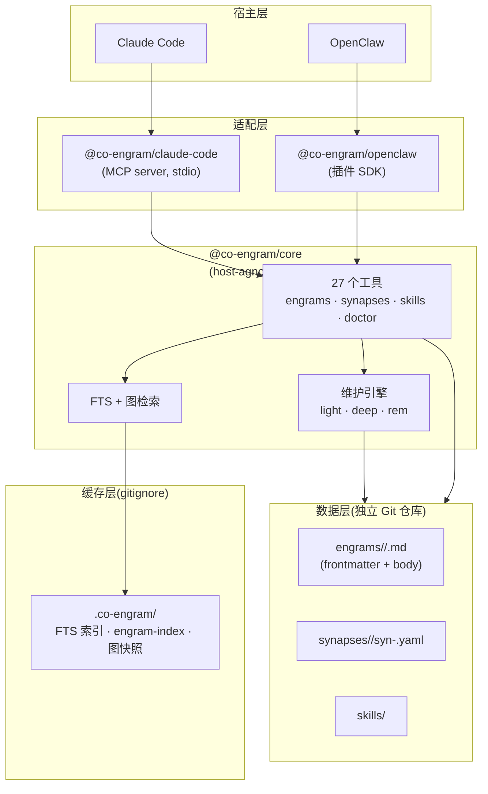

<div align="center">
  <picture>
    <source media="(prefers-color-scheme: dark)" srcset="docs/images/co-engram-logo-dark.svg">
    
  </picture>
  <h1>Co-Engram：协同自进化的团队记忆</h1>
  <p><a href="./README.md">English</a> | 中文</p>
</div>

Co-Engram 是一个面向 AI agent 和团队的**自进化记忆系统**。与传统只做检索的向量库不同,Co-Engram 仿照大脑建模记忆:engram 在使用中被强化、在失效时被削弱、在"睡眠"中自动巩固、并通过元认知自我验证。

已接入 **Claude Code**(通过 MCP)和 **OpenClaw**(通过插件 SDK),并提供 host-agnostic 的 TypeScript 核心,可嵌入任何环境。

## 为什么用 Co-Engram

| 差异化                   | 含义                                                                                                                                             |
| ------------------------ | ------------------------------------------------------------------------------------------------------------------------------------------------ |
| **稳定 ID + 单文件布局** | 每条记忆是一个带 YAML frontmatter 的 Markdown 文件。engram 使用 ULID 永久标识,重命名、移动、重写都不会破坏引用,同时内容 diff 在 Git 中保持干净。 |
| **Per-edge synapse**     | 记忆之间的连接是独立文件,以 `(from, to, kind)` 的确定性哈希为键。无重复边、去重 trivial、清理陈旧连接只需删一个文件。                            |
| **自维护**               | 维护引擎自动运行 `light`(RPE 强化)、`deep`(巩固)、`rem`(元认知升级/反驳)三阶段,无需人工标注。                                                    |
| **双层提案过滤**         | 隐式记忆提案经过规则预过滤(Layer 1,零成本)+ 必要性评估(Layer 2 — 默认规则版,可选 LLM)—— 机械重复被拒,只有真正可复用的决策才成为候选。            |
| **核心 host-agnostic**   | `@co-engram/core` 零宿主依赖。无论用 Claude Code、OpenClaw 还是自己的 agent,记忆和工具完全一致。                                                 |

## 快速开始

三条命令让 Co-Engram 在 Claude Code 里跑起来:

```bash
# 1. 全局安装 MCP server
npm install -g @co-engram/claude-code

# 2. 初始化数据仓库(独立 Git 仓库,不嵌入本项目)
mkdir -p ~/team-memory && cd ~/team-memory && git init

# 3. 让 co-engram 指向该数据仓库(写入 ~/.co-engram/config.json)
co-engram config data-root $HOME/team-memory

# 4. 接入 Claude Code
claude mcp add co-engram \
  --scope user \
  -- co-engram-mcp
```

重启 Claude Code,在新会话中运行 `/mcp`,应该看到 `co-engram` 工具已加载。

**零安装变体**(跳过步骤 1):把步骤 3 的 `co-engram-mcp` 换成 `npx -y @co-engram/claude-code`。

### OpenClaw

```bash
# 1. 从 npm 安装插件
openclaw plugins install @co-engram/openclaw --dangerously-force-unsafe-install

# 2. 将 memory slot 切换为 Co-Engram
openclaw config set plugins.slots.memory co-engram

# 3. 重启 gateway
openclaw gateway restart
```

> `--dangerously-force-unsafe-install` 参数必填,因为 `scripts/setup.mjs` 使用 `child_process` 自动配置 git merge driver。对插件本身是安全的。安装完成后,Co-Engram 工具(memory_search、memory_get)即可被 agent 使用。

详细配置参见 [docs/host-openclaw.md](./docs/host-openclaw.md)。

## 使用 Co-Engram

Co-Engram**通过对话工作**——你和 AI agent 自然交流,agent 自行判断何时捕获、搜索或更新记忆。以下所有交互都是自然语言;标注的工具调用是 agent 在底层透明执行的。

### 通过对话完成安装

新项目不需要离开聊天窗口。直接告诉 agent:

> "帮我在 home 目录下全局安装 co-engram，数据仓库放 ~/team-memory。"

agent 依次执行:`npm install -g @co-engram/claude-code` → `mkdir -p ~/team-memory && cd ~/team-memory && git init` → `co-engram config data-root $HOME/team-memory` → `claude mcp add co-engram --scope user -- co-engram-mcp`。OpenClaw 用户:`openclaw plugins install @co-engram/openclaw --dangerously-force-unsafe-install` → `openclaw config set plugins.slots.memory co-engram` → `openclaw gateway restart`。全部在一次对话中完成,无需手动操作。显式命令见[快速开始](#快速开始)。

### dedup 防止知识噪音

当你捕获重叠内容时,Co-Engram**不会创建重复条目**,而是**强化原始记忆**并告诉 agent 匹配了什么。

> 你:"我们用 Zod v4 做运行时校验。"
> *几周后……*
> 你:"记住:我们已统一用 Zod v4 处理所有输入解析。"
>
> agent 调用 `engram_create` → 返回 `verdict: "DUPLICATE"`,指向已有 engram,并提升其重要性。没有僵尸副本,没有相互矛盾的多份记录。

背后机制:`engram_create` 对内容做哈希后计算与现有 engram 的余弦相似度(`dedupe: true` 默认开启)。`DUPLICATE` 结果会触发对原始 engram 的**强化加成**——这和 `close_learning_loop` 使用的是同一套 RPE 驱动的可塑性机制。当新内容有意义地扩展了已有 engram 时(差异够大值得合并,相似度够高属于同一主题),`engram_create` 也会返回 `UPDATE`,将新信息合并进去。

### 系统发现你该记住什么

你不需要自己判断什么值得记住。Co-Engram**会观察你的对话**,发现某个话题反复出现却没有对应记忆时自动提醒。

> 连续三个会话中,你们反复讨论同一个 CI 流水线超时问题。你从来没有明确说过"记住这个"。
>
> Co-Engram 的提案引擎检测到这个重复规律,建议一条候选 engram。agent 告诉你:"我注意到我们多次讨论了 CI 超时问题,要不要保存下来?"
>
> 你说"好" → `engram_accept_proposal` → 它变成一条永久 engram,`kind=pattern`,领域标签从上下文中推断。

背后原理:**双层过滤器**阻挡噪音。Layer 1(零成本规则)拒绝问候语、单字回复、机械重复。Layer 2(可配置:默认规则版,可选 LLM)判断"这是可复用的知识,还是只是闲聊?"只有通过两层过滤的提案才会呈现给你。

你可以随时查看待处理候选:"有什么记忆建议?"agent 调用 `engram_list_proposals`。用 `engram_accept_proposal` 批准,用 `engram_dismiss_proposal` 驳回。

### Synapse 图:一次召回带出关联上下文

agent 用 `synapse_create` 连接两条 engram 后,后续的 `engram_search` 会**自动沿边遍历**——所以记起一条记忆时,扩展它、依赖它、为它提供情境的关联记忆也会浮现。

> agent 调用 `synapse_create(from="01J...PostgreSQL", to="01J...迁移方案", kind="extends")`
>
> 之后:"我们对分析数据库了解多少?"
>
> `engram_search("分析数据库")` 返回 PostgreSQL engram,因为存在 `extends` 边,迁移方案 engram 也出现在附近结果中——尽管它的内容从未提到"分析"一词。

共 12 种 synapse 类型(见 [Synapse Schema](#synapse-schema))。搜索时还会沿 `consolidates` 边遍历(合并后的 engram),并抑制 `contradicts` 邻居(标记待审查)。边是**确定性**的——同一个 `(from, to, kind)` 三元组始终哈希到同一个文件,再次创建会合并 evidence 而非重复。

### 渐进披露:只为实际需要的内容付费

LLM 的上下文窗口有限且昂贵。Co-Engram 的 `tier` 系统让 agent 先请求能回答问题的最廉价表示,只在必要时加深。

| Tier | 返回内容 | 适用场景 |
|------|---------|---------|
| `catalog` | `id`, `title`, `kind`, `domainTags` | 浏览列表、确认某条记忆是否存在 |
| `digest` | catalog + `summary`, `importance`, `status` | 略读搜索结果、决定打开哪一条 |
| `content` | 完整 frontmatter + Markdown 正文 | 用原文回答细节问题 |
| `auto` | 能装进 `contextBudget.totalTokens` 的最深 tier | agent 不确定记忆有多大——让系统决策 |

> agent 调用 `engram_get(id="01J...", tier="auto", contextBudget={totalTokens:800})` → 系统测量 JSON 大小,自选能装进预算的最深 tier。

这对用户完全透明——agent 学会默认用 `tier=auto`,只在真正需要正文时才切到 `content`。

### 闭合学习回路:反馈改变重要性

使用记忆后,agent 报告它是**帮助了**还是**误导了**。

> agent 检索到 "PostgreSQL JSONB 迁移" engram,应用了该模式,确认有效。
>
> 调用 `close_learning_loop(engramId="01J...", outcome="success", effectiveness=0.9)`。
>
> 该 engram 的 `importance` 上升。通过 `extends` 或 `consolidates` 边连接的邻居 engram 获得**Hebbian 加成**(按边强度加权)。`failure` 结果会压低权重,重复失败(默认 5 次)后建议遗忘该 engram。

这就是 **RPE 回路**(reinforcement-prediction-error):`engram_search` 的返回设定期望,`close_learning_loop` 交付实际结果,二者的差值调整重要性。随时间推移,频繁有效的记忆自我提升;陈旧或错误的记忆无需任何人提工单就自动衰减。

### 记忆如何强化与遗忘

Co-Engram 仿照大脑建模记忆可塑性——不是一个静态仓库,而是一个**活的系统**,其中每次交互都会推动重要性上升或下降。这是与键值或向量记忆的本质区别:**帮你的记忆会变强,误导你的或不再使用的记忆会自动消失。**

#### 强化:LTP(长时程增强)

每次成功使用都会沿多个路径强化 engram:

| 触发条件 | 效果 | 累积字段 |
|---------|------|---------|
| `engram_search` 返回该 engram | 检索计数 +1;记录最近分数 | `retrievalCount`, `lastRetrievalScore` |
| `engram_create` 返回 `DUPLICATE` | 原始 engram 获得强化加成(与 `close_learning_loop` 相同的 RPE 数学) | `reinforcementScore` |
| `close_learning_loop(outcome="success")` | 重要性上升: `Δ = learningRate × effectiveness × (1 - oldImportance)` | `importance`, `reinforcementScore`, `effectiveRetrievals` |
| `synapse_create(kind="extends"\|"consolidates")` | 连接 engram 每次 `close_learning_loop(success)` 时,邻居按边权重获得 Hebbian 加成 | 邻居的 `importance` |
| `engram_reinforce`(直接调用) | 手动加成,与 success loop 相同的 RPE 数学 | `reinforcementScore` |

**RPE 增量**受人约束:单次 success 对 importance 的提升最多为 `learningRate`(默认 0.1)。这避免了一次交互的剧烈摆动,同时让持续使用形成复利:被检索 12 次、其中 9 次确认为有效的 engram,会自然攀升到高重要性平台。

#### 衰减:LTD(长时程抑制)

反向机制同样重要——**去学习**:

| 触发条件 | 效果 | 阈值 |
|---------|------|------|
| `close_learning_loop(outcome="failure")` | 重要性下降;`failedUses` 计数器 +1 | — |
| `failedUses >= 3` | 系统建议归档:status → `archived`,默认搜索结果中排除 | 3 次失败 |
| `failedUses >= 5` | 系统建议遗忘:status → `forgotten`,经过 `CO_ENGRAM_TRASH_AFTER_DAYS` 后移入 `.trash/` | 5 次失败 |
| Ebbinghaus 衰减(Deep 阶段) | `importance *= e^(-Δt / halfLife)` — 超过 `halfLife` 天未被检索的 engram 失去约 63% 的重要性 | `decayHalfLifeDays`(默认按 kind 而异;`null` = 永衰减) |
| `engram_report_failure` | 标记某次检索为有害;递增 `failedUses` | — |

**遗忘管道**有两条路径:

```
active ──(failedUses>=3)──→ archived ──(engram_restore)──→ active
active ──(failedUses>=5)──→ forgotten ──(CO_ENGRAM_TRASH_AFTER_DAYS)──→ .trash/ ──(CO_ENGRAM_TRASH_PURGE_AFTER_DAYS)──→ deleted
                    forgotten ──(engram_restore)──→ active
```

归档(archive)是软删除(默认搜索结果中排除,但保留全部数据)。遗忘(forget)是硬删除(移入回收站,在配置的时间窗口后清除)。两者在清除截止时间前均可通过 `engram_restore` 恢复。

#### Hebbian 扩散:"一起放电的神经元会连接在一起"

当 `close_learning_loop(success)` 作用在 engram A 上时,每个通过 `extends` 或 `consolidates` synapse 与 A 相连的 engram B 获得**按比例加成**:

```
boost(B) = edgeWeight(A→B) × Δ_importance(A) × hebbianDecay
```

其中 `hebbianDecay`(默认约 0.5)防止无限传播链。这意味着一个被频繁使用的模式 engram 会逐渐提升所有与之关联的具体实例——反之亦然。使用数周后,synapse 图反映的不只是"被说过什么",而是**什么和什么一起被证明有用**。

#### 在查看器中观察这个循环

打开 [Web 查看器](#访问-web-查看器)的 **Health** 标签页,你会看到:

- **RPE 分数分布** — 所有 engram 的 `reinforcementScore` 直方图;健康的图谱中大多数 engram 处于 0.3–0.9 区间
- **验证状态饼图** — `verified` / `probable` / `plausible` / `unverified` / `refuted` 的比例
- **维护阶段报告** — Light / Deep / REM 上一次运行时做了什么,下次运行何时触发

### 这项记忆可信吗?

并非所有记忆都同样可靠。Co-Engram 给每条 engram 配备了一个**验证徽章**,随证据自动演进:

```
unverified → plausible → probable → verified
                                    ↘ refuted
```

新 engram 起步于 `unverified`——"有人说过这个,还未核实"。随着记忆被成功使用、被其他 engram 引用、以及通过矛盾检测,REM 维护阶段会自动升级它。被持续矛盾的记忆则走向 `refuted`——它仍留在仓库中(你可能还想知道它曾经被相信过),但被明确标记为不可靠。

**REM 阶段**(默认每 7 天)对每条 engram 从五个维度做评估:

| 维度 | 检查内容 |
|------|---------|
| **一致性** | 与其他 engram 是否一致(通过 `contradicts` synapse 检测) |
| **存续时间** | 这条 engram 存活了多久而未被反驳 |
| **使用情况** | 被检索并确认有效的频率 |
| **来源** | 是一手经历、二手转述还是推理 |
| **可执行性** | (仅 procedure)是否有人确实按这些步骤操作并成功了 |

每个维度贡献到综合真值评分。你不需要跟踪任何这些——系统自动更新徽章。当你想问"那个可靠吗?",agent 可以调用 `engram_get(tier=digest)` 报告当前的 `verificationStatus`。

### 自动维护:light → deep → REM

没人有时间为知识库做人工管理。设置 `CO_ENGRAM_MAINTENANCE=1` 后,Co-Engram 在后台定时运行三个阶段:

| 阶段 | 间隔(默认) | 做什么 |
|------|-----------|--------|
| **Light** | 5 分钟 | 对最近返回的 engram 施加 RPE,更新检索统计 |
| **Deep** | 1 小时 | 合并碎片化 engram,重算综合重要性,施加 Ebbinghaus 遗忘衰减 |
| **REM** | 7 天 | 运行元认知:升级 `verificationStatus`(`unverified`→`plausible`→`probable`→`verified`),检测跨 synapse 的矛盾,建议归档或反驳某些 engram |

三阶段全部**零干预**——引擎从 engram frontmatter 读取使用统计,应用数学模型(RPE、Ebbinghaus 遗忘曲线、Hebbian 可塑性),写回更新后的字段。数学原理见 [docs/maintenance-engine.zh-CN.md](./docs/maintenance-engine.zh-CN.md)。

### 访问 Web 查看器

Co-Engram 内置了单页应用用于可视化探索。wiring 时启用:

```bash
# Claude Code (MCP) — viewer 默认 18899
claude mcp add co-engram \
  -e CO_ENGRAM_VIEWER_ENABLED=1 \
  ... -- co-engram-mcp
```

OpenClaw 在插件 manifest 中设置 `startViewer: true` —— viewer 同样默认 18899。

浏览器打开 **http://127.0.0.1:18899**。用 `CO_ENGRAM_VIEWER_PORT` 覆盖。

| 标签 | 内容 |
|------|------|
| **Engrams** | 可筛选的记忆表格——按重要性排序、按标签/状态/验证级别过滤,点击查看全文 |
| **Graph** | 交互式力导向 synapse 图——节点为 engram,边为有类型连接;点击节点跳转内容 |
| **Audit** | 每次 `engram_create` / `engram_update` / `engram_delete` / `close_learning_loop` 调用的时间线——谁、何时、改了什么 |
| **Health** | 各阶段维护报告、验证状态饼图、RPE 分数分布 |

更详细的使用指南见 [docs/concepts.zh-CN.md](./docs/concepts.zh-CN.md) 和 [docs/tool-reference.zh-CN.md](./docs/tool-reference.zh-CN.md)。

### Obsidian 集成(通过派生 wikilinks 实现 graph view)

Co-Engram 在每条被 synapse 触及的 engram 正文末尾追加 `## Synapses (derived)` 段,列出出边(`→`)和入边(`←`),格式为:

```
- → [[co-engram-foo|某标题 · extends]]
- ← [[co-engram-bar|另一标题 · derives_from]]
```

wikilink 的 **target 是文件名**(去 `.md`),Obsidian 直接解析,**不依赖 frontmatter aliases**。**display 显示目标 engram 的标题 + 关系 kind**,在不跳转的情况下就能读懂网络结构。`contradicts` 边前置排序,作为视觉警告。

用 [Obsidian](https://obsidian.md/) 打开团队记忆目录("Open vault → ~/AIOS/team-memory/team-memory/" 或 dataRoot 指向的路径),**Graph View** 就能渲染完整的记忆网络——反向链接、文件 shift-click 跳转、全局结构一目了然。YAML 权威源仍在 `synapses/*.yaml`;派生段每次 synapse 写入时重建,手动改了它也不要紧,下次写入会覆盖回来。

**自愈:** `engram_doctor` 会逐条比对派生段与权威 synapse yaml(比如你手改了 wikilink、写入被中断、文件被重命名),发现漂移就重建。幂等——干净仓库跑一次报 0 修复。Obsidian 图谱看起来不对、或大批量导入 / Git 合并之后跑一次即可。

**已知 tradeoff:** Obsidian 的边是无向无差别的——12 种 synapse kind 在 graph 上会折叠成一种线。kind 信息保留在 wikilink 显示文本(`[[...|某标题 · extends]]`)里。要按 kind 过滤,用网页内的 **Graph** 标签。

### 保存并同步到远端(`engram_sync`)

记忆每次写入都会把仓库标记为脏,宿主会在合适时机自动落盘提交。当你**想主动掌控时机**——比如关会话前、切换机器前、或者想先拉取队友更新——可以让 agent 调用 `engram_sync` 工具:

```
engram_sync({ message?: string, dryRun?: boolean, pull?: boolean, push?: boolean })
```

工具跑一遍完整的 **pull → commit → push** 流水线:

1. `ensureGitignore` —— 缺失则创建 `.gitignore`(排除整个 `.co-engram/` 缓存目录;只跟踪 `*.md` + `synapses/*.yaml`)。
2. `git fetch` + 与上游比对 —— 远端无新提交时 pull 阶段短路返回 `upToDate: true`。
3. `git pull --rebase --autostash` —— 保持线性历史;本地未提交变更自动暂存再重放。
4. `git add -A` + `git commit` —— 无变更时自动跳过(不产生空提交)。
5. `git push` —— **未配置 remote 时自动降级为仅提交**(不报错)。

**冲突策略:** rebase 冲突**不自动解决**。工具会跑 `git rebase --abort` 回到 pull 前状态,把冲突文件清单放到 `pulled.conflicts` 数组里返回,交给人工裁决——解决后重新调一次 `engram_sync` 即可。

**公司内外部通用**(GitHub / GitLab / Gerrit / 内网 git 服务器):

- 直接调用系统 `git`,继承用户本机的 SSH 配置、凭据、HTTP proxy。**不硬编码任何主机名或 URL**。
- **不主动写 `Change-Id`**。如果你装了 Gerrit 的 `commit-msg` hook(`gitdir/hooks/commit-msg`),它会自动加 `Change-Id`。
- **尊重用户 `.git/config` 的 push refspec**。若你为 Gerrit review 配置了 `push = refs/heads/*:refs/for/*`,push 会走 review;否则直接推到 tracking 分支。
- 纯本地仓库也能用——sync 在 commit 阶段自然停下。

用 `dryRun: true` 可以预览 `git status` 会涉及哪些文件,不真改任何东西。

## 架构



## 数据布局(单文件模型)

每条 engram 就是一个文件。路径由 `domainTags + slug(title)` 派生,但 **id** 是 ULID,永不变化 —— 所以重命名标题、移动目录、重写正文都不会破坏 synapse 引用。

```
~/team-memory/
├── engineering/typescript/strict-mode-gotcha.md     # 一条 engram = 一个文件
├── engineering/react/hooks-useeffect-patterns.md
├── ops/linux/ssh-tunnel-bastion.md
├── synapses/
│   ├── extends/
│   │   └── syn-<hash>.yaml                          # 一条边 = 一个文件
│   ├── contradicts/
│   │   └── syn-<hash>.yaml
│   └── similar_to/
│       └── syn-<hash>.yaml
├── skills/                                          # 程序性记忆
├── .co-engram/                                      # 派生缓存(gitignore)
│   ├── engram-index.json                            # {ULID → path/title/...}
│   ├── digest.jsonl                                 # 每行一个 engram 的目录快照
│   └── graph.json                                   # synapse 图快照
└── .trash/                                          # 回收站(可选)
```

每个 `.md` 文件包含 YAML frontmatter(id、title、importance、retrieval 统计等)和 Markdown 正文。完整 schema 见 [docs/data-format.md](./docs/data-format.md)。

## Engram Schema

每条 engram 是一个带 YAML frontmatter 的 Markdown 文件。字段按职责分组:

| 分组         | 字段                                  | 类型                | 说明                                                                                                                                    |
| ------------ | ------------------------------------- | ------------------- | --------------------------------------------------------------------------------------------------------------------------------------- |
| **标识**     | `id`                                  | ULID 字符串         | 26 字符稳定 id;与路径解耦。重命名、移动都不变。                                                                                         |
|              | `title`                               | 字符串              | 人类可读标题;未锁定 `slug` 时被 slugify 成文件名。                                                                                      |
|              | `slug`                                | 字符串(可选)        | 显式文件名;未设置则由 `title` 派生。                                                                                                    |
|              | `domainTags`                          | 字符串数组          | 领域层级(`[engineering, typescript]`);未设置则从路径推断。                                                                              |
|              | `kind`                                | 枚举                | `observation` \| `fact` \| `pattern` \| `procedure` \| `hypothesis`。                                                                   |
|              | `kinds`                               | 枚举数组(可选)      | 多面 engram 的次级类型。                                                                                                                |
|              | `tags`                                | 字符串数组(可选)    | 自由格式上下文标签。                                                                                                                    |
| **内容**     | `summary`                             | 字符串(可选)        | 一行摘要,在 `tier=digest` 时返回。                                                                                                      |
|              | `contentHash`                         | 字符串              | 正文的 SHA-256;驱动搜索索引重建。                                                                                                       |
|              | `contentSize`                         | 整数                | 正文字节数。                                                                                                                            |
| **作者**     | `createdBy` / `createdAt`             | 字符串 / ISO 时间戳 | 原始作者与创建时间。                                                                                                                    |
|              | `updatedBy` / `updatedAt`             | 字符串 / ISO 时间戳 | 最近修改者与时间。                                                                                                                      |
|              | `version`                             | 整数                | `engram_update` 时单调递增。                                                                                                            |
| **价值**     | `importance`                          | 数值 `[0, 1]`       | 综合重要性;驱动排序与衰减。                                                                                                             |
|              | `importanceVector`                    | 对象(可选)          | 按受众的权重:`personal/team/project/network/temporal/composite`。                                                                       |
|              | `confidence`                          | 数值 `[0, 1]`       | 由 `sourceType` 派生的初始置信度(`firsthand=0.8` / `secondhand=0.65` / `inferred=0.5`)。                                                |
|              | `sourceType`                          | 枚举                | `firsthand` \| `secondhand` \| `inferred`。                                                                                             |
|              | `emotionalValence`                    | 枚举(可选)          | `positive` \| `neutral` \| `negative`。                                                                                                 |
|              | `evidenceCount`                       | 整数                | 支持性 synapse/evidence 数量。                                                                                                          |
| **检索统计** | `retrievalCount`                      | 整数                | `engram_search` 命中的总次数。                                                                                                          |
|              | `effectiveRetrievals`                 | 整数                | 调用方上报成功的次数(`engram_reinforce` 或 `close_learning_loop`)。                                                                     |
|              | `failedUses`                          | 整数                | 调用方上报失败的次数(`engram_report_failure`)。达 3 → 建议归档;达 5 → 建议遗忘。                                                        |
|              | `reinforcementScore`                  | 数值                | RPE 累积强化分。                                                                                                                        |
|              | `lastRetrievedAt` / `lastEffectiveAt` | ISO 时间戳          | 最近一次检索 / 最近一次有效使用。                                                                                                       |
|              | `lastRetrievalScore`                  | 数值 `[0, 1]`       | 最近一次相关性分数;RPE 基准。                                                                                                           |
| **生命周期** | `status`                              | 枚举                | `draft` \| `active` \| `archived` \| `forgotten`。                                                                                      |
|              | `forcedFreshness`                     | 枚举(可选)          | `fresh` \| `aging` \| `stale` \| `forgotten`。由 lifecycle 工具显式覆盖派生值。                                                         |
|              | `decayHalfLifeDays`                   | 数值或 null         | Ebbinghaus 半衰期(天)。`null` = 永不衰减。                                                                                              |
|              | `visibility`                          | 枚举                | `private` \| `team` \| `public`。LLM 在存储含凭据 / 个人 / 内部 / 敏感信息的记忆前会主动询问;详见[记忆可见性与风险识别](#记忆可见性与风险识别)。                              |
| **验证**     | `verificationStatus`                  | 枚举                | `unverified` \| `plausible` \| `probable` \| `verified` \| `refuted`。REM 维护阶段会自动升级;也可通过 `upgrade_verification` 强制设置。 |
| **上下文**   | `encodingContext`                     | 字符串(可选)        | 记录该 engram 时 agent 在做什么。                                                                                                       |
|              | `perspective`                         | 字符串(可选)        | 视角标签(多视角保留)。                                                                                                                  |
|              | `contextTags`                         | 字符串数组(可选)    | 额外上下文标签。                                                                                                                        |

### Engram 文件示例

```markdown
---
id: 01J6XQK5P7R2V8Y3M4N6ZH0WQT
title: TypeScript strict mode readonly gotcha
slug: strict-mode-gotcha
domainTags:
  - engineering
  - typescript
kind: pattern
tags:
  - gotcha
summary: Use Object.assign({}, ...parts) to merge readonly configs
importance: 0.62
confidence: 0.85
sourceType: firsthand
status: active
verificationStatus: unverified
decayHalfLifeDays: 30
visibility: team
createdBy: claude-code
createdAt: 2026-06-21T10:30:00.000Z
updatedBy: claude-code
updatedAt: 2026-06-21T11:45:00.000Z
version: 3
contentHash: sha256:2c26b46b68ffc68ff99b453c1d30413413422d706483bfa0f98a5e886266e7ae
contentSize: 412
retrievalCount: 12
effectiveRetrievals: 9
failedUses: 1
reinforcementScore: 0.42
---

TS strict 模式下,readonly 字段不能直接赋值。
用 `Object.assign({}, ...parts)` 合并 partial config:

\`\`\`typescript
const merged = Object.assign({}, ...parts)
\`\`\`
```

## 记忆可见性与风险识别

每条 engram 都有 `visibility` 字段:

- **`public`**(默认):入团队仓库,所有队友可见。
- **`team`**:团队可见,过滤时单独处理。
- **`private`**:仅本地 —— 写入 `private/<domainTags>/` 子目录,`.gitignore` 排除该目录不入仓库。用于凭据、个人路径、设备特定信息(ADB 序列号、主机名、token)。
- **`restricted`**:策略受限访问(如安全敏感记忆)。

切换 visibility 是原子操作且保持 stableId 不变;co-engram 自动迁移文件路径。

**LLM 风险识别**。co-engram 在 LLM 系统提示中注入「可见性风险识别」段。LLM 在调用 `engram_create` / `engram_accept_proposal` / `engram_update` 前,会检查 content 是否含:

- 凭据 —— API key(`ghp_*`、`sk-*`、`xoxb-*`、`npm_*`、`AKIA*`、`AIza*`)、密码赋值(`password=`、`pwd:`)、JWT(`eyJ...`)、PEM 私钥头。
- 个人身份 —— 邮箱、电话、身份证号、家庭住址。
- 内部信息 —— 内网 IP(`10.*`、`172.16-31.*`、`192.168.*`)、内部域名(如 `*.zte.intra`)、内部项目代号。
- 敏感信息 —— 人名(尤其负面评价)、客户代号、商业敏感数据(营收、用户数、未公开路线图)。
- 绝对路径中的用户名 —— `/home/<用户名>/`、`/Users/<用户名>/`、`C:\Users\<用户名>\`。

任意信号出现时,LLM 会先询问:「这条记忆含 [类别](示例:...)。建议设为 private(仅本地,不入团队仓库)。是否?」原则:**宁可多问,不可漏检** —— 一次多余询问的代价远低于一次凭据泄漏。

查看器 Help tab 的「记忆可见性与风险识别」段有同样说明。

## Synapse Schema

每条 synapse 是 `synapses/<kind>/syn-<hash>.yaml` 中的一个 YAML 文件。哈希为 `syn-` + `SHA-256("${a}|${b}|${kind}")` 的前 16 个十六进制字符,其中 `[a, b]` 是两端点的 id(`bidirectional` 排序后哈希,`directional` 保留顺序)。`direction` **不**参与哈希,所以每个 `(from, to, kind)` 三元组最多映射到一个 synapse 文件。

### Synapse 类型(5 族 12 种)

| 族         | 类型             | 语义                         | 典型方向      |
| ---------- | ---------------- | ---------------------------- | ------------- |
| **结构族** | `extends`        | A 是 B 的泛化 / 超集         | directional   |
|            | `part_of`        | A 是 B 的组成部分            | directional   |
|            | `similar_to`     | A 和 B 覆盖同一主题,视角不同 | bidirectional |
| **因果族** | `depends_on`     | A 依赖于 B                   | directional   |
|            | `causes`         | A 导致 B                     | directional   |
|            | `follows`        | A 在 B 之前顺序发生          | directional   |
| **证据族** | `derives_from`   | A 由 B 派生(证据链)          | directional   |
|            | `contradicts`    | A 与 B 矛盾(触发元认知检查)  | bidirectional |
|            | `exemplifies`    | A 是 B 的具体实例            | directional   |
| **时间族** | `supersedes`     | A 取代 B(更新版本)           | directional   |
|            | `consolidates`   | A 强化 / 合并入 B            | directional   |
| **调节族** | `contextualizes` | A 为 B 提供情境              | directional   |

### Synapse 字段

| 字段                                    | 类型                | 说明                                                                                           |
| --------------------------------------- | ------------------- | ---------------------------------------------------------------------------------------------- |
| `id`                                    | 字符串              | 确定性哈希(见上)。                                                                             |
| `from` / `to`                           | ULID                | 端点 engram id。                                                                               |
| `kind`                                  | 枚举                | 上述 12 种之一。                                                                               |
| `weight`                                | 数值 `[0, 1]`       | 边的强度(默认 `0.5`)。                                                                         |
| `direction`                             | 枚举                | `directional` 或 `bidirectional`(默认 `directional`)。                                         |
| `evidence`                              | 数组                | 支持性证据:`{ description, source?, confidence?, addedAt, addedBy }`。                         |
| `sourceSemantic` / `targetSemantic`     | 字符串(可选)        | 两端点的语义角色标签;检索时用于加权图遍历。                                                    |
| `resolutionState`                       | 对象(可选)          | 仅 `contradicts` synapse 使用 — 跟踪 pending/auto_resolved/escalated/contested/resolved 流程。 |
| `createdBy` / `createdAt` / `updatedAt` | 字符串 / ISO 时间戳 | 作者信息。                                                                                     |
| `retrievalWeight`                       | 数值                | 系统在检索时使用的权重。                                                                       |

### Synapse 文件示例

```yaml
# synapses/extends/syn-a1b2c3d4e5f6a7b8.yaml
id: syn-a1b2c3d4e5f6a7b8
from: 01J6XQK5P7R2V8Y3M4N6ZH0WQT
to: 01J7TRY9F8G7H6J5K4L3M2N1O0P
kind: extends
weight: 0.8
direction: directional
evidence:
  - description: Both cover TS strict-mode patterns
    addedBy: claude-code
    confidence: 0.9
    addedAt: 2026-06-21T10:35:00.000Z
createdBy: claude-code
createdAt: 2026-06-21T10:35:00.000Z
updatedAt: 2026-06-21T10:35:00.000Z
retrievalWeight: 0.8
```

## 包

| 包                                                     | 用途                                     | 安装                                 |
| ------------------------------------------------------ | ---------------------------------------- | ------------------------------------ |
| [`@co-engram/core`](./packages/core)                   | Host-agnostic 记忆引擎 + 工具 + 维护引擎 | `npm install @co-engram/core`        |
| [`@co-engram/viewer`](./packages/viewer)               | 内置 Web 查看器(SPA),含 engram 表格、synapse 关系图、审计日志和健康仪表板 | `npm install @co-engram/viewer` |
| [`@co-engram/claude-code`](./packages/claude-code-mcp) | Claude Code 的 MCP server 适配器         | `npm install @co-engram/claude-code` |
| [`@co-engram/openclaw`](./packages/openclaw-plugin)    | OpenClaw 的插件 SDK 适配器               | `npm install @co-engram/openclaw`    |
| [`@co-engram/e2e`](./packages/e2e)                     | 跨宿主端到端测试(私有,不发布)            | 仅 workspace                         |

## 工具目录

Co-Engram 暴露 **27 个原生工具**,按五个关注点分组;此外 `@co-engram/openclaw` 还会注册 2 个 OpenClaw 兼容的 `memory_*` 包装工具。

**Engrams**(12 个)— 核心记忆单元
`engram_create` · `engram_get` · `engram_update` · `engram_delete` · `engram_search` · `engram_list` · `engram_reinforce` · `engram_report_failure` · `engram_archive` · `engram_restore` · `engram_forget` · `engram_recompute_importance`

**Synapses**(4 个)— engram 之间的有类型连接
`synapse_create` · `synapse_get` · `synapse_list` · `synapse_delete`

**Skills**(2 个)— 程序性记忆
`skill_get` · `skill_invoke`

**学习回路**(4 个)— 验证、矛盾、进化
`close_learning_loop` · `contradiction_resolve` · `upgrade_verification` · `get_evolution_lineage`

**候选提案**(3 个)— 从对话中隐式捕获
`engram_list_proposals` · `engram_accept_proposal` · `engram_dismiss_proposal`

**仓库健康**(2 个)— 诊断和浏览
`engram_doctor` · `engram_list_paths`

**OpenClaw memory 协议**(2 个)— 宿主兼容包装,仅 `@co-engram/openclaw` 注册
`memory_search` · `memory_get`

> `memory_*` 工具在 `openclaw.plugin.json` 中声明 `kind: "memory"`,使 OpenClaw 将 Co-Engram 视为主记忆插件(与 `memory-core` 互斥)。它们是 `engram_search` / `engram_get` 之上的薄适配层,隐藏 Co-Engram 内部术语,并通过 `registerMemoryCapability.promptBuilder` 注入自进化的 prompt 段落。

完整签名、输入参数、示例见 [docs/tool-reference.md](./docs/tool-reference.md)。

## 工具示例

理解 Co-Engram 最快的方式是看 LLM 实际发送和接收什么。下面是六个常见流程。所有示例假设你已把 MCP server 接入 Claude Code(或把插件接入 OpenClaw)—— agent 直接调用这些工具,你不需要写任何代码。

### 1. 创建 engram(带 dedup)

LLM 遇到可复用的洞察时会调用 `engram_create`。当 `dedupe: true`(默认)时,创建与现有 engram 内容高度相似的新 engram 会返回 `verdict: "DUPLICATE"`,并强化原 engram 而非写一个重复文件。

```json
// 工具输入
{
  "title": "SSH 隧道穿透堡垒机",
  "content": "用 `ssh -L 5432:db.internal:5432 user@bastion` 把本地端口通过堡垒机转发。",
  "kind": "procedure",
  "domainTags": ["ops", "linux"],
  "confidence": 0.85,
  "sourceType": "firsthand"
}

// 工具输出
{
  "id": "01J7TRY9F8G7H6J5K4L3M2N1O0P",
  "verdict": "NEW"
}
```

再次调用,内容近似时:

```json
// 工具输出
{
  "id": "01J7TRY9F8G7H6J5K4L3M2N1O0P", // 原 engram 的 id
  "verdict": "DUPLICATE",
  "targetId": "01J7TRY9F8G7H6J5K4L3M2N1O0P",
  "reason": "cosine similarity 0.94 > threshold 0.88",
  "confidence": 0.94,
  "candidatesConsidered": 3
}
```

### 2. 带过滤的搜索

`engram_search` 跑一次内存 FTS 查询(CJK 用 bigram 分词,英文用 word 分词),再通过 `extends` / `consolidates` 边做图扩展。用 `filter` 缩小结果集。

```json
// 工具输入
{
  "query": "readonly merge typescript",
  "filter": {
    "domainTags": ["engineering"],
    "kinds": ["pattern"],
    "status": ["active"],
    "minImportance": 0.4
  },
  "limit": 10
}

// 工具输出
{
  "results": [
    { "id": "01J6XQK5P7R2V8Y3M4N6ZH0WQT", "score": 0.91 },
    { "id": "01J6XR2...", "score": 0.78 }
  ],
  "total": 2
}
```

### 3. 按层级渐进读取

`engram_get` 支持 `tier`,LLM 只为自己需要的层级付费。`tier: "auto"` 配 `contextBudget` 自动选择能装下的最深层级。

```json
// tier=catalog(最省 — 仅标识)
{ "id": "01J6XQK5P7R2V8Y3M4N6ZH0WQT", "tier": "catalog" }
// → { entry: { id, title, kind, domainTags } }

// tier=content(完整正文)
{ "id": "01J6XQK5P7R2V8Y3M4N6ZH0WQT", "tier": "content" }
// → { entry: { ...全部 frontmatter, content: "..." } }

// tier=auto,挑能装进 500 token 的最深层级
{ "id": "01J6XQK5P7R2V8Y3M4N6ZH0WQT", "tier": "auto", "contextBudget": { "totalTokens": 500 } }
```

### 4. 用 synapse 连接两个 engram

`synapse_create` 在 `synapses/<kind>/` 下写一个 YAML 文件。端点 + kind 被哈希进文件名,所以同一条边创建两次会把 evidence 合并进现有文件而非复制。

```json
// 工具输入
{
  "from": "01J6XQK5P7R2V8Y3M4N6ZH0WQT",
  "to":   "01J7TRY9F8G7H6J5K4L3M2N1O0P",
  "kind": "extends",
  "weight": 0.8,
  "direction": "directional",
  "evidence": [
    { "description": "Both cover TS strict-mode patterns", "confidence": 0.9 }
  ]
}

// 工具输出
{ "id": "syn-a1b2c3d4e5f6a7b8", "created": true }
```

### 5. 闭合学习回路

在真实任务中用过一条 engram 后,LLM(或你的代码)调用 `close_learning_loop` 反馈结果。`success` 触发长时程增强(LTP)与 Hebbian 邻居加成;`failure` 触发长时程抑制(LTD),可能会归档或遗忘该 engram。

```json
// 工具输入
{
  "engramId": "01J6XQK5P7R2V8Y3M4N6ZH0WQT",
  "outcome": "success",
  "effectiveness": 0.9,
  "reason": "应用了 Object.assign 模式,成功合并了 readonly config。"
}

// 工具输出
{
  "engramId": "01J6XQK5P7R2V8Y3M4N6ZH0WQT",
  "outcome": "success",
  "importance": 0.71,
  "importanceDelta": 0.09,
  "hebbianTriggered": true,
  "provenanceTriggered": false,
  "shouldArchive": false,
  "shouldForget": false
}
```

### 6. Doctor:自愈扫描

`engram_doctor` 审计数据仓库,自动修复能安全修复的,把剩余的列为待人工审查。在外部编辑后(比如手解 Git 冲突)或定期跑一次。

```json
// 工具输入
{ "incremental": true }

// 工具输出
{
  "startedAt": "2026-06-21T10:30:00.000Z",
  "finishedAt": "2026-06-21T10:30:02.000Z",
  "totalEngrams": 142,
  "totalSynapses": 38,
  "autoFixesApplied": 2,
  "pendingManualReview": 1,
  "issues": [
    { "kind": "moved_file", "path": "eng/typescript/x.md", "autoFixed": true,
      "message": "File path changed; index re-pointed." },
    { "kind": "dangling_synapse", "autoFixed": false,
      "message": "Synapse references engram 01J...XYZ that no longer exists." }
  ]
}
```

### 常见模式

| 目标               | 调用顺序                                                                                          |
| ------------------ | ------------------------------------------------------------------------------------------------- |
| 捕获一个决策       | `engram_create` → 用一下 → `close_learning_loop(success)`                                         |
| 两条记忆冲突       | `synapse_create(contradicts)` → `contradiction_resolve(keep_new \| keep_old \| merge \| archive)` |
| 验证假设           | `engram_create(kind=hypothesis)` → 收集证据 → `upgrade_verification(probable \| verified)`        |
| 浏览工作集中在哪里 | `engram_list_paths` → `engram_search(filter.domainTags=[...])`                                    |
| 外部编辑后修复漂移 | `engram_doctor(incremental=true)`                                                                 |
| 分诊隐式候选       | `engram_list_proposals` → `engram_accept_proposal` 或 `engram_dismiss_proposal`                   |

> 完整状态机——创建、去重分支、verification 迁移、矛盾裁决、自动衰减、宿主触发点——见 **[docs/lifecycle.zh-CN.md](./docs/lifecycle.zh-CN.md)**。

## 配置

### 数据根目录(单一权威入口)

数据根目录是数据 Git 仓库的绝对路径,记忆文件都存于此。该路径从 `~/.co-engram/config.json`(数据根目录之外的 bootstrap 配置文件,切换 dataRoot 时不会被覆盖)读取。两种修改方式:

**CLI**(支持 `--force` 强制接管非空非 co-engram 目录):

```bash
co-engram config data-root                     # 打印当前 dataRoot
co-engram config data-root /path/to/repo       # 设置 dataRoot
co-engram config data-root --reset             # 重置为 $HOME/team-memory
co-engram config data-root /path --force       # 强制接管非空目录
```

**Viewer 网页**:打开 viewer(端口见下文),进入"配置"tab。首次打开(尚未设置 dataRoot)会看到欢迎卡片,提供 `~/team-memory`、`~/.co-engram-data` 一键推荐,也可输入自定义路径。若指向的目录已有其他文件,UI 会列出现有文件并请用户二次确认 —— co-engram 只会在目录里创建 `.co-engram/` 子目录,不会改动用户已有文件。CLI 加 `--force` 可跳过二次确认。修改后需重启宿主(Claude Code 或 `openclaw gateway restart`)生效。

若 `~/.co-engram/config.json` 缺失或 `dataRoot` 字段未设,co-engram 会回退到 `$HOME/team-memory` 并在 stderr 输出一次性提示。环境变量 `CO_ENGRAM_DATA_ROOT` 和旧的 `desiredDataRoot` 配置字段不再生效(若仍设置会打印 stderr 警告)。

### Viewer 端口(按宿主分离)

viewer 自 2026-07 起使用统一默认端口(`18899`),两宿主共用。早先的 host-specific 默认(Claude Code=18799 / OpenClaw=18899)已弃用 —— 当 holder 进程在两宿主间切换时,用户书签的 `18799` 实际 viewer 在 `18899`(或反之),触发 `connection refused`。统一端口让 URL 成为 dataRoot 的属性,而不是「哪个宿主当前持锁」的属性。

| 宿主             | 默认端口 |
| ---------------- | -------- |
| Claude Code MCP  | 18899    |
| OpenClaw plugin  | 18899    |

用环境变量 `CO_ENGRAM_VIEWER_PORT` 覆盖两宿主(例如 `CO_ENGRAM_VIEWER_PORT=19000 co-engram-mcp`)—— 适合同时跑两个独立 dataRoot 的场景。`~/team-memory/.co-engram/config.json` 里的 `viewer.port` 字段已废弃并被忽略 —— 两宿主共享同一份持久化配置,共用端口会冲突。

### 环境变量(Claude Code MCP server)

全部可选。通过 `claude mcp add -e KEY=value` 或 shell 设置。

| 变量                                      | 默认值              | 用途                                                                                                                    |
| ----------------------------------------- | ------------------- | ----------------------------------------------------------------------------------------------------------------------- |
| `CO_ENGRAM_DEFAULT_CREATED_BY`            | `unknown`           | 新建 engram 的默认作者                                                                                                  |
| `CO_ENGRAM_LANGUAGE`                      | `en`                | 工具描述 / 查看器 UI / 提示词的语言(`en` \| `zh`)。未设置时回退到 `~/team-memory/.co-engram/config.json` 中持久化的值。 |
| `CO_ENGRAM_MAINTENANCE`                   | `0`                 | 设为 `1` 启动维护引擎                                                                                                   |
| `CO_ENGRAM_MAINTENANCE_ENABLED_STAGES`    | `light,deep,rem`    | 逗号分隔的阶段列表                                                                                                      |
| `CO_ENGRAM_MAINTENANCE_LIGHT_INTERVAL_MS` | `300000`(5 分钟)    | light 阶段间隔                                                                                                          |
| `CO_ENGRAM_MAINTENANCE_DEEP_INTERVAL_MS`  | `3600000`(1 小时)   | deep 阶段间隔                                                                                                           |
| `CO_ENGRAM_MAINTENANCE_REM_INTERVAL_MS`   | `604800000`(7 天)   | rem 阶段间隔                                                                                                            |
| `CO_ENGRAM_MAINTENANCE_LEARNING_RATE`     | `0.1`               | RPE 学习率                                                                                                              |
| `CO_ENGRAM_TRASH_ENABLED`                 | `0`                 | 设为 `1` 后,forgotten 的 engram 会移入 `.trash/` 而非直接删除                                                           |
| `CO_ENGRAM_TRASH_AFTER_DAYS`              | `30`                | 进入 `forgotten` 状态多少天后才移入 `.trash/`                                                                           |
| `CO_ENGRAM_TRASH_PURGE_AFTER_DAYS`        | `365`               | 在 `.trash/` 中多少天后物理删除(`0` = 永不)                                                                             |
| `CO_ENGRAM_DAEMON`                        | `1`                 | 单守护进程模式:每个 Claude Code 会话连接到一个共享的常驻守护进程(所有会话共用一份 `ToolContext`)。设为 `0` 退回每会话一进程模式。 |
| `CO_ENGRAM_DAEMON_IDLE_TIMEOUT_MS`        | `1800000`(30 分钟) | 守护进程在所有客户端断开后,空闲超过该时长自动退出                                                                       |
| `CO_ENGRAM_DAEMON_SOCKET_DIR`             | `<tmpdir>/co-engram`| 守护进程 unix socket 文件目录(覆盖默认)                                                                                |
| `CO_ENGRAM_AUTO_MEMORY_SYNC`              | `1`                 | 仅 Claude Code。设为 `0` 关闭监听器 —— 该监听器把 `~/.claude/projects/*/memory/*.md` 镜像成 **待审批 proposal**(需 accept 才成为 engram;详见 [host-claude-code.md](./docs/host-claude-code.zh-CN.md#auto-memory-同步claude-code--co-engram-proposal)) |
| `CO_ENGRAM_CLAUDE_PROJECTS_ROOT`          | `~/.claude/projects` | 覆盖 auto-memory 项目根目录(仅 Claude Code)                                                                              |
| `CO_ENGRAM_SEARCH_ENGINE`                 | `sqlite`            | 搜索后端。`sqlite` = 派生 SQLite 索引,FTS5 trigram 分词 + LIKE 回退(默认;支持 5k+ engram 规模;需 Node 22.17+——旧 Node 或文件系统错误时自动回退到 `memory`)。`memory` = 进程内 FTS(基于 digest 行,engram 数超过 ~1k 性能下降;适用于受限环境 / 只读 fs / 嵌入式部署的显式 opt-out)。未知值回退到 `sqlite`(fail-safe 走向更强引擎)。详见 [architecture.md](./docs/architecture.zh-CN.md#搜索引擎)。 |

### OpenClaw manifest 配置

OpenClaw 通过插件 manifest 配置。完整 schema 见 [docs/host-openclaw.md](./docs/host-openclaw.md)。

## 对比

| 特性            | Co-Engram                          | mem0           | Letta        | LangChain Memory |
| --------------- | ---------------------------------- | -------------- | ------------ | ---------------- |
| 存储模型        | 单文件 Git 友好 + per-edge synapse | 向量 + 图      | 向量 + 状态  | 向量 / 键值      |
| 稳定 ID(ULID)   | 有 — 重命名 / 移动不破坏引用       | 无             | 无           | 无               |
| 可塑性(LTP/LTD) | 有(RPE 驱动)                       | 手动 API       | 手动 API     | 手动 API         |
| 自动维护        | 有(light/deep/rem)                 | 无             | 无           | 无               |
| 元认知          | 有(五维 truth score)               | 无             | 无           | 无               |
| 宿主耦合        | 无(host-agnostic 核心)             | 紧(Python SDK) | 紧(REST API) | 紧(Python SDK)   |
| 协议            | MIT                                | Apache-2.0     | Apache-2.0   | MIT              |

## 路线图

实时路线图见 [GitHub Issues](https://github.com/co-engram/co-engram/issues)。重点:

- **TypeDoc 自动生成工具参考** — 替换手写的 `docs/tool-reference.md`,改为自动生成的 API 文档
- **Provider 支持的抽象层** — LLM 驱动的 REM 阶段,做叙事抽象
- **Web UI** — 浏览 engram、检查 synapse 图、手动触发维护
- **更多宿主适配器** — Continue.dev、Cursor、Aider
- **1.0 发布** — API 稳定且有真实生产用户后

## 贡献

欢迎贡献。开发环境、测试命令、PR 规范见 [CONTRIBUTING.md](./CONTRIBUTING.md)。安全漏洞报告见 [SECURITY.md](./SECURITY.md)。

## 协议

[MIT](./LICENSE) — © 2026 Yang Yang
