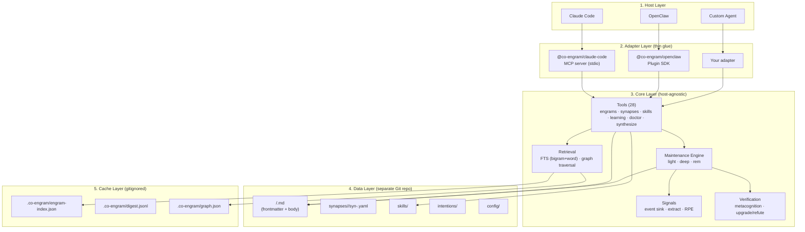

# Architecture

Co-Engram is built in five layers. Each layer has one job and communicates with adjacent layers through well-defined boundaries.

## Layered View



## Layer Responsibilities

### 1. Host Layer

The application that uses Co-Engram. Currently supported:

- **Claude Code** — desktop / CLI AI coding assistant
- **OpenClaw** — open-source agent gateway
- **Custom** — any TypeScript/JavaScript process that can call MCP or import `@co-engram/core` directly

### 2. Adapter Layer

Thin glue that translates between the host's protocol and the core API. Each adapter:

- Receives tool calls in host-specific format (MCP JSON-RPC, OpenClaw plugin API)
- Converts to core `ToolContext` and dispatches to the right `Tool.execute`
- Wraps the result back into host-specific format
- Optionally injects `signalSink` and starts the maintenance engine

**Hard rule:** adapters contain no business logic. If you find yourself writing memory rules in the adapter, it belongs in core.

### 3. Core Layer (`@co-engram/core`)

The heart of Co-Engram. Zero host dependencies — no `@modelcontextprotocol/sdk`, no `openclaw`, no MCP types.

Five sub-modules:

- **Tools** — 28 self-describing tools with Zod schemas, used by both MCP and plugin adapters
- **Retrieval** — in-memory inverted index over `digest.jsonl` (bigram tokenizer for CJK + word tokenizer for English), plus graph traversal via synapse edges
- **Maintenance Engine** — runs `light` / `deep` / `rem` stages on intervals (see [maintenance-engine.md](./maintenance-engine.md))
- **Signals** — collects `ToolCallEvent`s, extracts behavioral signals, computes RPE (prediction error)
- **Verification** — five-dimension truth scoring (cross-context / time-stable / mutually-supported / source-reliable / executable)

### 4. Data Layer

A **separate Git repository** at `$CO_ENGRAM_DATA_ROOT` (default: `~/team-memory`). This is the source of truth.

```
team-memory/
├── <domainTags>/              # Engram files organized by domain
│   └── <slug>.md              # One engram = one file (frontmatter + body)
├── synapses/                  # Per-edge synapse storage
│   └── <kind>/
│       └── syn-<hash>.yaml    # One edge = one file
├── skills/                    # Procedural memory
├── intentions/                # Pending intentions
└── config/                    # Repo-level config
```

**Why one file per engram?** See [design-rationale.md](./design-rationale.md). TL;DR: content diffs stay reviewable in Git while metadata evolves independently, and a ULID (decoupled from the file path) keeps synapse references stable across renames and moves.

### 5. Cache Layer

Gitignored `.co-engram/` inside the data repo. Derived artifacts:

- `engram-index.json` — fast ULID → entry lookup, drives `engram_doctor` incremental scans and `engram_list_paths`
- `digest.jsonl` — one-line-per-engram catalog used by the retrieval orchestrator; rebuilt when content hashes change
- `graph.json` — synapse graph snapshot for fast traversal
- `index.db` *(default since 0.2.0; opt-out via `CO_ENGRAM_SEARCH_ENGINE=memory`)* — SQLite-derived index (WAL + FTS5 trigram) for scaling to 5k+ engrams; see [Search Engine](#search-engine) below

Rebuildable at any time by deleting `.co-engram/` and triggering an incremental rebuild (e.g. via `engram_doctor` or restarting the host).

## Data Flow

### Write Path

```
Host tool call → Adapter → Tool.execute(ctx, input)
  → Zod validates input
  → Repository writes <domainTags>/<slug>.md (frontmatter + body)
  → Git commit
  → FTS index updated (async)
  → Return EngramRef to host
```

### Read Path

```
Host tool call → Adapter → engram_search
  → FTS query (bigram + word tokenizer)
  → Graph expansion (follow consolidates/extends edges)
  → Score by: relevance · recency · importance · reinforcementScore
  → Bump retrieval stats (effectiveRetrievals, lastRetrievalScore)
  → Return ranked EngramRef[]
```

### Maintenance Path

```
Every 5 min (light):
  drain signal sink → extract behavioral signals → RPE update
  → bump effectiveRetrievals / failedUses / reinforcementScore
  → auto-merge near-duplicate engrams (consolidates synapse)

Every 1 hour (deep):
  re-run light dreaming (extra consolidation pass)
  → apply Ebbinghaus decay to importance, archive/forget stragglers
  → sweep long-forgotten engrams into .trash/

Every 7 days (rem):
  run abstraction dreaming
  + metacognition 5-dim scoring
  → upgrade or refute verificationStatus
```

## Search Engine

<a id="search-engine"></a>

Co-Engram ships two interchangeable search backends behind the `SearchEngine` interface. Pick one with the `CO_ENGRAM_SEARCH_ENGINE` env var (default: `sqlite`).

### `sqlite` (default, scaling path)

Derived SQLite index at `.co-engram/index.db` (WAL mode, FTS5 trigram tokenizer). Designed for the 5k+ engram target. Default since 0.2.0 — at small scale (≤1k engrams) cold start is a few dozen ms and steady-state overhead is negligible; at large scale it stays sub-100ms where `memory` blows past 1s.

- **Filesystem stays the source of truth.** SQLite is purely derived — drop the file, run `engram_doctor` or just restart, and it gets rebuilt from `engrams/*.md` on cold start.
- **Write-through.** `EngramRepository.createEngram / updateEngram / deleteEngram / mutateFrontmatter` transparently upsert/delete the derived row after the file lands. SQLite write failures are fail-silent at the repository layer (file truth still wins; `engram_doctor` + cold start reconcile drift).
- **Recall parity with `memory`.** The LIKE fallback covers title + summary + content_tokens + domain tags for queries below the trigram minimum length (3 UTF-16 code units). At ≥3 chars, FTS5 trigram matches memory-FTS recall on the same text (Jaccard = 1.0 in the regression suite).
- **Cold start.** First launch against a non-empty repo triggers a one-shot full rebuild inside a single transaction. Hot start (db already has rows) is a no-op.
- **Concurrency.** WAL allows multiple reader processes alongside a single writer. Both host adapters (`claude-code-mcp`, `openclaw-plugin`) can mount the same `dataRoot` simultaneously.
- **Fail-safe fallback.** If SQLite is unavailable at boot time (Node < 22.17, file system permission error, schema corruption, disk full), `bootstrapRepositoryAndSearch` catches the error, logs `[co-engram] search engine: sqlite unavailable (...) falling back to memory`, and transparently degrades to the `memory` engine — host startup never crashes.
- **Node version requirement.** Uses the built-in `node:sqlite` module (stabilized in Node 22.17). The `engines.node` field in every package is pinned to `>=22.17.0`; older Node silently falls through to the `memory` fallback above.

### `memory` (opt-out)

In-process FTS over `digest.jsonl` lines. Tokenizer is bigram + word. Suitable for repos up to ~1k engrams — `digest.jsonl` is parsed on every `rebuildSearchIndex()` call, and the FTS index lives in heap.

- Zero disk footprint beyond `digest.jsonl`.
- Recomputed on every watcher invalidation (cheap at small scale).
- Set `CO_ENGRAM_SEARCH_ENGINE=memory` to opt out of SQLite — useful for embedded / read-only-fs / sandboxed deployments where the `index.db` side-effect is undesirable.

Unknown values fall back to `sqlite` (fail-safe toward the stronger engine — a typo never silently downgrades you to the less-scalable backend).

## Boundary Rules

1. **Host code never imports core internals directly** — only through adapter packages or the published `@co-engram/core` barrel.
2. **Adapters never add new tools** — they only expose existing core tools via host protocols.
3. **Core never reads host config** — all configuration is injected via `ToolContext` or constructor params.
4. **Data repo never contains executable code** — only Markdown / YAML / JSON. No `.ts`, no `.js`, no scripts.

## Extending Co-Engram

- **New host adapter** — copy `packages/claude-code-mcp/` as a starting point, swap the MCP SDK for your host's protocol
- **New tool** — add to `packages/core/src/tools/`, register in `tools/registry.ts`, declare in `openclaw.plugin.json` contracts.tools
- **New maintenance stage** — extend `MaintenanceEngine` with a new `run<Stage>` method, add to `DreamingScheduler`

See [CONTRIBUTING.md](../CONTRIBUTING.md) for the development workflow.
