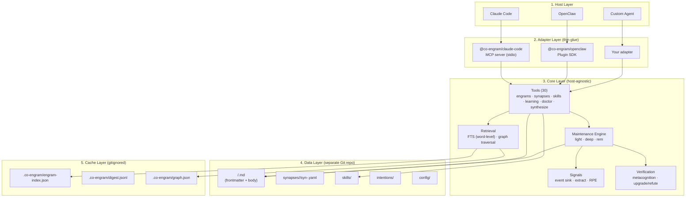

# 架构

Co-Engram 采用五层架构。每一层只负责一项职责,并通过清晰的边界与相邻层通信。

## 分层视图



## 各层职责

### 1. Host 层

使用 Co-Engram 的应用程序。当前支持:

- **Claude Code** — 桌面 / CLI AI 编码助手
- **OpenClaw** — 开源 agent 网关
- **Custom** — 任何能调用 MCP 或直接 import `@co-engram/core` 的 TypeScript/JavaScript 进程

### 2. Adapter 层

负责在宿主协议和 core API 之间进行转换的薄胶水层。每个 adapter 都会:

- 以宿主特定格式(MCP JSON-RPC、OpenClaw plugin API)接收工具调用
- 转换为 core 的 `ToolContext` 并分派到对应的 `Tool.execute`
- 将结果重新包装为宿主特定格式
- 可选地注入 `signalSink` 并启动维护引擎

**硬性规则:** adapter 不包含任何业务逻辑。如果你发现自己在 adapter 中写记忆规则,那它应该放在 core 中。

### 3. Core 层(`@co-engram/core`)

Co-Engram 的核心。零宿主依赖 — 不依赖 `@modelcontextprotocol/sdk`,不依赖 `openclaw`,不依赖任何 MCP 类型。

五个子模块:

- **Tools** — 30 个自描述工具,使用 Zod schema,被 MCP adapter 和 plugin adapter 共同使用
- **Retrieval** — 基于 `digest.jsonl` 的内存倒排索引(CJK 使用 Intl.Segmenter 词级分词器 + 英文使用 word 分词器),以及基于 synapse 边的图遍历
- **Maintenance Engine** — 按间隔运行 `light` / `deep` / `rem` 阶段(详见 [maintenance-engine](./maintenance-engine.zh-CN.md))
- **Signals** — 收集 `ToolCallEvent`,提取行为信号,计算 RPE(预测误差)
- **Verification** — 五维真值评分(跨上下文 / 时间稳定 / 相互支持 / 来源可靠 / 可执行)

### 4. Data 层

位于 `$CO_ENGRAM_DATA_ROOT`(默认为 `~/team-memory`)的**独立 Git 仓库**。这是唯一的事实来源。

```
team-memory/
├── <domainTags>/              # Engram files organized by domain
│   └── <slug>.md              # One engram = one file (frontmatter + body)
├── synapses/                  # Per-edge synapse storage
│   └── <kind>/
│       └── syn-<hash>.yaml    # One edge = one file
├── skills/                    # Procedural memory
├── intentions/                # Pending intentions
└── config/                    # Repo-level config
```

**为什么一个 engram 对应一个文件?** 详见 [design-rationale](./design-rationale.zh-CN.md)。简而言之:让内容 diff 在 Git 中保持可评审,同时让元数据独立演进,而 ULID(与文件路径解耦)保证 synapse 引用在重命名和移动后依然稳定。

### 5. Cache 层

数据仓库中被 gitignore 的 `.co-engram/` 目录。派生产物:

- `engram-index.json` — 快速的 ULID → entry 查找,驱动 `engram_doctor` 增量扫描和 `engram_list_paths`
- `digest.jsonl` — 检索编排器使用的每行一个 engram 的目录;在内容 hash 变化时重建
- `graph.json` — synapse 图快照,用于快速遍历
- `index.db` *(0.2.0 起默认;通过 `CO_ENGRAM_SEARCH_ENGINE=memory` opt-out)* — SQLite 派生索引(WAL + FTS5 trigram),用于规模化到 5k+ engram;详见下文[搜索引擎](#搜索引擎)

任何时候都可以通过删除 `.co-engram/` 并触发增量重建(如通过 `engram_doctor` 或重启宿主)来重建。

## 数据流

### 写入路径

```
Host tool call → Adapter → Tool.execute(ctx, input)
  → Zod validates input
  → Repository writes <domainTags>/<slug>.md (frontmatter + body)
  → Git commit
  → FTS index updated (async)
  → Return EngramRef to host
```

### 读取路径

```
Host tool call → Adapter → engram_search
  → FTS query (Intl.Segmenter word-level tokenizer)
  → Graph expansion (follow consolidates/extends edges)
  → Score by: relevance · recency · importance · reinforcementScore · access heat (hotness)
  → Bump retrieval stats (effectiveRetrievals, lastRetrievalScore)
  → Return ranked EngramRef[]
```

### 维护路径

```
Every 5 min (light):
  drain signal sink → extract behavioral signals → RPE update
  → bump effectiveRetrievals / failedUses / reinforcementScore
  → auto-merge near-duplicate engrams (consolidates synapse)

Every 1 hour (deep):
  re-run light dreaming (extra consolidation pass)
  → evaluate freshness decay (age vs halfLife); forget/archive stragglers by importance threshold
  → sweep long-forgotten engrams into .trash/

Every 1 day (rem):
  run abstraction dreaming
  + metacognition 5-dim scoring
  → generate rem-verification proposals (land only after user accepts in Proposals)
```

## 搜索引擎

<a id="搜索引擎"></a>

Co-Engram 在 `SearchEngine` 接口后面提供两个可互换的搜索后端。通过 `CO_ENGRAM_SEARCH_ENGINE` 环境变量切换(默认 `sqlite`)。

### `sqlite`(默认,规模化路径)

派生 SQLite 索引,位于 `.co-engram/index.db`(WAL 模式,FTS5 trigram 分词器)。为 5k+ engram 目标设计。0.2.0 起作为默认 —— 小规模(≤1k engram)冷启动几十毫秒、稳态开销可忽略;大规模下保持百毫秒级延迟,而 `memory` 在同等规模会突破 1 秒。

- **文件系统始终是真理源。** SQLite 完全是派生数据 —— 删掉文件、运行 `engram_doctor`、或直接重启,都会在冷启动时从 `engrams/*.md` 全量重建。
- **Write-through。** `EngramRepository.createEngram / updateEngram / deleteEngram / mutateFrontmatter` 在文件落盘成功后,透明地把派生行 upsert/delete 到 SQLite。SQLite 写失败在 repository 层是 fail-silent(文件真理仍生效;`engram_doctor` + 冷启动会修复漂移)。
- **召回率与 `memory` 持平。** 对于短于 trigram 最小长度(3 UTF-16 码元)的查询,LIKE 回退覆盖 title + summary + content_tokens + domain 标签。≥3 字符时,FTS5 trigram 在相同文本上的召回与 memory-FTS 一致(回归套件 Jaccard = 1.0)。
- **冷启动。** 首次启动且仓库非空时,会在单个事务内触发一次性全量重建。热启动(db 已有行)是 no-op。
- **并发。** WAL 允许多个 reader 进程加单个 writer 并存。两个宿主适配器(`claude-code-mcp`、`openclaw-plugin`)可以同时挂载同一个 `dataRoot`。
- **Fail-safe 回退。** 启动时若 SQLite 不可用(Node < 22.17、文件系统权限错误、schema 损坏、磁盘满),`bootstrapRepositoryAndSearch` 会捕获错误,打印 `[co-engram] search engine: sqlite unavailable (...) falling back to memory`,然后透明地降级到 `memory` 引擎 —— 宿主启动永远不会崩溃。
- **Node 版本要求。** 使用内置的 `node:sqlite` 模块(Node 22.17 起稳定)。每个包的 `engines.node` 字段都收紧到 `>=22.17.0`;旧版本 Node 会通过上面的 fail-safe 静默落到 `memory`。

### `memory`(opt-out)

进程内 FTS,基于 `digest.jsonl` 行。分词器是 Intl.Segmenter 词级(CJK)+ word(英文)。适用于仓库规模 ≤ ~1k engram —— 每次 `rebuildSearchIndex()` 都要重新解析 `digest.jsonl`,FTS 索引驻留在堆内存。

- 除 `digest.jsonl` 外零磁盘占用。
- 每次 watcher 失效都重新计算(小规模下代价低)。
- 设置 `CO_ENGRAM_SEARCH_ENGINE=memory` 显式 opt-out SQLite —— 适用于嵌入式 / 只读 fs / 沙箱部署等不希望产生 `index.db` 副作用的场景。

未知值回退到 `sqlite`(fail-safe 走向更强引擎 —— 拼错也不会让你意外降级到不 scale 的后端)。

## 边界规则

1. **Host 代码绝不直接 import core 内部实现** — 只能通过 adapter 包或已发布的 `@co-engram/core` barrel。
2. **Adapter 绝不新增工具** — 它们只能通过宿主协议暴露已有的 core 工具。
3. **Core 绝不读取宿主配置** — 所有配置都通过 `ToolContext` 或构造参数注入。
4. **数据仓库绝不包含可执行代码** — 只有 Markdown / YAML / JSON。没有 `.ts`,没有 `.js`,没有脚本。

## 扩展 Co-Engram

- **新增宿主 adapter** — 以 `packages/claude-code-mcp/` 为起点复制一份,把 MCP SDK 换成你的宿主协议
- **新增工具** — 添加到 `packages/core/src/tools/`,在 `tools/registry.ts` 中注册,并在 `openclaw.plugin.json` 的 contracts.tools 中声明
- **新增维护阶段** — 为 `MaintenanceEngine` 扩展一个新的 `run<Stage>` 方法,并加入 `DreamingScheduler`

开发流程详见 [CONTRIBUTING](../CONTRIBUTING.md)。
