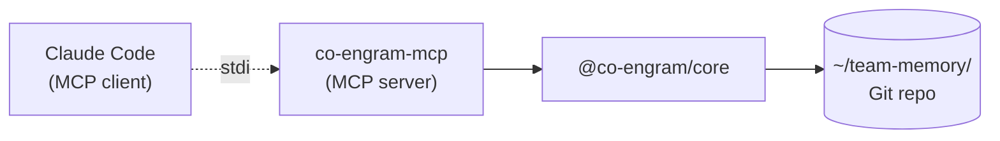

# Claude Code Integration (MCP)

Co-Engram integrates with Claude Code via the **Model Context Protocol** (MCP) — Anthropic's open standard for connecting AI applications to external tools.

## How It Works



- Claude Code spawns the `co-engram-mcp` binary as a child process
- Communication is over stdio (JSON-RPC 2.0)
- The MCP server loads `@co-engram/core`, wires up tools, optionally starts the maintenance engine
- Tools are exposed as `mcp__co-engram__<tool_name>` in the Claude Code session

## Installation

### Option A: Global install (recommended)

```bash
npm install -g @co-engram/claude-code
```

Pros: fast startup (package already on disk), `co-engram-mcp` on PATH.
Cons: manual updates (`npm update -g @co-engram/claude-code`).

### Option B: Zero-install via npx

No install step. Each cold start fetches the package.

```bash
# When wiring with claude mcp add:
... -- npx -y @co-engram/claude-code
```

Pros: always latest, no disk footprint.
Cons: ~2s penalty on first run of each session.

## Wiring

Run `claude mcp add` once. This stores the config in your Claude Code user config.

### Minimal (no maintenance engine)

```bash
claude mcp add co-engram \
  -e CO_ENGRAM_DATA_ROOT=$HOME/team-memory \
  --scope user \
  -- co-engram-mcp
```

### Full (with auto-maintenance)

```bash
claude mcp add co-engram \
  -e CO_ENGRAM_DATA_ROOT=$HOME/team-memory \
  -e CO_ENGRAM_DEFAULT_CREATED_BY=$USER \
  -e CO_ENGRAM_MAINTENANCE=1 \
  -e CO_ENGRAM_MAINTENANCE_ENABLED_STAGES=light,deep,rem \
  --scope user \
  -- co-engram-mcp
```

### npx variant

Replace `-- co-engram-mcp` with `-- npx -y @co-engram/claude-code`.

## Scope

The `--scope` flag controls where the config lives:

| Scope                         | File                        | Visibility                        |
| ----------------------------- | --------------------------- | --------------------------------- |
| `user` (default for this doc) | `~/.claude.json`            | All your Claude Code sessions     |
| `project`                     | `.mcp.json` in project root | Anyone cloning the repo           |
| `local`                       | project-local               | Only this project on your machine |

For team-shared config, use `project` and commit `.mcp.json`.

## Verifying

```bash
# From shell — check connection
claude mcp list

# From Claude Code session — check tools loaded
/mcp
```

Expected:

```
co-engram: ✓ Connected
  Tools: 19    # standard profile (default); use CO_ENGRAM_TOOLS_PROFILE=minimal|full to change
```

## Environment Variables

All optional. See the [Configuration section of the main README](../README.md#configuration) for the full table.

Key ones:

- `CO_ENGRAM_DATA_ROOT` — **must be absolute path** to the data Git repo
- `CO_ENGRAM_DEFAULT_CREATED_BY` — default value for `engram_create.createdBy` / `synapse_create.createdBy` when the caller omits it. Priority: this env var > `team-memory.json`'s `defaultCreatedBy` field (written by `co-engram init`) > **local git identity (`user.name` → `user.email`)** > final fallback `'unknown'`. Set this to your username/email if you want to override the auto-detected git identity.
- `CO_ENGRAM_MAINTENANCE=1` — enable the maintenance engine
- `CO_ENGRAM_MAINTENANCE_LEARNING_RATE` — RPE learning rate (default 0.1)
- `CO_ENGRAM_PROPOSALS_ENABLED=1` — enable implicit memory proposals
- `ANTHROPIC_API_KEY` — Claude API key used by the proposal engine's Layer 2 necessity evaluator. Usually already set in the Claude Code environment; the adapter auto-detects it. When unset, Layer 2 falls back to the rule-based evaluator (zero LLM cost). See [observability two-layer filtering](./observability.md#proposal-engine).
- `CO_ENGRAM_VIEWER_ENABLED=1` — start the web viewer at `http://127.0.0.1:18799`
- `CO_ENGRAM_LANGUAGE` — language for tool descriptions / viewer / prompts (`en` | `zh`; default `en` or persisted team-memory config)
- `CO_ENGRAM_TOOLS_PROFILE` — tool surface for the LLM: `minimal` (12 tools — 8 core read/write + 3 proposal triage + `engram_sync`, so the maintenance engine's auto-generated candidates can always be closed-loop handled), `standard` (19, default — adds learning loop, contradiction, self-healing, progressive disclosure, LLM synthesis, audit query), `full` (29, includes admin + internal management tools). Counts are derived from `PROFILE_TOOL_COUNTS` in source via `.size`, so they cannot silently drift. Invalid values warn and fall back to `standard`.

## Web Viewer

The viewer is a loopback-only HTTP server that lets you browse the data repo in a browser. Off by default. Enable with:

```bash
claude mcp add co-engram \
  -e CO_ENGRAM_DATA_ROOT=$HOME/team-memory \
  -e CO_ENGRAM_VIEWER_ENABLED=1 \
  -e CO_ENGRAM_VIEWER_TOKEN=mysecret \
  --scope user \
  -- co-engram-mcp
```

Then open `http://127.0.0.1:18799` in your browser. If you set a token, the browser will prompt for it.

> **`viewer.port` persisted config is deprecated.** If `port` is set in `~/team-memory/.co-engram/config.json`'s `viewer` block, the server prints a one-line warning at startup because the two hosts (Claude Code + OpenClaw) share that persisted config and would otherwise collide. Prefer the env var `CO_ENGRAM_VIEWER_PORT`. The persisted value still works as a fallback for this release.

Endpoints: see [observability.md](./observability.md#viewer).

### Memory Proposals

Proposals are implicit candidates — topics the engine noticed recurring in conversation but haven't been recorded yet. Off by default. Enable with `CO_ENGRAM_PROPOSALS_ENABLED=1`.

When enabled, the engine applies **two-layer filtering** to suppress mechanical noise and evaluate necessity (see [observability two-layer filtering](./observability.md#proposal-engine)):

- **Layer 1**: prefilter at `observe()` entry rejects system/empty/short/trivial/low-density messages
- **Layer 2**: before cluster promotion, rule-based evaluator (5 rules) + optional LLM semantic judgment

The LLM evaluator uses Anthropic Messages API and auto-detects env `ANTHROPIC_API_KEY` with default model `claude-haiku-4-5-20251001`. You can also configure `necessityLlm` explicitly in `~/.co-engram/config.json` (supports custom endpoint / model / apiKey / headers). LLM call failures (network / timeout / parse error) automatically fall back to the rule-based evaluator, with reason prefixed `[llm-unavailable, rule-fallback] ...`.

When enabled and a session starts with pending proposals, the MCP server emits a log message via `notifications/message`:

```
[co-engram] 3 memory candidates pending (topics seen ≥3 times but not recorded).
Use `engram_list_proposals` to view, `engram_accept_proposal` to record,
or `engram_dismiss_proposal` to ignore.
```

Claude Code surfaces this in the session banner. The LLM can then triage with the three proposal tools.

### Auto-Memory Sync (Claude Code → Co-Engram)

Claude Code maintains its own auto-memory under `~/.claude/projects/<encoded-cwd>/memory/*.md` (typed: `user` / `feedback` / `project` / `reference` / `pattern`). Co-Engram watches this directory and **mirrors every memory into the team repo as an engram**, so insights the host already captured don't have to be re-typed via `engram_create`.

**On by default** (low-friction). Disable with:

```bash
claude mcp add co-engram \
  -e CO_ENGRAM_AUTO_MEMORY_SYNC=0 \
  -- co-engram-mcp
```

Or in `~/.co-engram/config.json`:

```json
{ "autoMemorySync": { "enabled": false } }
```

How it works:

- On startup, scans every project's `memory/` directory under `~/.claude/projects/` and bulk-syncs existing files
- A `fs.watch` watcher picks up new/updated `.md` files in real time (debounced 500ms)
- Each memory becomes an engram with:
  - `domainTag` `claude-code-auto-memory` (filterable in `engram_search`)
  - `encodingContext` `claude-code-auto-memory:<slug>` (idempotency key)
- Type mapping: `pattern` → `pattern`, `feedback` / `user` → `observation`, `project` / `reference` → `fact`
- Renaming or rewriting a memory in Claude Code → existing engram's `content` is updated (stats preserved)
- `MEMORY.md` (the index file) is intentionally skipped

Watch for this log line at MCP startup to confirm it's running:

```
[co-engram] auto-memory sync: watching /home/you/.claude/projects (initial: 12 files, 5 created, 0 updated)
```

OpenClaw doesn't have an equivalent auto-memory writer, so this subsystem is **claude-code-mcp only** — the openclaw-plugin does not start it.

## Project-Local Config (`.mcp.json`)

For team-shared Co-Engram setups, drop a `.mcp.json` in the project root:

```json
{
  "mcpServers": {
    "co-engram": {
      "command": "npx",
      "args": ["-y", "@co-engram/claude-code"],
      "env": {
        "CO_ENGRAM_DATA_ROOT": "${workspaceFolder}/.team-memory",
        "CO_ENGRAM_MAINTENANCE": "1"
      }
    }
  }
}
```

Commit it to share with teammates.

## Restarting

MCP servers are loaded at Claude Code startup. If you change env vars:

```bash
claude mcp remove co-engram -s user
# re-add with new env
claude mcp add co-engram -e NEW=VALUE ... -- co-engram-mcp
```

Or just edit `~/.claude.json` directly and restart Claude Code.

## Troubleshooting

See [quickstart.md → Troubleshooting](./quickstart.md#troubleshooting) for common issues.
