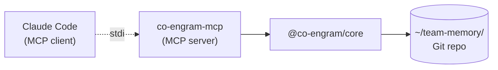

# Claude Code 集成(MCP)

Co-Engram 通过 **Model Context Protocol**(MCP)—— Anthropic 推出的、用于将 AI 应用接入外部工具的开放标准 —— 与 Claude Code 集成。

## 工作原理



- Claude Code 将 `co-engram-mcp` 二进制作为子进程启动
- 通过 stdio(JSON-RPC 2.0)通信
- MCP server 加载 `@co-engram/core`,装配好各工具,可选启动维护引擎
- 工具在 Claude Code 会话中以 `mcp__co-engram__<tool_name>` 的形式暴露
- MCP initialize 时向系统提示确定性注入**团队技能清单**(每个 skill 的 skillId + SKILL.md 原生 description,按效用排序,最多 10 条);`retentionStage` 为 `forgotten` 的过期技能不注入,随维护引擎的衰退重算自动进出清单

> **单进程 daemon 模式(2026-07 起为默认)。** 每次 `co-engram-mcp` 启动会 thin-launch 到一个共享的常驻 **daemon** —— 同一 data root 上所有 Claude Code 会话复用同一个 `ToolContext` —— 因此第二个会话起跳过冷启动。daemon 空闲 30 分钟自动退出。设 `CO_ENGRAM_DAEMON=0` 回退到每会话一进程;daemon 启动 / 连接失败也会透明回退到 in-process 路径。仅 Claude Code 受影响 —— OpenClaw 不变。详见[环境变量](#环境变量)。

## 安装

### 方案 A:全局安装(推荐)

```bash
npm install -g @co-engram/claude-code
```

优点:启动快(包已在磁盘上),`co-engram-mcp` 在 PATH 中。
缺点:需手动更新(`npm update -g @co-engram/claude-code`)。

### 方案 B:通过 npx 免安装

无需安装步骤。每次冷启动都会拉取该包。

```bash
# 使用 claude mcp add 接入时:
... -- npx -y @co-engram/claude-code
```

优点:始终为最新版本,无磁盘占用。
缺点:每个会话首次运行有约 2 秒延迟。

## 接入

执行一次 `claude mcp add` 即可。这会将配置保存到你的 Claude Code 用户配置中。

### 最小配置(不含维护引擎)

```bash
claude mcp add co-engram \
  -e CO_ENGRAM_DATA_ROOT=$HOME/team-memory \
  --scope user \
  -- co-engram-mcp
```

### 完整配置(含自动维护)

```bash
claude mcp add co-engram \
  -e CO_ENGRAM_DATA_ROOT=$HOME/team-memory \
  -e CO_ENGRAM_DEFAULT_CREATED_BY=$USER \
  -e CO_ENGRAM_MAINTENANCE=1 \
  -e CO_ENGRAM_MAINTENANCE_ENABLED_STAGES=light,deep,rem \
  --scope user \
  -- co-engram-mcp
```

### npx 变体

将 `-- co-engram-mcp` 替换为 `-- npx -y @co-engram/claude-code`。

## 作用域

`--scope` 标志控制配置存放位置:

| 作用域             | 文件                       | 可见范围                  |
| ------------------ | -------------------------- | ------------------------- |
| `user`(本文档默认) | `~/.claude.json`           | 你的所有 Claude Code 会话 |
| `project`          | 项目根目录下的 `.mcp.json` | 任何 clone 该仓库的人     |
| `local`            | 项目本地                   | 仅本机上的此项目          |

如需团队共享配置,请使用 `project` 并提交 `.mcp.json`。

## 验证

```bash
# 从 shell 检查连接
claude mcp list

# 从 Claude Code 会话中检查工具是否加载
/mcp
```

预期结果:

```
co-engram: ✓ Connected
  Tools: 19    # standard 配置(默认);使用 CO_ENGRAM_TOOLS_PROFILE=minimal|full 切换
```

## 环境变量

均为可选。完整表格见 [README 的 Configuration 章节](../README.md#configuration)。

关键项:

- `CO_ENGRAM_DATA_ROOT` —— 数据 Git 仓库的**绝对路径**
- `CO_ENGRAM_DEFAULT_CREATED_BY` —— `createdBy` 的兜底值(2026-07:`engram_create` / `synapse_create` / `engram_accept_proposal` 等**已忽略 LLM 传入的 `createdBy`**,防止自填 host 标识如 `"claude-code"`)。解析链:**本机 git 身份(`user.name` → `user.email`)** > `team-memory.json` 的 `defaultCreatedBy` 字段(由 `co-engram init` 写入)> 此环境变量 > 最终回退 `'unknown'`。git 是权威源;此 env 仅在 git 不可用时作为逃生口。
- `CO_ENGRAM_MAINTENANCE=1` —— 启用维护引擎
- `CO_ENGRAM_MAINTENANCE_LEARNING_RATE` —— RPE 学习率(默认 0.1)
- `CO_ENGRAM_PROPOSALS_ENABLED=1` —— 启用隐式记忆候选(proposals)
- `ANTHROPIC_API_KEY` —— proposal engine Layer 2 必要性评估用的 Claude API key。Claude Code 环境通常已配置,适配器会自动读取。不配置时 Layer 2 走规则版评估器(零 LLM 成本)。详见 [observability 双层过滤](./observability.zh-CN.md#proposal-引擎)。
- `CO_ENGRAM_VIEWER_ENABLED=1` —— 在 `http://127.0.0.1:18899` 启动 web 查看器
- `CO_ENGRAM_LANGUAGE` —— 工具描述/查看器/提示词所用语言(`en` | `zh`;默认 `en` 或已持久化的 team-memory 配置)
- `CO_ENGRAM_TOOLS_PROFILE` —— 暴露给 LLM 的工具集合:`minimal`(12 个 —— 8 个核心读/写 + 3 个 proposal 处理 + `engram_sync`,确保维护引擎自动生成的候选始终能闭环)、`standard`(19 个,默认 —— 加上学习回路、contradiction、自愈、渐进式披露、LLM 综合与审计查询)、`full`(29 个,包含管理类 + 内部管理工具)。数值由源码中的 `PROFILE_TOOL_COUNTS` 经 `.size` 自动算出,不会静默漂移。无效值会告警并退为 `standard`。
- `CO_ENGRAM_DAEMON` —— 单进程 daemon 模式(默认 `1`):每个 Claude Code 会话连接到一个共享的常驻 daemon(同一 data root 上所有会话复用同一个 `ToolContext`)。设为 `0` 回退到每会话一进程;daemon 启动 / 连接失败也会透明回退。仅 Claude Code 受影响;OpenClaw 忽略。
- `CO_ENGRAM_DAEMON_IDLE_TIMEOUT_MS` —— daemon 在无客户端连接超过此值时自动退出(默认 `1800000` = 30 分钟)。
- `CO_ENGRAM_DAEMON_SOCKET_DIR` —— daemon 的 unix socket 文件目录(默认 `<tmpdir>/co-engram`)。

## Web 查看器

查看器是一个仅限 loopback 的 HTTP server,允许你在浏览器中浏览数据仓库。默认关闭。启用方式:

```bash
claude mcp add co-engram \
  -e CO_ENGRAM_DATA_ROOT=$HOME/team-memory \
  -e CO_ENGRAM_VIEWER_ENABLED=1 \
  -e CO_ENGRAM_VIEWER_TOKEN=mysecret \
  --scope user \
  -- co-engram-mcp
```

然后在浏览器中打开 `http://127.0.0.1:18899`。若设置了 token,浏览器会提示输入。

> **`viewer.port` 持久化配置已废弃。** 如果 `~/team-memory/.co-engram/config.json` 的 `viewer` 块里设了 `port`,server 启动时会打印一行警告 —— 因为两个宿主(Claude Code + OpenClaw)共享这份持久化配置,留 `port` 字段会冲突。建议改用环境变量 `CO_ENGRAM_VIEWER_PORT`。本次启动仍会以持久化值为准。

端点详情见 [observability.md](./observability.zh-CN.md#viewer)。

### 记忆候选(Proposals)

候选是隐式条目 —— 引擎注意到在对话中反复出现、但尚未被记录的主题。默认关闭,通过 `CO_ENGRAM_PROPOSALS_ENABLED=1` 启用。

启用后,引擎通过**双层过滤**挡住机械噪音 + 评估必要性(详见 [observability 双层过滤机制](./observability.zh-CN.md#proposal-引擎)):

- **Layer 1**:`observe()` 入口预过滤,挡 system/空/短/trivial/低密度消息
- **Layer 2**:cluster 晋升前,默认规则版评估(5 条规则)+ 可选 LLM 语义判断

LLM 评估器用 Anthropic Messages API,自动读取 env `ANTHROPIC_API_KEY` + 默认模型 `claude-haiku-4-5-20251001`。也可在 `~/.co-engram/config.json` 中显式配置 `necessityLlm`(支持自定义 endpoint / model / apiKey / headers)。LLM 调用失败(网络/超时/解析错)自动 fallback 到规则版,reason 标 `[llm-unavailable, rule-fallback] ...`。

启用后,若会话启动时存在待处理候选,MCP server 会通过 `notifications/message` 发出一条日志消息:

```
[co-engram] 3 memory candidates pending (topics seen ≥3 times but not recorded).
Use `engram_list_proposals` to view, `engram_accept_proposal` to record,
or `engram_dismiss_proposal` to ignore.
```

Claude Code 会在会话 banner 中显示此消息。随后 LLM 可借助三个候选工具进行分诊处理。

### Auto-Memory 同步(Claude Code → Co-Engram Proposal)

Claude Code 在 `~/.claude/projects/<encoded-cwd>/memory/*.md` 下维护它自己的 auto-memory(类型:`user` / `feedback` / `project` / `reference` / `pattern`)。加载 co-engram 后,LLM 系统提示(`## 唯一记忆系统` 章节)+ `engram_create` 工具说明**引导 agent 直接调 `engram_create`** —— auto-memory 作为未接入 co-engram 原生工具的 agent 的兜底入口。无论从哪个入口写入,co-engram 都会监听该目录,**把每个文件镜像成团队仓库里的待审批 proposal(候选)** —— 而不是直接生成 engram。用户(或 LLM)随后通过 `engram_list_proposals` / `engram_accept_proposal` / `engram_dismiss_proposal` 分诊,与对话聚类 proposal 走的是同一条审批路径。这样 auto-memory 与其他捕获入口一视同仁,必须经过审批才能入库。

**默认开启**(开箱即用)。关闭方式:

```bash
claude mcp add co-engram \
  -e CO_ENGRAM_AUTO_MEMORY_SYNC=0 \
  -- co-engram-mcp
```

或在 `~/.co-engram/config.json` 里:

```json
{ "autoMemorySync": { "enabled": false } }
```

工作原理:

- 启动时扫 `~/.claude/projects/` 下每个项目的 `memory/` 子目录,批量同步已存在的文件
- `fs.watch` 监听器实时捕获新写入/更新的 `.md` 文件(去抖 500ms)
- 每条记忆变为一个 pending proposal(entityId 为 `am:<slug>`),自带预填 payload:
  - `domainTag` `claude-code-auto-memory`(accept 后可在 `engram_search` 里过滤)
  - `encodingContext` `claude-code-auto-memory:<slug>`(幂等键)
  - `source` `auto-memory`(区别于 `conversation` 聚类来源)
- 类型映射:`pattern` → `pattern`、`feedback` / `user` → `observation`、`project` / `reference` → `fact`
- 通过 `engram_accept_proposal({ entityId: "am:<slug>" })` 创建 engram(无需重复填 title/content —— proposal 已自带)
- 在 Claude Code 里编辑一条 memory → 对应 proposal 的 payload 被更新(替换原 pending proposal);已 accept 过的 proposal 不会被重开
- `MEMORY.md`(索引文件)有意跳过

MCP 启动时如果看到这行日志,说明 watcher 正在跑:

```
[co-engram] auto-memory sync: watching /home/you/.claude/projects (initial: 12 files, 5 proposed, 0 updated)
```

OpenClaw 没有等价的 auto-memory 写入器,所以本子系统**仅 claude-code-mcp 启动** —— openclaw-plugin 不会启动它。

### 外部 Markdown 提案(dataRoot `.md` → Co-Engram Proposal)

除了 Claude Code 的 auto-memory 目录,watcher 同时监听 data root 本身。**任何丢进 `CO_ENGRAM_DATA_ROOT` 的 `.md` 文件** —— 手写笔记、导出文档、从其他机器同步过来的文件 —— 都会被捕获并转成 pending proposal,绝不会被静默忽略。

- 文件已带合法 engram frontmatter(`title` + `kind`)→ 直接从 frontmatter 生成 proposal。
- **裸 `.md`**(无 frontmatter,或 frontmatter 缺 `title` / `kind`)→ 引擎先自动提取缺失字段再提案:
  - **`ANTHROPIC_API_KEY` 可用**(Claude Code 默认):走 LLM 智能抽取 `title` / `kind` / `domainTags` / `summary`。
  - **LLM 不可用或失败**:规则版降级 —— 首行 H1 或文件名 → `title`、`kind = observation`、`domainTags = ["imported"]`。

提案带 `source: "external-markdown"`(区别于 `conversation` 与 `auto-memory`),payload 已预填,可用 `engram_list_proposals` / `engram_accept_proposal` 分诊,或用 `engram_accept_proposals_by_source({ source: "external-markdown" })` 批量入库。提取为异步 fire-and-forget,不会阻塞 watcher。

与 auto-memory 同步不同,该子系统位于 `@co-engram/core`,**两个宿主共用**(Claude Code 与 OpenClaw)。提取细节见 [observability 双层过滤机制](./observability.zh-CN.md#proposal-引擎)。

## 自动同步生命周期

data root 是一个 Git 仓库,Claude Code 宿主会自动与远端保持同步 —— 例行的跨机更新无需手动调 `engram_sync`。

**启动时**(MCP server —— 或 daemon 模式下的共享 daemon —— 启动时):

- `git pull --no-edit`(30 秒超时)拉取远端的他人变更。
- merge driver 自动解决 YAML 冲突,无需干预。
- 无远端 / 无网络 / 已是最新时静默跳过(不打印日志)。

**退出时**(会话结束,或 daemon 空闲超时退出前):

1. `git commit`(自动)—— 若本会话有记忆变更,提交之。
2. `git push`(30 秒超时)—— 推送新 commit 到远端。
3. push 失败仅打印警告,不阻塞退出 —— 下次启动的 `git pull` 会补同步。

如需按需控制(自定义 commit message、`dryRun`、冲突复核、Gerrit review 回退),显式调 `engram_sync` —— 见 [README → 保存并同步到远端](../README.zh.md#保存并同步到远端-engram_sync)。两条路径互补:自动生命周期负责日常流量,`engram_sync` 是手动 override。

## 项目本地配置(`.mcp.json`)

对于团队共享的 Co-Engram 配置,在项目根目录放置一个 `.mcp.json`:

```json
{
  "mcpServers": {
    "co-engram": {
      "command": "npx",
      "args": ["-y", "@co-engram/claude-code"],
      "env": {
        "CO_ENGRAM_DATA_ROOT": "${workspaceFolder}/.team-memory",
        "CO_ENGRAM_MAINTENANCE": "1"
      }
    }
  }
}
```

提交后即可与团队成员共享。

## 重启

MCP server 在 Claude Code 启动时加载。若修改了环境变量:

```bash
claude mcp remove co-engram -s user
# 用新的环境变量重新添加
claude mcp add co-engram -e NEW=VALUE ... -- co-engram-mcp
```

或者直接编辑 `~/.claude.json` 并重启 Claude Code。

## 故障排查

常见问题见 [quickstart.md → 故障排查](./quickstart.zh-CN.md#troubleshooting)。
