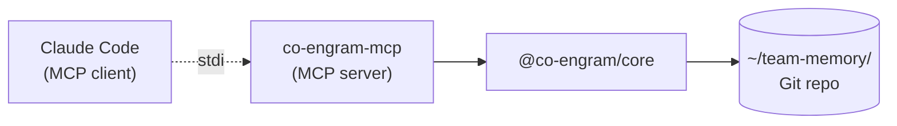

# Claude Code 集成(MCP)

Co-Engram 通过 **Model Context Protocol**(MCP)—— Anthropic 推出的、用于将 AI 应用接入外部工具的开放标准 —— 与 Claude Code 集成。

## 工作原理



- Claude Code 将 `co-engram-mcp` 二进制作为子进程启动
- 通过 stdio(JSON-RPC 2.0)通信
- MCP server 加载 `@co-engram/core`,装配好各工具,可选启动维护引擎
- 工具在 Claude Code 会话中以 `mcp__co-engram__<tool_name>` 的形式暴露

## 安装

### 方案 A:全局安装(推荐)

```bash
npm install -g @co-engram/claude-code
```

优点:启动快(包已在磁盘上),`co-engram-mcp` 在 PATH 中。
缺点:需手动更新(`npm update -g @co-engram/claude-code`)。

### 方案 B:通过 npx 免安装

无需安装步骤。每次冷启动都会拉取该包。

```bash
# 使用 claude mcp add 接入时:
... -- npx -y @co-engram/claude-code
```

优点:始终为最新版本,无磁盘占用。
缺点:每个会话首次运行有约 2 秒延迟。

## 接入

执行一次 `claude mcp add` 即可。这会将配置保存到你的 Claude Code 用户配置中。

### 最小配置(不含维护引擎)

```bash
claude mcp add co-engram \
  -e CO_ENGRAM_DATA_ROOT=$HOME/team-memory \
  --scope user \
  -- co-engram-mcp
```

### 完整配置(含自动维护)

```bash
claude mcp add co-engram \
  -e CO_ENGRAM_DATA_ROOT=$HOME/team-memory \
  -e CO_ENGRAM_DEFAULT_CREATED_BY=$USER \
  -e CO_ENGRAM_MAINTENANCE=1 \
  -e CO_ENGRAM_MAINTENANCE_ENABLED_STAGES=light,deep,rem \
  --scope user \
  -- co-engram-mcp
```

### npx 变体

将 `-- co-engram-mcp` 替换为 `-- npx -y @co-engram/claude-code`。

## 作用域

`--scope` 标志控制配置存放位置:

| 作用域             | 文件                       | 可见范围                  |
| ------------------ | -------------------------- | ------------------------- |
| `user`(本文档默认) | `~/.claude.json`           | 你的所有 Claude Code 会话 |
| `project`          | 项目根目录下的 `.mcp.json` | 任何 clone 该仓库的人     |
| `local`            | 项目本地                   | 仅本机上的此项目          |

如需团队共享配置,请使用 `project` 并提交 `.mcp.json`。

## 验证

```bash
# 从 shell 检查连接
claude mcp list

# 从 Claude Code 会话中检查工具是否加载
/mcp
```

预期结果:

```
co-engram: ✓ Connected
  Tools: 16    # standard 配置(默认);使用 CO_ENGRAM_TOOLS_PROFILE=minimal|full 切换
```

## 环境变量

均为可选。完整表格见 [README 的 Configuration 章节](../README.md#configuration)。

关键项:

- `CO_ENGRAM_DATA_ROOT` —— 数据 Git 仓库的**绝对路径**
- `CO_ENGRAM_DEFAULT_CREATED_BY` —— 当调用方未提供时,`engram_create.createdBy` / `synapse_create.createdBy` 的默认值。优先级:此环境变量 > `team-memory.json` 的 `defaultCreatedBy` 字段(由 `co-engram init` 写入)> **本机 git 身份(`user.name` → `user.email`)** > 最终回退为 `'unknown'`。若你想覆盖自动探测的 git 身份,可显式设为用户名/邮箱。
- `CO_ENGRAM_MAINTENANCE=1` —— 启用维护引擎
- `CO_ENGRAM_MAINTENANCE_LEARNING_RATE` —— RPE 学习率(默认 0.1)
- `CO_ENGRAM_PROPOSALS_ENABLED=1` —— 启用隐式记忆候选(proposals)
- `ANTHROPIC_API_KEY` —— proposal engine Layer 2 必要性评估用的 Claude API key。Claude Code 环境通常已配置,适配器会自动读取。不配置时 Layer 2 走规则版评估器(零 LLM 成本)。详见 [observability 双层过滤](./observability.zh-CN.md#proposal-引擎)。
- `CO_ENGRAM_VIEWER_ENABLED=1` —— 在 `http://127.0.0.1:18799` 启动 web 查看器
- `CO_ENGRAM_LANGUAGE` —— 工具描述/查看器/提示词所用语言(`en` | `zh`;默认 `en` 或已持久化的 team-memory 配置)
- `CO_ENGRAM_TOOLS_PROFILE` —— 暴露给 LLM 的工具集合:`minimal`(11 个 —— 8 个核心读/写 + 3 个 proposal 处理,确保维护引擎自动生成的候选始终能闭环)、`standard`(16 个,默认 —— 加上学习回路、contradiction、自愈与渐进式披露)、`full`(27 个,包含管理类 + 内部管理工具)。无效值会告警并回退为 `standard`。

## Web 查看器

查看器是一个仅限 loopback 的 HTTP server,允许你在浏览器中浏览数据仓库。默认关闭。启用方式:

```bash
claude mcp add co-engram \
  -e CO_ENGRAM_DATA_ROOT=$HOME/team-memory \
  -e CO_ENGRAM_VIEWER_ENABLED=1 \
  -e CO_ENGRAM_VIEWER_TOKEN=mysecret \
  --scope user \
  -- co-engram-mcp
```

然后在浏览器中打开 `http://127.0.0.1:18799`。若设置了 token,浏览器会提示输入。

端点详情见 [observability.md](./observability.zh-CN.md#viewer)。

### 记忆候选(Proposals)

候选是隐式条目 —— 引擎注意到在对话中反复出现、但尚未被记录的主题。默认关闭,通过 `CO_ENGRAM_PROPOSALS_ENABLED=1` 启用。

启用后,引擎通过**双层过滤**挡住机械噪音 + 评估必要性(详见 [observability 双层过滤机制](./observability.zh-CN.md#proposal-引擎)):

- **Layer 1**:`observe()` 入口预过滤,挡 system/空/短/trivial/低密度消息
- **Layer 2**:cluster 晋升前,默认规则版评估(5 条规则)+ 可选 LLM 语义判断

LLM 评估器用 Anthropic Messages API,自动读取 env `ANTHROPIC_API_KEY` + 默认模型 `claude-haiku-4-5-20251001`。也可在 `~/.co-engram/config.json` 中显式配置 `necessityLlm`(支持自定义 endpoint / model / apiKey / headers)。LLM 调用失败(网络/超时/解析错)自动 fallback 到规则版,reason 标 `[llm-unavailable, rule-fallback] ...`。

启用后,若会话启动时存在待处理候选,MCP server 会通过 `notifications/message` 发出一条日志消息:

```
[co-engram] 3 memory candidates pending (topics seen ≥3 times but not recorded).
Use `engram_list_proposals` to view, `engram_accept_proposal` to record,
or `engram_dismiss_proposal` to ignore.
```

Claude Code 会在会话 banner 中显示此消息。随后 LLM 可借助三个候选工具进行分诊处理。

## 项目本地配置(`.mcp.json`)

对于团队共享的 Co-Engram 配置,在项目根目录放置一个 `.mcp.json`:

```json
{
  "mcpServers": {
    "co-engram": {
      "command": "npx",
      "args": ["-y", "@co-engram/claude-code"],
      "env": {
        "CO_ENGRAM_DATA_ROOT": "${workspaceFolder}/.team-memory",
        "CO_ENGRAM_MAINTENANCE": "1"
      }
    }
  }
}
```

提交后即可与团队成员共享。

## 重启

MCP server 在 Claude Code 启动时加载。若修改了环境变量:

```bash
claude mcp remove co-engram -s user
# 用新的环境变量重新添加
claude mcp add co-engram -e NEW=VALUE ... -- co-engram-mcp
```

或者直接编辑 `~/.claude.json` 并重启 Claude Code。

## 故障排查

常见问题见 [quickstart.md → 故障排查](./quickstart.zh-CN.md#troubleshooting)。
