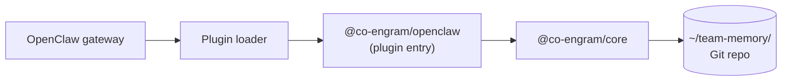

# OpenClaw Integration (Plugin)

Co-Engram integrates with OpenClaw via the **plugin SDK** — OpenClaw's official mechanism for extending its agent gateway with custom tools.

## How It Works



- OpenClaw scans the `extensions/` directory for packages with `openclaw.extensions` in their `package.json`
- The plugin entry (default export) must be an object with a `register(api)` method
- `register` receives an `OpenClawPluginApi` and calls `api.registerTool(...)` for every native tool in the registry plus 2 OpenClaw-compatible `memory_search` / `memory_get` wrappers
- The manifest `openclaw.plugin.json` declares `kind: "memory"` (making Co-Engram the primary memory plugin, mutually exclusive with `memory-core`) and lists every tool name under `contracts.tools`

## Installation

### Option A: Install from npm

```bash
# Inside the OpenClaw extensions directory (typically ~/.openclaw/extensions/)
cd ~/.openclaw/extensions/
npm install @co-engram/openclaw
```

### Option B: Build from source

```bash
git clone https://github.com/co-engram/co-engram.git
cd co-engram
pnpm install
pnpm -r build
# Copy the built package to OpenClaw extensions
cp -r packages/openclaw-plugin/dist ~/.openclaw/extensions/co-engram/
cp packages/openclaw-plugin/package.json ~/.openclaw/extensions/co-engram/
cp packages/openclaw-plugin/openclaw.plugin.json ~/.openclaw/extensions/co-engram/
# Plus @co-engram/core and its deps (zod, yaml)
```

## Wiring

Co-Engram doesn't need explicit wiring — OpenClaw auto-discovers plugins in `extensions/`. You only need to set configuration.

### Manifest Config Schema

In your OpenClaw config file (e.g. `~/.openclaw/config.yaml`):

```yaml
plugins:
  entries:
    co-engram:
      enabled: true
      config:
        dataRoot: /home/your/team-memory
        startMaintenance: true
        maintenanceConfig:
          enabledStages: [light, deep, rem]
          lightIntervalMs: 300000
          deepIntervalMs: 3600000
          remIntervalMs: 86400000
          learningRate: 0.1
        proposalEnabled: true
        proposalConfig:
          threshold: 3
          similarityThreshold: 0.75
        startViewer: true
        viewerConfig:
          port: 18899
```

> **`dataRoot` in plugin config is deprecated.** The effective data root is resolved solely from the bootstrap file `~/.co-engram/config.json` (shared with the Claude Code host). Setting `dataRoot` here no longer takes effect — the plugin only emits a deprecation warning and ignores the value. Change the data root via `co-engram config data-root <path>` or the viewer's config tab, then restart.

**Fields:**

| Field                  | Type           | Default             | Purpose                                                                                                         |
| ---------------------- | -------------- | ------------------- | --------------------------------------------------------------------------------------------------------------- |
| `enabled`              | boolean        | `true`              | Toggle tool registration                                                                                        |
| `dataRoot`             | string         | `$HOME/team-memory` | Absolute path to data Git repo. **Deprecated in plugin config** — see note below; effective value comes from `~/.co-engram/config.json`. |
| `defaultCreatedBy`     | string         | _(runtime)_         | Default author for new engrams. When unset, resolved at runtime from git author → persisted config → env (avoid tool names like `openclaw`/`claude-code`). |
| `language`             | `"en" \| "zh"` | `"zh"`              | Language for tool descriptions, viewer UI, system prompts. Falls back to team-memory persisted config, then `DEFAULT_LANGUAGE` (`zh`). |
| `startMaintenance`     | boolean        | `true`              | Start the maintenance engine                                                                                    |
| `maintenanceConfig`    | object         | (see below)         | Maintenance engine tuning                                                                                       |
| `auditEnabled`         | boolean        | `true`              | Append-only audit log                                                                                           |
| `effectivenessEnabled` | boolean        | `true`              | Track retrieve_hit → effective/inconclusive                                                                     |
| `proposalEnabled`      | boolean        | `false`             | Implicit memory proposal engine                                                                                 |
| `proposalConfig`       | object         | (see below)         | Proposal engine tuning                                                                                          |
| `startViewer`          | boolean        | `true`              | Start web viewer at 127.0.0.1:18899 (requires `@co-engram/claude-code`)                                         |
| `viewerConfig`         | object         | `{ port: 18899 }`   | Viewer port and optional token                                                                                  |

### Memory Capability & Self-Evolving Prompts

Because `openclaw.plugin.json` declares `"kind": "memory"`, OpenClaw treats Co-Engram as the **primary memory plugin** (mutually exclusive with `memory-core`). On startup the plugin calls `api.registerMemoryCapability({ promptBuilder })` to inject a "## Memory Recall" section into the agent system prompt. The section is rebuilt every conversation turn with three layers:

1. **Base guidance (always on)** — when to call `memory_search` / when to skip / how to interpret `truthScore`. Also embeds a depth=2 repo-structure overview (second-level directories + engram counts) so the LLM sees the warehouse layout before searching; deeper levels are pulled on demand via `engram_list_paths(maxDepth=N)`.
2. **Proposal reminder (conditional)** — if the proposal engine has pending candidates, a one-liner names the count and tool to invoke.
3. **Self-evolving signals (conditional)** — populated from `<dataRoot>/.co-engram/prompt-signals.json`, written by the `light` maintenance stage every 5 minutes:
   - `topTags`: the 20 most frequent domain tags across all engrams (no minimum-occurrence threshold; `minCount = 1`).
   - `lowConfidenceTopics`: tags whose engrams have `confidence < 0.4` AND `retrievalCount ≥ 2` — RPE feedback that tells the LLM "these areas are shaky, verify before citing".
   - `missedTopics`: reserved for future expansion (conversation-history mining).

In addition, every prompt deterministically injects the **team skill catalog** (each skill's skillId + native SKILL.md description, ordered by utility, max 10 entries; skills whose `retentionStage` is `forgotten` are excluded). The injection goes through the `before_prompt_build` hook's `appendSystemContext` (cache-stable — content changes only when SKILL.md files change) and shares the same `collectSkillCatalog` data with the promptBuilder's skill section.

The snapshot file is a cache; if absent or corrupt, the promptBuilder silently degrades to base guidance only. Deleting it forces a recompute on the next `light` tick.

```bash
# Inspect the current snapshot
cat ~/team-memory/.co-engram/prompt-signals.json

# Force a refresh
rm ~/team-memory/.co-engram/prompt-signals.json
# (or wait for the next light maintenance tick)
```

If the host does not implement `registerMemoryCapability`, the plugin logs a warning and continues — all native tools plus the 2 wrappers still work, the LLM just won't get the guided "Memory Recall" section.

### Memory Proposals

When `proposalEnabled: true`, the plugin registers a session hook. On session `new`, if pending proposals exist, the plugin enqueues a next-turn injection so the LLM sees:

```
[co-engram] N memory candidates pending ...
```

The LLM can then call `engram_list_proposals`, `engram_accept_proposal`, or `engram_dismiss_proposal`.

**Two-Layer Filtering** — the proposal engine applies two layers to suppress mechanical noise and evaluate necessity (see [observability two-layer filtering](./observability.md#proposal-engine)):

- **Layer 1**: prefilter at `observe()` entry rejects system/empty/short/trivial/low-density messages
- **Layer 2**: before cluster promotion, rule-based evaluator (5 rules) + optional LLM semantic judgment

**LLM necessity evaluator config** (optional):

```yaml
plugins:
  entries:
    co-engram:
      config:
        proposalEnabled: true
        # Option 1: explicit OpenAI-compatible endpoint
        necessityLlm:
          endpoint: https://api.example.com/v1
          apiKey: sk-xxx
          model: gpt-4o-mini
        # Option 2: host injects evaluator instance directly (takes precedence over necessityLlm)
        # necessityEvaluator injected manually by host inside register()
```

When unset, the plugin auto-detects provider config (`baseUrl` + `apiKey`) from `~/.openclaw/openclaw.json`'s `agents.defaults.model.primary`. LLM call failures fall back to the rule-based evaluator, with reason prefixed `[llm-unavailable, rule-fallback] ...`.

**Reasoning model support**: OpenAI-compatible reasoning models — `Qwen3` / `DeepSeek-R1` / `DeepSeek-V4` / `GLM-5.2` / Kimi K2 / etc. — are supported out of the box. When `max_tokens` is exhausted in the reasoning phase (leaving `content=null`), the adapter falls back to `reasoning_content` and the parser extracts the JSON verdict from the trailing text. See [observability § Provider-Agnostic LLM Abstraction](./observability.md#provider-agnostic-llm-abstraction).

**Note**: This requires the host to support `registerHook` + `enqueueNextTurnInjection` in its plugin API. If unavailable, the plugin silently skips injection — tools still work, you just won't get the automatic prompt.

### Web Viewer

If you also install `@co-engram/claude-code` alongside the plugin, you can start the viewer:

```yaml
plugins:
  entries:
    co-engram:
      config:
        startViewer: true
        viewerConfig:
          port: 18899
          token: mysecret # optional
```

The plugin will dynamically import `@co-engram/claude-code` and start its viewer. If the package is missing, the plugin logs a warning and continues without the viewer.

> **`viewerConfig.port` is deprecated.** Persisted `port` lives in `~/team-memory/.co-engram/config.json`, which is shared with the Claude Code host — setting it from both sides causes collisions. Prefer the env var `CO_ENGRAM_VIEWER_PORT` when running OpenClaw. Since 2026-07 both hosts share a unified default port `18899` (the earlier host-specific defaults Claude Code=18799 / OpenClaw=18899 are deprecated; the URL is now a property of the dataRoot, not of whichever host won the holder lock). The persisted value still works as a fallback for this release; the server prints a one-line warning at startup when it kicks in.

### `maintenanceConfig` sub-fields

| Field             | Type                         | Default                  |
| ----------------- | ---------------------------- | ------------------------ |
| `enabledStages`   | `("light"\|"deep"\|"rem")[]` | `["light","deep","rem"]` |
| `lightIntervalMs` | number                       | `300000`                 |
| `deepIntervalMs`  | number                       | `3600000`                |
| `remIntervalMs`   | number                       | `86400000`               |
| `learningRate`    | number                       | `0.1`                    |

## Verifying

```bash
# Check plugin is loaded
openclaw plugins list

# Check tools are registered (use --runtime for actual runtime load)
openclaw plugins inspect co-engram --runtime --json
```

Expected:

```json
{
  "plugin": {
    "id": "co-engram",
    "status": "loaded",
    "activated": true,
    "toolNames": [
      "engram_create", "engram_get", ...  // all native tools (registry) + memory_search + memory_get
    ]
  }
}
```

## Why the Manifest `contracts.tools`

OpenClaw enforces a **manifest-first** control plane. The loader refuses to register tools not declared in `contracts.tools`:

```json
{
  "contracts": {
    "tools": ["engram_create", "engram_get", ...]
  }
}
```

This prevents plugins from quietly registering hidden tools. If you fork Co-Engram and add a new tool, you must also add its name to this array — otherwise the loader silently drops it.

## Dual-Host Setup

You can run Co-Engram in **both** Claude Code and OpenClaw simultaneously, pointed at the same `~/team-memory` Git repo. Both hosts will see the same engrams, and updates from one are visible to the other after `engram_search` refreshes its FTS cache.

For a cross-host consistency test, see `packages/e2e/test/dual-host.e2e.test.ts`.

## Troubleshooting

### `openclaw plugins inspect` shows `toolNames: []`

Make sure you passed `--runtime`. Without it, inspect only shows manifest metadata, not the actual registered tools.

### Tools registered but calls fail with `Cannot find package 'yaml'`

The plugin's `node_modules/` is missing dependencies. Either:

- Run `npm install` inside the plugin's directory, or
- Ensure `zod` and `yaml` are available at a parent `node_modules/` that Node's resolution can find

### Plugin loaded but maintenance engine not running

Check that `startMaintenance: true` is set in the plugin config (not just `enabled: true`). The two are independent toggles.
