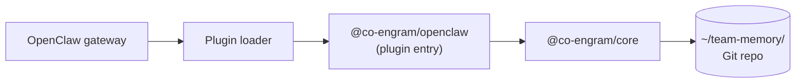

# OpenClaw 集成(插件)

Co-Engram 通过 **插件 SDK** —— OpenClaw 用于扩展其 agent gateway、接入自定义工具的官方机制 —— 与 OpenClaw 集成。

## 工作原理



- OpenClaw 扫描 `extensions/` 目录,寻找 `package.json` 中带 `openclaw.extensions` 字段的包
- 插件入口(默认导出)必须是一个含 `register(api)` 方法的对象
- `register` 接收一个 `OpenClawPluginApi`,并为 27 个原生工具加上 2 个 OpenClaw 兼容的 `memory_search` / `memory_get` 包装器(共 29 个)逐一调用 `api.registerTool(...)`
- manifest `openclaw.plugin.json` 声明 `kind: "memory"`(使 Co-Engram 成为首要记忆插件,与 `memory-core` 互斥),并在 `contracts.tools` 下罗列每个工具名

## 安装

### 方案 A:从 npm 安装

```bash
# 在 OpenClaw extensions 目录中执行(通常为 ~/.openclaw/extensions/)
cd ~/.openclaw/extensions/
npm install @co-engram/openclaw
```

### 方案 B:从源码构建

```bash
git clone https://github.com/co-engram/co-engram.git
cd co-engram
pnpm install
pnpm -r build
# 将构建产物复制到 OpenClaw extensions
cp -r packages/openclaw-plugin/dist ~/.openclaw/extensions/co-engram/
cp packages/openclaw-plugin/package.json ~/.openclaw/extensions/co-engram/
cp packages/openclaw-plugin/openclaw.plugin.json ~/.openclaw/extensions/co-engram/
# 还需要 @co-engram/core 及其依赖(zod、yaml)
```

## 接入

Co-Engram 无需显式接入 —— OpenClaw 会自动发现 `extensions/` 下的插件。你只需设置配置即可。

### Manifest 配置 Schema

在你的 OpenClaw 配置文件中(例如 `~/.openclaw/config.yaml`):

```yaml
plugins:
  entries:
    co-engram:
      enabled: true
      config:
        dataRoot: /home/your/team-memory
        defaultCreatedBy: openclaw
        startMaintenance: true
        maintenanceConfig:
          enabledStages: [light, deep, rem]
          lightIntervalMs: 300000
          deepIntervalMs: 3600000
          remIntervalMs: 604800000
          learningRate: 0.1
        proposalEnabled: true
        proposalConfig:
          threshold: 3
          similarityThreshold: 0.75
        startViewer: false
        viewerConfig:
          port: 18799
```

**字段说明:**

| 字段                   | 类型           | 默认值              | 用途                                                                             |
| ---------------------- | -------------- | ------------------- | -------------------------------------------------------------------------------- |
| `enabled`              | boolean        | `true`              | 切换工具注册                                                                     |
| `dataRoot`             | string         | `$HOME/team-memory` | 数据 Git 仓库的绝对路径                                                          |
| `defaultCreatedBy`     | string         | `"openclaw"`        | 新 engram 的默认作者                                                             |
| `language`             | `"en" \| "zh"` | `"en"`              | 工具描述、查看器 UI、系统提示词所用语言。未设置时回退到 team-memory 持久化配置。 |
| `startMaintenance`     | boolean        | `false`             | 启动维护引擎                                                                     |
| `maintenanceConfig`    | object         | (见下文)            | 维护引擎调优                                                                     |
| `auditEnabled`         | boolean        | `true`              | 仅追加的审计日志                                                                 |
| `effectivenessEnabled` | boolean        | `true`              | 跟踪 retrieve_hit → effective/inconclusive                                       |
| `proposalEnabled`      | boolean        | `false`             | 隐式记忆候选引擎                                                                 |
| `proposalConfig`       | object         | (见下文)            | 候选引擎调优                                                                     |
| `startViewer`          | boolean        | `false`             | 在 127.0.0.1:18799 启动 web 查看器(需要 `@co-engram/claude-code`)                |
| `viewerConfig`         | object         | `{ port: 18799 }`   | 查看器端口及可选 token                                                           |

### memory 能力与自演化提示词

由于 `openclaw.plugin.json` 声明了 `"kind": "memory"`,OpenClaw 会将 Co-Engram 视作**首要记忆插件**(与 `memory-core` 互斥)。启动时插件调用 `api.registerMemoryCapability({ promptBuilder })`,向 agent 系统提示词注入一个 "## Memory Recall" 小节。该小节在每一轮对话时都会重建,分三层:

1. **基础引导(始终启用)** —— 何时调用 `memory_search` / 何时跳过 / 如何解读 `truthScore`。
2. **候选提醒(条件触发)** —— 若候选引擎有待处理候选,会以一行文案点出数量及应调用的工具。
3. **自演化信号(条件触发)** —— 取自 `<dataRoot>/.co-engram/prompt-signals.json`,由 `light` 维护阶段每 5 分钟写入一次:
   - `topTags`:所有 engram 中出现频次最高的 5 个 domain 标签(阈值:≥3 次)。
   - `lowConfidenceTopics`:其 engram 的 `confidence < 0.4` 且 `retrievalCount ≥ 2` 的标签 —— 这是 RPE 反馈,告知 LLM "这些领域不稳固,引用前先验证"。
   - `missedTopics`:预留给未来扩展(对话历史挖掘)。

快照文件是缓存;若缺失或损坏,promptBuilder 会静默降级为仅基础引导。删除它将强制在下一个 `light` tick 时重算。

```bash
# 查看当前快照
cat ~/team-memory/.co-engram/prompt-signals.json

# 强制刷新
rm ~/team-memory/.co-engram/prompt-signals.json
# (或等待下一次 light 维护 tick)
```

若宿主未实现 `registerMemoryCapability`,插件会记录告警并继续 —— 全部 29 个工具仍可用,只是 LLM 不会得到引导式的 "Memory Recall" 小节。

### 记忆候选(Proposals)

当 `proposalEnabled: true` 时,插件会注册一个 session hook。在 session `new` 时,若存在待处理候选,插件会排入一条 next-turn 注入,使 LLM 看到:

```
[co-engram] N memory candidates pending ...
```

随后 LLM 可调用 `engram_list_proposals`、`engram_accept_proposal` 或 `engram_dismiss_proposal`。

**双层过滤机制** —— proposal engine 通过两层过滤挡机械噪音 + 评估必要性(详见 [observability 双层过滤机制](./observability.zh-CN.md#proposal-引擎)):

- **Layer 1**:`observe()` 入口预过滤,挡 system/空/短/trivial/低密度消息
- **Layer 2**:cluster 晋升前,默认规则版评估(5 条规则)+ 可选 LLM 语义判断

**LLM 必要性评估器配置**(可选):

```yaml
plugins:
  entries:
    co-engram:
      config:
        proposalEnabled: true
        # 方式 1:显式配置 OpenAI 兼容端点
        necessityLlm:
          endpoint: https://api.example.com/v1
          apiKey: sk-xxx
          model: gpt-4o-mini
        # 方式 2:宿主直接注入评估器实例(优先级高于 necessityLlm)
        # necessityEvaluator 由宿主在 register() 内手工注入
```

不配置时,插件会自动从 `~/.openclaw/openclaw.json` 的 `agents.defaults.model.primary` 解析 provider 配置(`baseUrl` + `apiKey`)。LLM 调用失败自动 fallback 到规则版评估器,reason 标 `[llm-unavailable, rule-fallback] ...`。

**推理模型支持**:OpenAI 兼容推理模型——`Qwen3` / `DeepSeek-R1` / `DeepSeek-V4` / `GLM-5.2` / Kimi K2 / 等——开箱即用。当 `max_tokens` 在 reasoning 阶段用光(导致 `content=null`)时,适配器 fallback 读 `reasoning_content`,解析器从末尾文本抽 JSON 答案。详见 [observability § Provider-Agnostic LLM 抽象](./observability.zh-CN.md#provider-agnostic-llm-抽象)。

**注意**:这要求宿主在其插件 API 中支持 `registerHook` + `enqueueNextTurnInjection`。若不可用,插件会静默跳过注入 —— 工具仍可用,只是不会得到自动提示。

### Web 查看器

若你在插件之外同时安装了 `@co-engram/claude-code`,即可启动查看器:

```yaml
plugins:
  entries:
    co-engram:
      config:
        startViewer: true
        viewerConfig:
          port: 18799
          token: mysecret # 可选
```

插件会动态 import `@co-engram/claude-code` 并启动其查看器。若该包缺失,插件会记录告警并在没有查看器的情况下继续运行。

### `maintenanceConfig` 子字段

| 字段              | 类型                         | 默认值                   |
| ----------------- | ---------------------------- | ------------------------ |
| `enabledStages`   | `("light"\|"deep"\|"rem")[]` | `["light","deep","rem"]` |
| `lightIntervalMs` | number                       | `300000`                 |
| `deepIntervalMs`  | number                       | `3600000`                |
| `remIntervalMs`   | number                       | `604800000`              |
| `learningRate`    | number                       | `0.1`                    |

## 验证

```bash
# 检查插件是否加载
openclaw plugins list

# 检查工具是否注册(使用 --runtime 查看实际运行时加载)
openclaw plugins inspect co-engram --runtime --json
```

预期结果:

```json
{
  "plugin": {
    "id": "co-engram",
    "status": "loaded",
    "activated": true,
    "toolNames": [
      "engram_create", "engram_get", ...  // 29 tools total (27 native + memory_search + memory_get)
    ]
  }
}
```

## 为何需要 manifest 的 `contracts.tools`

OpenClaw 强制执行**manifest 优先**的控制面。loader 会拒绝注册未在 `contracts.tools` 中声明的工具:

```json
{
  "contracts": {
    "tools": ["engram_create", "engram_get", ...]
  }
}
```

这能防止插件悄悄注册隐藏工具。若你 fork 了 Co-Engram 并新增一个工具,也必须把其名称加入此数组 —— 否则 loader 会静默丢弃它。

## 双宿主配置

你可以**同时**在 Claude Code 与 OpenClaw 中运行 Co-Engram,指向同一个 `~/team-memory` Git 仓库。两个宿主会看到相同的 engram,一方的更新在另一方 `engram_search` 刷新其 FTS 缓存后即可见。

跨宿主一致性测试见 `packages/e2e/test/dual-host.e2e.test.ts`。

## 故障排查

### `openclaw plugins inspect` 显示 `toolNames: []`

请确保你传入了 `--runtime`。否则 inspect 只显示 manifest 元数据,而非实际注册的工具。

### 工具已注册,但调用失败并报 `Cannot find package 'yaml'`

插件的 `node_modules/` 缺少依赖。可:

- 在插件目录中执行 `npm install`,或
- 确保 `zod` 与 `yaml` 位于父级 `node_modules/`,且 Node 的模块解析能找到

### 插件已加载,但维护引擎未运行

请检查插件配置中是否设置了 `startMaintenance: true`(而不仅仅是 `enabled: true`)。这两者是相互独立的开关。
