# Maintenance Engine

The maintenance engine is what makes Co-Engram **self-correcting**. Instead of relying on agents to manually tag or score memories, the engine observes how memories are used and adjusts their strength automatically.

Inspired by the brain's sleep cycles — `light` (ongoing), `deep` (consolidation), `rem` (abstraction + verification). The engine runs each stage on its own cadence, in the background, with zero agent intervention.

## Three stages

```mermaid
flowchart TB
  subgraph Light["Light stage · every 5 min"]
    L1["drain signal sink"] --> L2["extract behavioral signals"]
    L2 --> L3["compute RPE per engram"]
    L3 --> L4["bump effectiveRetrievals /<br />failedUses / reinforcementScore"]
    L4 --> L5["prune expired signals +<br />sweep timed-out windows"]
  end

  subgraph Deep["Deep stage · every 1 hour"]
    D1["light dreaming: dedup + merge duplicates"] --> D2["decay by freshness:<br />forgotten → forget,<br />stale + low importance → forget,<br />stale + high importance → archive (frozen)"]
    D2 --> D3["run doctor self-heal<br />(dangling synapse / orphan md / SQLite ghost)"]
    D3 --> D4["write .co-engram/doctor-report.json"]
  end

  subgraph REM["REM stage · every 1 day"]
    R1["metacognition evaluates truth"] --> R2["emit rem-verification proposal"]
    R2 --> R3["dreaming clusters + abstracts patterns"]
    R3 --> R4["emit rem-pattern / rem-synapse proposals"]
    R4 --> R5["user reviews proposals in viewer;<br />accept to land"]
  end
```



Defaults: `DEFAULT_LIGHT_INTERVAL_MS = 5 min`, `DEFAULT_DEEP_INTERVAL_MS = 1 hour`, `DEFAULT_REM_INTERVAL_MS = 1 day`. Stages are independent — disabling one does not affect the others (see `enabledStages` in `MaintenanceConfig`).

### Light stage (every 5 min)

Closest to "wake state" — processes behavioral signals continuously.

1. **Drain the signal sink** — pull tool-call events accumulated since the last tick from `signals.jsonl`.
2. **Extract signals** — group raw events per engram into a `weight ∈ [-1, 1]` aggregate plus a count, using `extractSignals` with the configured rules and window size.
3. **Compute RPE per engram** — `effectiveness = (signalWeight + 1) / 2 − lastRetrievalScore`, where `lastRetrievalScore` defaults to `0.5` for old data.
4. **Apply RPE update** via `applyRpeUpdate`, gated by a `0.05` dead zone:
   - `effectiveness > +0.05` → `effectiveRetrievals += 1`, `reinforcementScore += effectiveness × learningRate`
   - `effectiveness < −0.05` → `failedUses += 1`, `reinforcementScore += effectiveness × learningRate` (negative delta)
   - `|effectiveness| ≤ 0.05` → neutral, no update
5. **Prune expired signals** and **sweep timed-out observation windows**, so `signals.jsonl` stays bounded.

`learningRate` defaults to `DEFAULT_RPE_LEARNING_RATE = 0.1`. Light never touches the `importance` field — only the retrieval statistics and `reinforcementScore`.

### Deep stage (every 1 hour)

Consolidation — what the brain does during slow-wave sleep.

1. **Light dreaming pass** — scan for near-duplicates; merge `DUPLICATE`/`UPDATE` verdicts into their target (target gets reinforced, source deleted).
2. **Ebbinghaus decay** via `applyDecayBatch`, decisions driven entirely by **freshness** (see math below):
   - `forgotten` → mark `forgotten`
   - `stale` + `importance < forgetImportanceThreshold` (default `0.2`) → mark `forgotten`
   - `stale` + `importance ≥ threshold` → archive as `frozen` (recoverable)
   - `fresh` / `aging` → untouched
3. **Doctor self-heal** — `runDoctor` detects and auto-fixes infrastructure drift: moved files, title renames, dangling synapse references, orphan markdown, Obsidian view staleness, missing derived indexes, `sqlite_ghost` rows whose source markdown vanished, `sqlite_resynced` rows whose frontmatter drifted, and more. Each issue is classified as auto-fixed or pending manual review with a `nextAction` hint.
4. **Persist the doctor report** to `.co-engram/doctor-report.json` so the viewer can show what Deep repaired, even after the fact.

Critical: **Deep does not decay `importance`**. Importance is purely event-driven (see math). Deep only reclassifies lifecycle status (`forgotten` / `frozen`) based on the *derived* freshness — and freshness itself depends on importance, so decaying importance here would create a feedback loop.

### REM stage (every 1 day)

Abstraction and truth-tracking — what the brain does during REM sleep.

**Hybrid trigger (activity-driven first, time-based fallback).** The interval above is only the fallback. At the end of each light tick, the engine sums the `importance` of engrams created since the last REM run (`EngramRepository.sumImportanceSince`, a single aggregate SQL on the SQLite index) and triggers REM early once the sum reaches `remActivityThreshold` (default `12.0`, roughly 20 memories × 0.6 importance; `0` disables, falling back to pure time-based triggering). A debounce window of `remMinIntervalMs` (default 12 h) keeps two REM runs apart — within the window the activity check simply doesn't fire and waits for the next light tick. The time-based fallback (interval timer + startup catch-up) is not affected by the debounce, because REM also carries metacognition upgrades / tag-drift refresh / synapse candidate pairs that have nothing to do with new memories. Only the `importance` of currently existing engrams counts toward the sum — reinforcement events and retrieval counts are deliberately excluded (the former would require scanning `audit.jsonl`, the latter would double-incentivize with the search-time hotness factor).

1. **Dreaming clusters + abstraction** — `clusterSimilarEngrams` groups active engrams by token-Jaccard similarity (default `0.3`), then a `PatternAbstractionProvider` (heuristic by default, LLM-injectable for production) drafts an abstract pattern from each cluster.
2. **Metacognition** — for every active, non-refuted engram, `applyMetacognition` scores five truth dimensions (cross-context support, time stability, mutual support, source reliability, executability) and recommends `upgrade_verified` / `upgrade_one_level` / `refute` / `hold`.

Since commit `d9618698` / `8433de95`, **REM does not auto-persist structural changes**. Both subsystems emit proposals instead, and only acceptance lands them:

| Source                      | Proposal kind        | Lands as                                              |
| --------------------------- | -------------------- | ----------------------------------------------------- |
| Metacognition recommendation| `rem-verification`   | `verificationStatus` bump on the source engram        |
| Dreaming pattern abstraction| `rem-pattern`        | new `pattern` engram with `derives_from` synapses     |
| Dreaming synapse ops        | `rem-synapse`        | `synapse_create` / `synapse_delete` / kind retyping   |

Proposals surface in the **Memory proposals** page of the viewer and in `engram_list_proposals`. The user explicitly accepts or dismisses each one — REM never rewrites memory on its own.

## REM deep thought (2026-08)

Beyond mechanical evaluation (metacognition scoring, similarity clustering), REM now runs a **deep-thought step** when event signals justify it. Three thinking modes ship in phase 1 (integration / retrospective / inspiration; four more are planned), each with an event-driven trigger, a seed selector, a prompt, and a mode-specific rubric:

| Mode | Trigger signal | Thinks about |
| ---- | -------------- | ------------ |
| Integration | many new synapses, dense same-domain additions | cross-context common structures and themes |
| Retrospective | `failedUses ≥ 3`, refutations | AAR causal chains (expected → actual → cause → improvement) |
| Inspiration | new cross-domain tags (generic tags like `imported` filtered out) | structure-mapping between deliberately distant domains |

Each run picks the top-K modes by signal strength (default 2; an active night-thinking entry pins inspiration to the top slot). Material selection is **seed-oriented spreading activation** over the memory graph (new / reactivated / reconnected nodes as seeds, two hops with decay, ~30-node subgraph cap) — a different layer from the five-factor query scoring, which stays query-oriented. An importance-ranked neighborhood baseline is computed alongside for ablation measurement.

**Time-fallback REM runs skip deep thought entirely** (zero LLM calls): a quiet repository never burns tokens. The pipeline is **on by default** (2026-08-16 blind-eval calibration: 84-95% genuine-insight rate, 46/52 judged genuine); set `maintenance.remInsight.enabled: false` to turn it off.

Three-stage validation applies to every insight:

1. **Proposal time** — mechanical checks (citation closure, per-type structure, dedup by Jaccard ≥ 0.65, mode-specific structure such as disjoint domains for analogies) plus an **independent second-call critic** scoring four dimensions (evidence sufficiency / novelty / actionability / consistency) below threshold → no proposal. Hard cap of **5 insight proposals per REM run**.
2. **Accept time** — sources must still exist and not be refuted; acceptance creates a `pattern` (or `hypothesis`) engram with `confidence = critic score` (a machine-subjective initial value, not ground truth) and a `derives_from` evidence chain.
3. **Lifetime** — insights get no privilege: evidence-chain decay (>30% refuted/non-active endpoints lands the insight in a daily re-review digest, not a per-item proposal flood), and an insight with `failedUses ≥ 3` becomes a retrospective seed next run — the system retrospects its own output.

## Contemplation

The flagship capability: *ask a question and the system does one full-resource-inventory deep think around it — the entire memory graph, behavioral logs and skill library, fully local and read-only, one report per run.* (Redesigned 2026-08-17; the former "night thinking" multi-round dream model was removed.)

Entries live in a sidecar (`.co-engram/incubations.json`): question, optional focus memories (`seedEngramIds`; blank = full-library search), a five-state status (`queued → thinking → verifying → repairing → done`), and the full session timeline. Entries can be created from chat (`ponder_create`), the viewer's **Contemplation** tab, or CLI. Legacy data (including the earlier five-state names) normalizes on read (no migration script); entry cap is 50 (creation is rejected at the cap with the oldest answered entries listed for deletion — no auto-cleanup).

Two execution tiers:

- **L2 agent orchestration (main path)** — one full agent session following the fixed protocol: inventory capabilities → mine all resources (multi-angle memory search / behavioral-log Read / skill_list+skill_get / controlled web research) → PLAN → read-only execution → **write the answer (produced in-session; the primary deliverable)** → write back exactly once via `ponder_report` (including the `resourcesUsed` declaration backing the viewer's "Evidence" section; engram ids are verified against the repo — invented ids are dropped). Viewer async jobs and scheduled runs spawn a headless `claude -p` session (the implementation lives in core and is shared by all three hosts); the chat entry point executes in the current session per the fixed protocol returned by `ponder_run`.
- **L1 baseline (fallback)** — a single-pass LLM distant analogy, used only when the host has no agent runtime or no claude CLI is present (spawn ENOENT); the audit records level honestly. **Any other L2 failure (timeout / unparseable / non-zero exit) surfaces as an explicit error — no silent downgrade** (fixed 2026-08-17: silent downgrades had been feeding users baseline output without notice).

**Asking starts the think**: viewer/CLI creation immediately launches an async job; the chat path is `ponder_create` + `ponder_run` (the agent may confirm the question first). A cross-process thinking lock (TTL 30 min) prevents concurrent runs. Each run feeds back the last 10 sessions (insight summaries + accept/dismiss dispositions) with the instruction "deepen or pivot, do not repeat"; insights with Jaccard ≥ 0.65 against history are vetoed (counts kept as diagnostics). **A report always carries an answer**: the L2 answer is produced in-session; when absent, the synthesis layer writes a fallback (failures are recorded as answerError — never a stitched pseudo-answer). `delete` removes the entry (produced proposals and audit records are kept). Audit events: `contemplation_create / run_start / run_done (with level, duration, diagnosis, PDCA state) / run_fail / delete / gap_check`.

### Closure check and repair loop (PDCA, 2026-08-18)

The core trust problem of contemplation: process evidence used to be purely self-reported (resource claims only verified id existence; citation closure was self-certified by the insight's own sourceIds; task seeds could be cited wholesale) — a formally compliant performance passed all gates. Phase1 lands "**self-declared list, factualized evidence**": the list is still submitted by the executor via `ponder_report`'s `requirements` field (per item: resource type / description / necessity logic-needed·helpful / closure state / evidence anchor `evidence.ids`), but every closure claim is mechanically cross-checked by the engine against the **tool-call stream** (`.co-engram/signals.jsonl`, filtered to this run's time window; snapshot read that does not consume the maintenance engine's drain queue):

- **Fake-closure gate**: for closed engrams/skills items, every id in `evidence.ids` must actually appear in the stream (search hits or direct engram_get/skill_get reads); otherwise the item becomes a gap (`evidence-mismatch`) and the run moves to `repairing` with the gap list returned to the executor — who mines the missing resources and **re-reports in full** until closure;
- **Under-declaration gate**: the stream shows engram/skill read calls but the list declares no corresponding item (or the list is missing entirely) → the whole report is rejected; a run with zero engram/skill read calls (total resource neglect) is likewise rejected;
- **Zero-increment gate**: an insight whose sourceIds all come from the task seeds (user-specified ∪ engine fallback search) is rejected — seeds are starting hints, not the boundary;
- **logs/web/mcp types**: the engine has no observation surface (WebSearch / host skills / Read do not pass through the co-engram tool layer), so `closed` is display-only (unverified); but declaring an item and leaving it perpetually open also blocks finalization — don't list resources you don't intend to close.

Hard limits (engine-enforced, parameters aligned with industry baselines; `maintenance.remInsight.repairRounds` configurable in [1,10]): repair reports ≤ 6; new gaps per report ≤ 3 (excess deferred, not counted toward closure); cumulative unique gaps per run ≤ 10. **Re-report semantics inverted**: re-reporting the same gap hash counts as a repair failure (2 consecutive re-reports force escalation to logic-needed) — it is never a finalization reason; **finalization can only be triggered by budget exhaustion**. Hitting the cap (repair rounds exhausted / total gaps exceeded / TTL 30 min timeout) → **degraded finalization**: the entry records a degraded marker with the unclosed list, and the run's insight proposals get a permanent quarantine flag — **excluded from the default approval queue** (the viewer's proposals tab shows a top quarantine zone with the unclosed list; adjudicate from the "All" view). A normal finalization (all closed) automatically clears the flag. L1 and deployments without an injected evidence source skip the closure check (audit records `evidenceAvailable=false` honestly).

**Execution boundary (hard constraint)**: the local memory repo and files are strictly read-only; web access is read-only research (restored 2026-08-17 as controlled web research: the whitelist includes WebSearch/WebFetch and the protocol allows web grounding for external facts — industry trends, competitor moves, benchmarks). **The privacy boundary is fixed in the protocol: raw memory content never leaves the machine — only the question itself and summary-level content may go out with a search.** The L2 prompt carries only digest-level seeds (never raw memory content). **MCP tools count as contemplation resources too** (the protocol requires inventorying the host's other MCP servers and using their read-only capabilities when relevant; MCP usage lands in the trace): the agent mode (in-session) reaches them naturally, while headless sessions stay strict — whitelist only by default, with hosts able to grant extra servers via `readOnlyMcpServers` (per-server granularity; no `mcp__*` wildcard, which would admit write tools as well). The viewer shows the answer, insight proposals, process (plan/trace), diagnosis, and evidence (memories actually read / skills used / logs touched / web research) — process transparency is the source of trust.

## The math

Three quantities govern how a memory's strength evolves. Each is computed by a single authoritative function — no other path should mutate these fields.

### `importance` is event-driven, not time-driven

`importance ∈ [0, 1]` represents synaptic strength. As of `2026-07-20`, the daily time-decay step (`applyDailyDecay`) was **removed** because time was polluting the same field that freshness derives from, creating a feedback loop (`importance↓ → halfLife↓ → freshness decays faster`).

Today, importance only moves on **events**:

- **RPE / LTP** (Light stage, `applyRpeUpdate`): `reinforcementScore += effectiveness × learningRate`, where `learningRate = 0.1` and `effectiveness ∈ [-1, 1]`. `effectiveRetrievals` / `failedUses` are bumped in lockstep.
- **Explicit reinforce** (`engram_reinforce`): `importance = clamp01(importance + effectiveness × LTP_GAIN)` with `LTP_GAIN = 0.1` (env: `CO_ENGRAM_LTP_GAIN`).
- **Failure feedback** (`engram_report_failure`): `importance = clamp01(importance − FAILURE_LOSS)` with `FAILURE_LOSS = 0.1` (env: `CO_ENGRAM_FAILURE_LOSS`); `failedUses += 1`. This is cumulative LTD — repeated failures ratchet importance down toward archive/forget thresholds, but a single failure does not delete the memory.

Time has no direct vote. An unused memory stays at its current importance until RPE or an explicit tool call moves it.

### `freshness` is derived, not stored

`computeFreshness` (`packages/core/src/lifecycle/freshness.ts`) computes the band on demand from `effectiveAge` vs `halfLife`:

```
halfLife = BASE_HALFLIFE_DAYS × (importance + 0.1)^1.5 × kindMultiplier
```

| Constant / factor         | Default | Source                                              |
| ------------------------- | ------- | --------------------------------------------------- |
| `BASE_HALFLIFE_DAYS`      | `50`    | env `CO_ENGRAM_BASE_HALFLIFE_DAYS`                  |
| `kindMultiplier`          | varies  | per `EngramKind` (see below)                        |

`kindMultiplier` table — durability by memory type:

| Kind          | Multiplier | Rationale                                      |
| ------------- | ---------- | ---------------------------------------------- |
| `observation` | `0.6`      | Episodic, hippocampus-dependent, fastest decay |
| `hypothesis`  | `0.7`      | Unverified, should not linger                  |
| `procedure`   | `0.8`      | Tool-coupled, can go stale with tool versions  |
| `fact`        | `1.0`      | Semantic, baseline                             |
| `pattern`     | `1.5`      | REM-distilled, cross-context, most durable     |

The `effectiveAge` clock starts at `lastEffectiveAt ?? createdAt` — first encoding starts the clock, usage only refreshes it.

Bands, computed from `ageDays`:

| Band          | Condition                |
| ------------- | ------------------------ |
| `fresh`       | `age ≤ halfLife`         |
| `aging`       | `age ≤ 2 × halfLife`     |
| `stale`       | `age ≤ 4 × halfLife`     |
| `forgotten`   | `age > 4 × halfLife`     |

Freshness is never persisted on the engram — it is recomputed whenever `applyDecayBatch` (Deep) or retrieval scoring needs it.

### Search score blends five factors

`computeFiveFactorScore` (`packages/core/src/retrieval/scoring.ts`):

```
score = α · relevance + β · recency + γ · effectiveImportance + δ · strength + ε · hotness
```

| Factor                | Symbol | Weight | Formula                                                                 |
| --------------------- | ------ | ------ | ----------------------------------------------------------------------- |
| Relevance             | `α`    | `0.50` | BM25 / cosine similarity from the search engine                         |
| Recency               | `β`    | `0.15` | `0.5 ^ (ageDays / halfLife)` — same `halfLife` as freshness             |
| Effective importance  | `γ`    | `0.25` | `importance × (0.3 + 0.7 × truthFactor)`                                |
| Strength              | `δ`    | `0.05` | `clamp01(reinforcementScore)`                                           |
| Hotness (access heat) | `ε`    | `0.05` | `sigmoid(ln(1 + retrievalCount)) · 0.5 ^ (daysSinceLastRetrieval / 7)`  |

Hotness (added 2026-08, ported from OpenViking's `memory_lifecycle.py`) is a **purely derived signal**: it is computed at scoring time from `retrievalCount` / `lastRetrievedAt` — both already written on every search hit — with no stored field and no background decay job. It rewards frequently *accessed* memories independently of `strength`, which only accumulates through explicit reinforce/failure feedback. Frequency is log-compressed (`count` 10→100 adds < 0.08) to resist flooding; the 7-day half-life is tunable via `search.scoring.hotnessHalfLifeDays`, and the weight via `search.scoring.hotness` (omitted → split evenly out of the `strength` budget; `0` disables).

`truthFactor` maps from `verificationStatus`: `verified = 1.0`, `probable = 0.7`, `plausible = 0.5`, `unverified = 0.3`, `refuted = 0`. High-value but low-truth memories are attenuated — value is upstream of truth, and truth is a constraint on use.

Three independent time-aware mechanisms combine cleanly:

- `importance` answers *"how strongly is this encoded?"* — event-driven.
- `freshness` answers *"how stale has the trace gone?"* — time-vs-halfLife, derived.
- `recency` answers *"how much should retrieval boost recent use?"* — the same half-life, applied as an exponential decay on the search score.

Removing the daily decay let each mechanism own exactly one dimension, which is why Deep no longer touches importance.
