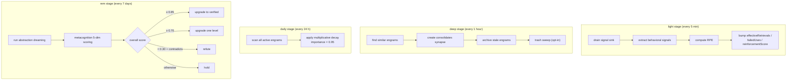

# Maintenance Engine

The maintenance engine is what makes Co-Engram **self-correcting**. Instead of relying on agents to manually tag or score memories, the engine observes how memories are used and adjusts their strength automatically.

Inspired by the brain's sleep cycles — `light` (ongoing), `deep` (consolidation), `daily` (time-driven decay), `rem` (abstraction + verification).

## The Four Stages



## Light Stage

**Purpose:** Adjust reinforcement scores based on observed behavior.

**Trigger:** Every `lightIntervalMs` (default 5 minutes).

**Flow:**

1. Drain pending `ToolCallEvent`s from the signal sink (JSONL file at `.co-engram/signals.jsonl`)
2. Apply extraction rules (see [concepts.md → Signals](./concepts.md#signal))
3. For each `(engramId, signalWeight)` pair, compute RPE:
   ```
   actual = (signalWeight + 1) / 2
   rpe    = actual - expected    // expected = lastRetrievalScore
   ```
4. Apply update:
   - `rpe > 0.05`: `effectiveRetrievals += 1`, `reinforcementScore += rpe * learningRate`
   - `rpe < -0.05`: `failedUses += 1`, `reinforcementScore += rpe * learningRate`
   - `|rpe| ≤ 0.05`: neutral
5. Prune the signal sink of events older than 7 days

**Does not:** create/delete engrams, modify content, bump engram version.

## Deep Stage

**Purpose:** Consolidate similar memories, archive stale ones, and sweep long-forgotten engrams to the trash.

**Trigger:** Every `deepIntervalMs` (default 1 hour).

**Flow:**

1. For each engram pair with similarity > threshold (configurable):
   - Create a `consolidates` synapse if not present
2. Archive engrams whose freshness has reached `stale` (computed from `lastEffectiveAt` + halflife derived from `importance`, see [Daily Stage](#daily-stage))
3. **Trash sweep** (opt-in): move engrams with `status=forgotten` older than `afterDays` (default 30) into `.trash/YYYY-MM/`. Optionally purge partitions older than `purgeAfterDays` (default 365).

**Does not:** apply time-based decay to `importance` (that moved to [Daily Stage](#daily-stage)), bump version, modify content, refute engrams.

## Daily Stage

**Purpose:** Apply time-driven multiplicative decay to `importance`, separate from the event-driven RPE updates in light stage.

**Trigger:** Every `dailyIntervalMs` (default 24 hours).

**Flow:**

1. Scan all `status=active` engrams
2. Apply multiplicative decay:
   ```
   importance *= 0.95
   ```
   - `importance` already at `0` or `1` is left untouched (boundary clamp)
   - A `decay` audit event is appended per engram that actually changed

**Why multiplicative (× 0.95) instead of additive (− 0.1)?** A constant additive step reaches `0` in fixed time regardless of starting value, so a high-importance engram and a low-importance engram expire at the same rate. Multiplicative decay preserves relative ordering — high-importance engrams stay above low-importance ones as both decline, which is the input the [halflife derivation](#) uses to compute freshness boundaries.

**Does not:** bump version, modify content, modify `verificationStatus`. The light stage's RPE updates are additive and event-driven; daily is multiplicative and time-driven. The two are orthogonal and do not cancel each other.

### Trash Sweep Details

The trash is a recovery window — like a computer's recycle bin, but Git-tracked.

**What triggers a sweep:**

- Engram status is `forgotten` (either by decay or by explicit `engram_forget` call)
- The engram file's mtime is older than `afterDays`

**What the sweep does:**

- Computes the current month partition (e.g., `2026-06`)
- Moves the engram's single `<domainTags>/<slug>.md` file to `.trash/<partition>/<domainTags>/<slug>.md`
- Uses `git mv` if the data root is a Git repo (preserves history); falls back to `fs.rename` otherwise
- Does NOT cascade — synapse references from other engrams become "dangling", which is intentional (they auto-heal if the target is restored)

**Restoring from trash:**

- Call `engram_restore` with the engram ID — the tool checks active area first, then falls back to `.trash/`
- On restore, files are moved back and status is reset to `active` / `fresh`
- The empty partition directory is cleaned up automatically

**Purge (physical deletion):**

- Sweep also checks existing `.trash/` partitions
- Partitions whose directory mtime exceeds `purgeAfterDays` are deleted entirely (coarse-grained by month)
- `purgeAfterDays=0` means "never purge" — trash grows indefinitely but is safe

**Why file mtime, not a `forgottenAt` field?**
The `updateLifecycle` call that transitions to `forgotten` does not bump `updatedAt`. We use file mtime as an approximation. For forgotten engrams (which are rarely touched afterward), this is accurate 90%+ of the time. A dedicated `forgottenAt` field may be added later if precision becomes important.

## REM Stage

**Purpose:** Abstract patterns and verify truth through metacognition.

**Trigger:** Every `remIntervalMs` (default 7 days).

**Flow:**

1. Run abstraction dreaming — when an LLM client is configured (via `necessityLlm` in plugin config, `ANTHROPIC_API_KEY` for Claude Code MCP, or `~/.openclaw/openclaw.json` for OpenClaw), clusters are synthesized by `LlmPatternAbstraction` (semantic, shares the same prompt as the `engram_synthesize` tool). Without an LLM client it falls back to `LocalHeuristicPatternAbstraction` (token-frequency based); LLM call failures also fall back to the heuristic so REM never blocks.
2. For each engram, run metacognition scoring (see [concepts.md → Metacognition](./concepts.md#metacognition))
3. Apply decision:
   - `overall ≥ 0.85` + `ageDays ≥ 7` → upgrade to `verified`
   - `overall ≥ 0.70` → upgrade one level
   - `overall < 0.30` + has `contradicts` synapse → mark `refuted`
   - otherwise → hold

**Does:** modify `verificationStatus`. This is the only stage that does.

## Configuration

All intervals are in milliseconds. Set via env vars (MCP) or `maintenanceConfig` (OpenClaw).

| Var                                       | Default              | Effect                                                                     |
| ----------------------------------------- | -------------------- | -------------------------------------------------------------------------- |
| `CO_ENGRAM_MAINTENANCE`                   | `0`                  | Master switch. Set to `1` to enable.                                       |
| `CO_ENGRAM_MAINTENANCE_ENABLED_STAGES`    | `light,deep,daily,rem` | Comma-separated subset                                                     |
| `CO_ENGRAM_MAINTENANCE_LIGHT_INTERVAL_MS` | `300000` (5 min)     | Light stage cadence                                                        |
| `CO_ENGRAM_MAINTENANCE_DEEP_INTERVAL_MS`  | `3600000` (1 hour)   | Deep stage cadence                                                         |
| `CO_ENGRAM_MAINTENANCE_DAILY_INTERVAL_MS` | `86400000` (24 h)    | Daily stage cadence (multiplicative decay)                                 |
| `CO_ENGRAM_MAINTENANCE_REM_INTERVAL_MS`   | `604800000` (7 days) | REM stage cadence                                                          |
| `CO_ENGRAM_MAINTENANCE_LEARNING_RATE`     | `0.1`                | RPE learning rate                                                          |
| `CO_ENGRAM_TRASH_ENABLED`                 | `0`                  | Enable trash sweep in deep stage. Set to `1` to enable.                    |
| `CO_ENGRAM_TRASH_AFTER_DAYS`              | `30`                 | Days after `forgotten` before an engram is moved to `.trash/`              |
| `CO_ENGRAM_TRASH_PURGE_AFTER_DAYS`        | `365`                | Days after entering `.trash/` before physical deletion. `0` = never purge. |

## Tuning Recommendations

### Conservative (low false-positive risk)

```bash
CO_ENGRAM_MAINTENANCE_LEARNING_RATE=0.05
CO_ENGRAM_MAINTENANCE_REM_INTERVAL_MS=1209600000   # 14 days
```

Use when you have many engrams and want to avoid premature `verified` upgrades.

### Aggressive (fast learning)

```bash
CO_ENGRAM_MAINTENANCE_LEARNING_RATE=0.2
CO_ENGRAM_MAINTENANCE_LIGHT_INTERVAL_MS=60000       # 1 min
CO_ENGRAM_MAINTENANCE_DEEP_INTERVAL_MS=900000       # 15 min
CO_ENGRAM_MAINTENANCE_REM_INTERVAL_MS=86400000      # 1 day
```

Use in active development / testing. Battery cost goes up.

### Disable REM only

```bash
CO_ENGRAM_MAINTENANCE_ENABLED_STAGES=light,deep
```

Keeps reinforcement + consolidation, skips metacognition upgrades. Useful if you don't trust the 5-dim scoring yet.

## Signal Sink

The light stage drains events from a JSONL file:

```
$DATA_ROOT/.co-engram/signals.jsonl
```

Each line is a `ToolCallEvent`. The sink is unbounded (no rotation) but pruned every light cycle to 7-day retention. For typical workloads (100 events/day), this stays under 700 lines.

If you generate extreme event volume (>10k/day), consider adding a rotation policy. Open an issue if you hit this.

## Self-Hosting the Engine

If you're embedding `@co-engram/core` directly (not through MCP or OpenClaw), you can start the engine programmatically:

```typescript
import { EngramRepository } from "@co-engram/core";
import { MaintenanceEngine } from "@co-engram/core";
import { FileSignalSink } from "@co-engram/core";
import { DreamingScheduler } from "@co-engram/core";

const repo = new EngramRepository({ rootPath: "/path/to/team-memory" });
const signalSink = new FileSignalSink("/path/to/team-memory");
const dreamingScheduler = new DreamingScheduler(repo);
const engine = new MaintenanceEngine(
  { repo, signalSink, dreamingScheduler },
  { learningRate: 0.1, lightIntervalMs: 300000 },
);
engine.start();
// ... later
engine.stop();
```

The engine uses `setInterval` + `unref()` internally — it won't keep your process alive if nothing else does.

## Observability

The engine logs to the host's logger (MCP server stderr, OpenClaw plugin logger). Look for lines tagged `[maintenance]`:

```
[maintenance] light: processed 12 signals, updated 5 engrams in 34ms
[maintenance] deep: consolidated 2 pairs, decayed 8 engrams in 120ms
[maintenance] rem: upgraded 1 engram to probable, refuted 0 in 2.1s
```

If you don't see these, check `CO_ENGRAM_MAINTENANCE=1` is actually set.

## Memory Proposals

Beyond the maintenance stages (light/deep/rem), co-engram runs an **implicit proposal engine** that watches conversations passively. When a topic is mentioned multiple times but no matching engram exists, it generates a _candidate proposal_ for the LLM or user to accept/dismiss.

This is a hybrid "prompted candidates" design — not fully automatic (you stay in control of what gets recorded), not fully manual (the engine surfaces patterns you'd otherwise miss).

### How it works

1. **Observe**: Each conversation message is embedded (default: hash-based 128-dim vector, L2-normalized — no LLM call required).
2. **Cluster**: The vector is matched against existing topic clusters via cosine similarity (default threshold `0.75`). Above threshold → join cluster; below → new cluster.
3. **Promote**: When a cluster reaches the occurrence threshold (default `3`), the engine checks the repository for similar engrams (keyword overlap on title). If none found, a proposal is created with `status: pending`.
4. **Prompt**: On session start, the host (MCP server or OpenClaw plugin) injects a one-line prompt into the agent context: `[co-engram] N memory candidates pending ...`.
5. **Decide**: The LLM calls `engram_list_proposals` to see samples, then `engram_accept_proposal` (creates a real engram) or `engram_dismiss_proposal` (default **permanent** — silenced until manually accepted; pass `dismissDays > 0` for temporary suppression).

### Configuration

**MCP server** (`~/.config/claude-code/config.json`):

```json
{
  "mcpServers": {
    "co-engram": {
      "command": "co-engram-mcp",
      "env": {
        "CO_ENGRAM_DATA_ROOT": "/home/you/team-memory",
        "CO_ENGRAM_PROPOSALS_ENABLED": "1",
        "CO_ENGRAM_PROPOSALS_THRESHOLD": "3",
        "CO_ENGRAM_PROPOSALS_SIMILARITY": "0.75"
      }
    }
  }
}
```

**OpenClaw plugin** (`plugins.entries.co-engram.config`):

```json
{
  "proposalEnabled": true,
  "proposalConfig": {
    "threshold": 3,
    "similarityThreshold": 0.75,
    "maxSamples": 3,
    "defaultDismissDays": 0,
    "minMessageLength": 20
  }
}
```

### Storage

Proposals live in `$DATA_ROOT/.co-engram/`:

- `topic-clusters.jsonl` — incremental cluster state (id, centroid, occurrences, samples)
- `proposals.jsonl` — pending/accepted/dismissed proposals
- `audit.jsonl` — every propose/accept/dismiss event is logged here too

Both files are gitignored (they're derived state, not source-of-truth). Deleting them is safe — the engine will simply re-observe from scratch.

### Tuning recommendations

| Workload                            | threshold | similarity | minMessageLength |
| ----------------------------------- | --------- | ---------- | ---------------- |
| Solo developer, terse notes         | 2         | 0.70       | 15               |
| Team, verbose discussions (default) | 3         | 0.75       | 20               |
| High-noise channel (Slack/IRC)      | 5         | 0.80       | 40               |

Higher `threshold` = fewer false positives but slower signal capture. Higher `similarity` = stricter clustering (more clusters, smaller). Higher `minMessageLength` filters chitchat.

### Why hash-based embedder (not LLM)

The proposal engine ships with a deterministic hash-based embedder (128-dim, L2-normalized). It's zero-cost and good enough for short technical snippets where exact word overlap matters more than semantic paraphrase.

For production use with multilingual or paraphrased content, swap the embedder in `createCoEngramContext` / `createCoEngramMcpServer`. The interface is `(text: string) => Promise<readonly number[]>` — anything returning a normalized vector works (OpenAI, local sentence-transformers, etc.).
