# 维护引擎

维护引擎让 Co-Engram 具备**自我纠错**能力。引擎无需依赖 agent 手动为记忆打分或加标签,而是观察记忆的使用情况并自动调整其强度。

灵感来源于大脑的睡眠周期 —— `light`(持续进行)、`deep`(巩固)、`rem`(抽象 + 验证)。引擎按各自节奏在后台独立运行三个阶段,全程零 agent 介入。

## 三个阶段

```mermaid
flowchart TB
  subgraph Light["Light 阶段 · 每 5 分钟"]
    L1["排空 signal sink"] --> L2["抽取行为信号"]
    L2 --> L3["逐 engram 计算 RPE"]
    L3 --> L4["更新 effectiveRetrievals /<br />failedUses / reinforcementScore"]
    L4 --> L5["清理过期信号 +<br />扫描超时观察窗口"]
  end

  subgraph Deep["Deep 阶段 · 每 1 小时"]
    D1["light dreaming:去重 + 合并重复"] --> D2["按 freshness 决定遗忘:<br />forgotten → forget,<br />stale + 低 importance → forget,<br />stale + 高 importance → archive(frozen)"]
    D2 --> D3["运行 doctor 自愈<br />(dangling synapse / orphan md / SQLite ghost)"]
    D3 --> D4["写入 .co-engram/doctor-report.json"]
  end

  subgraph REM["REM 阶段 · 每 1 天"]
    R1["metacognition 评估真值"] --> R2["生成 rem-verification 提案"]
    R2 --> R3["dreaming 聚类 + 抽象模式"]
    R3 --> R4["生成 rem-pattern / rem-synapse 提案"]
    R4 --> R5["用户在 viewer 审批;<br />accept 后才落盘"]
  end
```



默认值:`DEFAULT_LIGHT_INTERVAL_MS = 5 分钟`、`DEFAULT_DEEP_INTERVAL_MS = 1 小时`、`DEFAULT_REM_INTERVAL_MS = 1 天`。三阶段相互独立,关闭其一不影响其他阶段(见 `MaintenanceConfig.enabledStages`)。

### Light 阶段(每 5 分钟)

最接近「清醒态」 —— 持续处理行为信号。

1. **排空 signal sink** —— 拉取自上次 tick 以来累积到 `signals.jsonl` 的工具调用事件。
2. **抽取信号** —— 用 `extractSignals` 按配置规则与窗口大小,把原始事件按 engram 聚合成 `weight ∈ [-1, 1]` 与出现次数。
3. **逐 engram 计算 RPE** —— `effectiveness = (signalWeight + 1) / 2 − lastRetrievalScore`,老数据缺省 `lastRetrievalScore = 0.5`。
4. **应用 RPE 更新**(`applyRpeUpdate`),以 `0.05` 死区过滤:
   - `effectiveness > +0.05` → `effectiveRetrievals += 1`、`reinforcementScore += effectiveness × learningRate`
   - `effectiveness < −0.05` → `failedUses += 1`、`reinforcementScore += effectiveness × learningRate`(负值,衰减)
   - `|effectiveness| ≤ 0.05` → 中性,不更新
5. **清理过期信号** + **扫描超时观察窗口**,控制 `signals.jsonl` 体积。

`learningRate` 默认 `DEFAULT_RPE_LEARNING_RATE = 0.1`。Light **不触碰** `importance` 字段,只更新检索统计与 `reinforcementScore`。

### Deep 阶段(每 1 小时)

巩固 —— 对应大脑慢波睡眠期间的工作。

1. **Light dreaming 扫重** —— 扫描近似重复;`DUPLICATE` / `UPDATE` 判定合并到目标(目标被强化,源被删除)。
2. **艾宾浩斯衰减**(`applyDecayBatch`),完全由 **freshness** 决定(见下方数学):
   - `forgotten` → 标记 `forgotten`
   - `stale` + `importance < forgetImportanceThreshold`(默认 `0.2`)→ 标记 `forgotten`
   - `stale` + `importance ≥ 阈值` → 归档为 `frozen`(可恢复)
   - `fresh` / `aging` → 不动
3. **Doctor 自愈** —— `runDoctor` 检测并自动修复基础设施漂移:文件移动、标题重命名、dangling synapse 引用、orphan markdown、Obsidian 视图漂移、派生索引缺失、`sqlite_ghost`(SQLite 残行而 markdown 源文件已删)、`sqlite_resynced`(SQLite 字段与 frontmatter 真相不一致)等。每个问题被分类为自动修复或待人工裁决,并附 `nextAction` 提示。
4. **持久化 doctor 报告** 到 `.co-engram/doctor-report.json`,让 viewer 能展示 Deep 修了什么,即便已自动修复。

关键:**Deep 不衰减 `importance`**。importance 纯事件驱动(见下方数学)。Deep 只根据**派生的** freshness 重新分类生命周期状态(`forgotten` / `frozen`) —— 而 freshness 本身又依赖 importance,若在此衰减 importance,会形成反馈环。

### REM 阶段(每 1 天)

抽象与真值追踪 —— 对应大脑 REM 睡眠期间的工作。

**混合触发(活动量优先、时间兜底)。** 上面的间隔只是兜底。每轮 light 结束时,引擎累加自上次 REM 以来新增 engram 的 `importance`(`EngramRepository.sumImportanceSince`,SQLite 索引上的单条聚合 SQL),总和达到 `remActivityThreshold`(默认 `12.0`,约 20 条 × 0.6 importance;设 `0` 禁用,退回纯时间触发)即提前触发 REM。防抖窗口 `remMinIntervalMs`(默认 12 小时)保证两次 REM 不连跑——窗口内活动量检查不生效,等下一轮 light 再查。时间兜底路径(间隔定时器 + 启动 catch-up)不受防抖限制,因为 REM 还承担元认知升级 / 标签漂移刷新 / 突触候选对等与新增记忆无关的职责。累加口径只算现存 engram 的 `importance`——强化事件与访问量刻意不计入(前者要扫 `audit.jsonl`,后者与检索侧 hotness 因子双重激励)。

1. **Dreaming 聚类 + 抽象** —— `clusterSimilarEngrams` 按 token-Jaccard 相似度(默认 `0.3`)对 active engram 聚类,再由 `PatternAbstractionProvider`(默认启发式,生产可注入 LLM)从每个 cluster 提炼抽象模式。
2. **Metacognition** —— 对每个 active 且未 refuted 的 engram,`applyMetacognition` 沿五个真值维度评分(跨情境支持、时间稳定性、相互支持、来源可靠性、可执行性),并给出 `upgrade_verified` / `upgrade_one_level` / `refute` / `hold` 建议。

自 commit `d9618698` / `8433de95` 起,**REM 不再自动落盘结构性变更**。两个子系统都改为生成提案,只有用户 accept 后才落盘:

| 来源                       | 提案种类             | 落盘为                                                |
| -------------------------- | -------------------- | ----------------------------------------------------- |
| Metacognition 建议         | `rem-verification`   | 源 engram 的 `verificationStatus` 升级/降级           |
| Dreaming 模式抽象          | `rem-pattern`        | 新建 `pattern` engram + `derives_from` synapse        |
| Dreaming synapse 操作      | `rem-synapse`        | `synapse_create` / `synapse_delete` / kind 重指定     |

提案呈现在 viewer 的**记忆提案**页以及 `engram_list_proposals` 工具中。每条提案由用户显式 accept 或 dismiss —— REM 绝不自作主张改写记忆。

## 数学原理

三个量决定一条记忆的强度如何演化。每个量都由唯一的权威函数计算 —— 不应从其他路径修改这些字段。

### `importance` 是事件驱动,而非时间驱动

`importance ∈ [0, 1]` 代表突触强度。`2026-07-20` 起,按时间每日衰减的步骤(`applyDailyDecay`)已被**移除**,原因是时间在污染同一个 importance 字段,而 freshness 又从它派生,形成反馈环(`importance↓ → halfLife↓ → freshness 加速衰退`)。

如今 importance 只随**事件**变动:

- **RPE / LTP**(Light 阶段,`applyRpeUpdate`):`reinforcementScore += effectiveness × learningRate`,其中 `learningRate = 0.1`、`effectiveness ∈ [-1, 1]`;`effectiveRetrievals` / `failedUses` 同步累加。
- **显式强化**(`engram_reinforce`):`importance = clamp01(importance + effectiveness × LTP_GAIN)`,其中 `LTP_GAIN = 0.1`(env:`CO_ENGRAM_LTP_GAIN`)。
- **失败反馈**(`engram_report_failure`):`importance = clamp01(importance − FAILURE_LOSS)`,其中 `FAILURE_LOSS = 0.1`(env:`CO_ENGRAM_FAILURE_LOSS`),`failedUses += 1`。这是**累积式 LTD** —— 多次失败会把 importance 逐步压向归档/遗忘阈值,但单次失败不会删除记忆。

时间不直接投票。未被使用的记忆保持当前 importance 不变,直到 RPE 或显式工具调用让它动。

### `freshness` 是派生而非存储

`computeFreshness`(`packages/core/src/lifecycle/freshness.ts`)按需从 `effectiveAge` 对 `halfLife` 计算档位:

```
halfLife = BASE_HALFLIFE_DAYS × (importance + 0.1)^1.5 × kindMultiplier
```

| 常数 / 因子                | 默认值  | 来源                                                |
| -------------------------- | ------- | --------------------------------------------------- |
| `BASE_HALFLIFE_DAYS`       | `50`    | env `CO_ENGRAM_BASE_HALFLIFE_DAYS`                  |
| `kindMultiplier`           | 不定    | 按 `EngramKind` 取值(见下)                          |

`kindMultiplier` 表 —— 不同记忆类型的持久度:

| Kind          | 倍率   | 理由                                       |
| ------------- | ------ | ------------------------------------------ |
| `observation` | `0.6`  | 情景记忆,海马依赖,衰退最快                |
| `hypothesis`  | `0.7`  | 待验证假设,不应久留                        |
| `procedure`   | `0.8`  | 工具相关流程,可能随工具版本过时            |
| `fact`        | `1.0`  | 语义记忆,基准                              |
| `pattern`     | `1.5`  | REM 提炼产物,跨情境,最持久                |

`effectiveAge` 的计时起点是 `lastEffectiveAt ?? createdAt` —— 首次编码即开始计时,使用只是刷新计时。

档位(按 `ageDays` 计算):

| 档位          | 条件                    |
| ------------- | ----------------------- |
| `fresh`       | `age ≤ halfLife`        |
| `aging`       | `age ≤ 2 × halfLife`    |
| `stale`       | `age ≤ 4 × halfLife`    |
| `forgotten`   | `age > 4 × halfLife`    |

Freshness 永不持久化在 engram 上 —— 只在 `applyDecayBatch`(Deep)或检索打分需要时按需重算。

### 搜索得分融合五因子

`computeFiveFactorScore`(`packages/core/src/retrieval/scoring.ts`):

```
score = α · relevance + β · recency + γ · effectiveImportance + δ · strength + ε · hotness
```

| 因子                  | 符号  | 权重  | 公式                                                                    |
| --------------------- | ----- | ----- | ----------------------------------------------------------------------- |
| 相关度                | `α`   | `0.50`| 搜索引擎返回的 BM25 / 余弦相似度                                        |
| 近因                  | `β`   | `0.15`| `0.5 ^ (ageDays / halfLife)` —— 复用 freshness 的 halfLife              |
| 有效重要性            | `γ`   | `0.25`| `importance × (0.3 + 0.7 × truthFactor)`                                |
| 强度                  | `δ`   | `0.05`| `clamp01(reinforcementScore)`                                           |
| 访问热度              | `ε`   | `0.05`| `sigmoid(ln(1 + retrievalCount)) · 0.5 ^ (距上次检索天数 / 7)`          |

访问热度(2026-08 新增,移植自 OpenViking `memory_lifecycle.py`)是**纯派生信号**:打分时从 `retrievalCount` / `lastRetrievedAt` 现算——两者在每次检索命中后本就异步落盘——不新增存储字段,也没有后台衰减任务。它奖励被频繁**访问**的记忆,与 `strength`(只经显式 reinforce/failure 反馈累积)正交。频次经对数压缩(count 10→100 增量 < 0.08)防刷;7 天半衰期可用 `search.scoring.hotnessHalfLifeDays` 调整,权重用 `search.scoring.hotness`(缺省时从 `strength` 预算对半分;设 `0` 关闭)。

`truthFactor` 由 `verificationStatus` 映射:`verified = 1.0`、`probable = 0.7`、`plausible = 0.5`、`unverified = 0.3`、`refuted = 0`。高价值但低可信的记忆会被减弱 —— 价值是上游,真相是使用时的约束。

三个独立的时间感知机制干净分工:

- `importance` 回答**「这条记忆编码得多牢?」** —— 事件驱动。
- `freshness` 回答**「记忆痕迹老化到什么程度?」** —— 时间对 halfLife,派生。
- `recency` 回答**「检索时该给近期使用多大加成?」** —— 复用同一个 halfLife,作为指数衰减作用在搜索分上。

移除 daily 衰减之后,每个机制只管一个维度,这就是 Deep 不再触碰 importance 的原因。
