# 维护引擎

维护引擎让 Co-Engram 具备**自我纠错**能力。引擎无需依赖 agent 手动为记忆打分或加标签,而是观察记忆的使用情况并自动调整其强度。

灵感来源于大脑的睡眠周期 —— `light`(持续进行)、`deep`(巩固)、`rem`(抽象 + 验证)。引擎按各自节奏在后台独立运行三个阶段,全程零 agent 介入。

## 三个阶段

```mermaid
flowchart TB
  subgraph Light["Light 阶段 · 每 5 分钟"]
    L1["排空 signal sink"] --> L2["抽取行为信号"]
    L2 --> L3["逐 engram 计算 RPE"]
    L3 --> L4["更新 effectiveRetrievals /<br />failedUses / reinforcementScore"]
    L4 --> L5["清理过期信号 +<br />扫描超时观察窗口"]
  end

  subgraph Deep["Deep 阶段 · 每 1 小时"]
    D1["light dreaming:去重 + 合并重复"] --> D2["按 freshness 决定遗忘:<br />forgotten → forget,<br />stale + 低 importance → forget,<br />stale + 高 importance → archive(frozen)"]
    D2 --> D3["运行 doctor 自愈<br />(dangling synapse / orphan md / SQLite ghost)"]
    D3 --> D4["写入 .co-engram/doctor-report.json"]
  end

  subgraph REM["REM 阶段 · 每 1 天"]
    R1["metacognition 评估真值"] --> R2["生成 rem-verification 提案"]
    R2 --> R3["dreaming 聚类 + 抽象模式"]
    R3 --> R4["生成 rem-pattern / rem-synapse 提案"]
    R4 --> R5["用户在 viewer 审批;<br />accept 后才落盘"]
  end
```



默认值:`DEFAULT_LIGHT_INTERVAL_MS = 5 分钟`、`DEFAULT_DEEP_INTERVAL_MS = 1 小时`、`DEFAULT_REM_INTERVAL_MS = 1 天`。三阶段相互独立,关闭其一不影响其他阶段(见 `MaintenanceConfig.enabledStages`)。

### Light 阶段(每 5 分钟)

最接近「清醒态」 —— 持续处理行为信号。

1. **排空 signal sink** —— 拉取自上次 tick 以来累积到 `signals.jsonl` 的工具调用事件。
2. **抽取信号** —— 用 `extractSignals` 按配置规则与窗口大小,把原始事件按 engram 聚合成 `weight ∈ [-1, 1]` 与出现次数。
3. **逐 engram 计算 RPE** —— `effectiveness = (signalWeight + 1) / 2 − lastRetrievalScore`,老数据缺省 `lastRetrievalScore = 0.5`。
4. **应用 RPE 更新**(`applyRpeUpdate`),以 `0.05` 死区过滤:
   - `effectiveness > +0.05` → `effectiveRetrievals += 1`、`reinforcementScore += effectiveness × learningRate`
   - `effectiveness < −0.05` → `failedUses += 1`、`reinforcementScore += effectiveness × learningRate`(负值,衰减)
   - `|effectiveness| ≤ 0.05` → 中性,不更新
5. **清理过期信号** + **扫描超时观察窗口**,控制 `signals.jsonl` 体积。

`learningRate` 默认 `DEFAULT_RPE_LEARNING_RATE = 0.1`。Light **不触碰** `importance` 字段,只更新检索统计与 `reinforcementScore`。

### Deep 阶段(每 1 小时)

巩固 —— 对应大脑慢波睡眠期间的工作。

1. **Light dreaming 扫重** —— 扫描近似重复;`DUPLICATE` / `UPDATE` 判定合并到目标(目标被强化,源被删除)。
2. **艾宾浩斯衰减**(`applyDecayBatch`),完全由 **freshness** 决定(见下方数学):
   - `forgotten` → 标记 `forgotten`
   - `stale` + `importance < forgetImportanceThreshold`(默认 `0.2`)→ 标记 `forgotten`
   - `stale` + `importance ≥ 阈值` → 归档为 `frozen`(可恢复)
   - `fresh` / `aging` → 不动
3. **Doctor 自愈** —— `runDoctor` 检测并自动修复基础设施漂移:文件移动、标题重命名、dangling synapse 引用、orphan markdown、Obsidian 视图漂移、派生索引缺失、`sqlite_ghost`(SQLite 残行而 markdown 源文件已删)、`sqlite_resynced`(SQLite 字段与 frontmatter 真相不一致)等。每个问题被分类为自动修复或待人工裁决,并附 `nextAction` 提示。
4. **持久化 doctor 报告** 到 `.co-engram/doctor-report.json`,让 viewer 能展示 Deep 修了什么,即便已自动修复。

关键:**Deep 不衰减 `importance`**。importance 纯事件驱动(见下方数学)。Deep 只根据**派生的** freshness 重新分类生命周期状态(`forgotten` / `frozen`) —— 而 freshness 本身又依赖 importance,若在此衰减 importance,会形成反馈环。

### REM 阶段(每 1 天)

抽象与真值追踪 —— 对应大脑 REM 睡眠期间的工作。

**混合触发(活动量优先、时间兜底)。** 上面的间隔只是兜底。每轮 light 结束时,引擎累加自上次 REM 以来新增 engram 的 `importance`(`EngramRepository.sumImportanceSince`,SQLite 索引上的单条聚合 SQL),总和达到 `remActivityThreshold`(默认 `12.0`,约 20 条 × 0.6 importance;设 `0` 禁用,退回纯时间触发)即提前触发 REM。防抖窗口 `remMinIntervalMs`(默认 12 小时)保证两次 REM 不连跑——窗口内活动量检查不生效,等下一轮 light 再查。时间兜底路径(间隔定时器 + 启动 catch-up)不受防抖限制,因为 REM 还承担元认知升级 / 标签漂移刷新 / 突触候选对等与新增记忆无关的职责。累加口径只算现存 engram 的 `importance`——强化事件与访问量刻意不计入(前者要扫 `audit.jsonl`,后者与检索侧 hotness 因子双重激励)。

1. **Dreaming 聚类 + 抽象** —— `clusterSimilarEngrams` 按 token-Jaccard 相似度(默认 `0.3`)对 active engram 聚类,再由 `PatternAbstractionProvider`(默认启发式,生产可注入 LLM)从每个 cluster 提炼抽象模式。
2. **Metacognition** —— 对每个 active 且未 refuted 的 engram,`applyMetacognition` 沿五个真值维度评分(跨情境支持、时间稳定性、相互支持、来源可靠性、可执行性),并给出 `upgrade_verified` / `upgrade_one_level` / `refute` / `hold` 建议。

自 commit `d9618698` / `8433de95` 起,**REM 不再自动落盘结构性变更**。两个子系统都改为生成提案,只有用户 accept 后才落盘:

| 来源                       | 提案种类             | 落盘为                                                |
| -------------------------- | -------------------- | ----------------------------------------------------- |
| Metacognition 建议         | `rem-verification`   | 源 engram 的 `verificationStatus` 升级/降级           |
| Dreaming 模式抽象          | `rem-pattern`        | 新建 `pattern` engram + `derives_from` synapse        |
| Dreaming synapse 操作      | `rem-synapse`        | `synapse_create` / `synapse_delete` / kind 重指定     |

提案呈现在 viewer 的**记忆提案**页以及 `engram_list_proposals` 工具中。每条提案由用户显式 accept 或 dismiss —— REM 绝不自作主张改写记忆。

## REM 深度思考(2026-08)

在机械评估(元认知打分、相似聚类)之外,REM 现在会在事件信号成立时运行**深度思考步骤**。一期上线三个思维模式(整合/复盘/灵感;另有四个规划中),每个模式各有事件驱动触发器、种子选择器、prompt 与专属判据:

| 模式 | 触发信号 | 想什么 |
| ---- | -------- | ------ |
| 整合 | 新突触多、同域新增密集 | 跨情境共性结构与主题 |
| 复盘 | `failedUses ≥ 3`、反驳 | AAR 因果链(预期→实际→原因→改进) |
| 灵感 | 跨域新增标签(过滤 `imported` 等笼统标签) | 刻意选远域做结构映射 |

每轮按信号强度选 top-K 模式执行(默认 2;存在 active 夜思条目时,灵感模式占最高优先级槽)。选材是**种子导向的扩散激活**(新编码/再激活/结构重连节点做种子,两跳衰减,子图约 30 节点上限)—— 与五因子检索打分(查询导向)不同层、非替代;同时计算重要性排序邻域 baseline 供消融度量。

**纯时间兜底的 REM 整体跳过深度思考**(零 LLM 调用):安静的仓库绝不烧 token。整条管线**默认开启**(2026-08-16 盲评校准:真洞察率 84-95%),待人工盲评校准 critic 阈值与 prompt 后再默认开启。

每条洞察走三段校验:

1. **生成时** —— 机械硬校验(引用闭合、各类型结构、Jaccard ≥ 0.65 查重、模式专属结构如类比域不相交)+ **独立第二次调用的 critic** 四维评分(证据充分性/新颖性/可行动性/一致性),低于阈值不出提案。每轮 REM 洞察提案**硬上限 5 条**。
2. **落盘时** —— 复验来源仍存在且未被反驳;accept 创建 `pattern`(或 `hypothesis`)engram,`confidence = critic 分`(机器主观初值,非客观真值),自动连 `derives_from` 证据链。
3. **存活期** —— 洞察无特权:证据链衰减(对端反驳/失效 >30% 汇入每日重审摘要,不逐条出提案防泛滥);洞察自身 `failedUses ≥ 3` 会成为下一轮复盘种子 —— 系统复盘自己的旧产出。

## 沉思(Contemplation)

核心差异化功能:*提出一个问题,围绕它做一次全资源盘点式深度思考 —— 调用全部记忆图谱、行为日志、技能库、联网检索与宿主可用的 MCP 工具,本地记忆只读不写,深思一次出一份报告。*(2026-08-17 重设计,原「夜思」多轮梦境模型移除;同日晚间恢复受控联网检索并纳入 MCP 工具)

条目存放在侧车文件(`.co-engram/incubations.json`):问题、可选重点记忆(`seedEngramIds`,留空自动全库检索)、五态状态(`queued → thinking → verifying → repairing → done`)与完整深思时间线。入口:对话(`ponder_create`)、viewer「沉思」页、CLI。旧数据(含更早的五态命名)在读取时自动归一化迁移(无迁移脚本);条目上限 50 条(达限拒绝创建并列出最老已答条目引导删除,不自动清理)。

执行双级:

- **L2 Agent 编排(主路径)** —— 一次完整 agent 会话,按固化协议执行:能力盘点 → 全资源开采(记忆图谱多角度检索 / 行为日志 Read / skill_list+skill_get / 受控联网检索)→ PLAN → 只读执行 → **写回答(answer,执行现场生产,主体交付物)** → 经 `ponder_report` 唯一写回路径回写(含 `resourcesUsed` 资源申报,支撑 viewer「依据」区;engram id 过试读清洗,编造即剔)。定时/调度场景与 viewer 异步任务 spawn 无头 `claude -p` 会话(实现收敛在 core,三宿主共用);对话入口由当前会话按 `ponder_run` 返回的固化协议现场执行。
- **L1 基线(兜底)** —— 单次 LLM 远距类比,仅宿主无 agent runtime 或环境无 claude CLI(spawn ENOENT)时使用,审计如实标注 level。**L2 其余失败(超时/解析/非零退出)显式报错,不再静默降级**(2026-08-17 修复:静默降级曾让用户长期吃到 L1 产物而无从知晓)。

**提问即深思**:viewer/CLI 创建即自动起异步任务;对话入口 `ponder_create` + `ponder_run` 分步(agent 可能先与用户确认问题)。跨进程 thinking 锁(TTL 30 分钟)防并发双跑。每次执行回灌最近 10 次深思史(洞察摘要 + accept/dismiss 理由),指令「深化或转向,不重复」;与历史 Jaccard ≥ 0.65 的洞察本次作废(veto 计数保留为诊断信号)。**报告必出回答**:L2 的 answer 由执行现场生产;缺省时综合层兜底补写,失败记 answerError,不拼接伪回答。`delete` 删除条目(已产出的提案与审计保留)。审计事件:`contemplation_create / run_start / run_done(含 level、耗时、诊断、PDCA 状态)/ run_fail / delete / gap_check`。

### 计划先行与探测引擎生成(Phase2,2026-08-18)

Phase1 的「清单自报」折中在 Phase2 收口 —— **清单生成权转移**:`ponder_run` 启动时(buildTask)由引擎生成**思考计划**(需求拓扑)并落盘(`run.plan`),执行者不再自拟清单:

- **计划双源**:LLM(critic 式单次调用,从问题结构 + 种子 + 深思史生成 3-6 项:资源类型/描述/必要性/探测词);无 llmClient 或生成失败时机械模板兜底(五类型全覆盖、问题词切片作探测;`planSource` 落审计)。上轮 degraded 的未闭合缺口**机械追加**进新计划(跨轮接力,不依赖 LLM)。
- **P5 细化防收窄**:report 的 requirements 逐条经 `planItemId` 链接计划项;计划项被删除 → 引擎合成 open 缺口;必要性降级 → 以计划为准覆写;执行者只能**追加**新需求(受缺口预算约束,计划项不占执行者预算 —— 预算是反执行者拖延的手段,不是惩罚引擎判断的)。
- **P1 探测引擎生成**:engrams 计划项携带 ≥2 个引擎生成的探测词,执行者**逐字执行不得改写**(闭合核验按精确匹配 —— 生成权管 payload,「表演式探测」的凑数通道关闭);**自动豁免**:全部探测变体都执行且都空(引擎从调用流水的 `{hits:0}` 亲证)→ 该项自动判闭合(probe-empty 豁免),豁免权完全在引擎侧 —— 「资源确实不存在」由引擎自己的空结果证明,不依赖执行者申报。探测非空 = 资源存在,必须真实闭合(evidence.ids)。web 探测词由引擎生成(payload 受控)但执行不可观测,闭合申报仅展示;skills 盘点为机械调用;logs/mcp 无探测。
- headless(auto)路径同样携带计划(prompt 渲染计划清单),且无修复轮 —— 一次做全,否则带缺口收束。

### 闭合校验与修复回路(PDCA,2026-08-18)沉思机制的核心信任问题:过程证据曾是纯自报(资源申报只验 id 存在、引用闭合用洞察自报的 sourceIds 自证、任务包种子可直接全引)—— 形式合规的表演即可全绿。Phase1 落地「**清单自报、证据事实化**」:清单仍由执行者在 `ponder_report` 的 `requirements` 字段提交(逐条:资源类型 / 描述 / 必要性 logic-needed·helpful / 闭合状态 / 事实锚点 `evidence.ids`),但每个闭合声明由引擎用**调用流水**(`.co-engram/signals.jsonl`,按本次 run 的时间窗过滤;快照读取,不消费维护引擎的 drain 队列)机械复核:

- **假闭合拦截**:closed 的 engrams/skills 条目,`evidence.ids` 中每个 id 必须真实出现在流水(检索命中或 engram_get/skill_get 直读),否则判缺口(`evidence-mismatch`),run 转入 `repairing` 并把缺口清单随工具返回 —— 执行者补做后**全量重报**,直至闭合;
- **瞒报拦截**:流水里有 engram/skill 读调用而清单未报对应条目(或清单整体缺失)→ 整单拒绝;run 内零 engram/skill 读调用(完全偏废)同样整单拒绝;
- **零增量拦截**:洞察 sourceIds 全部来自任务包种子(用户指定 ∪ 引擎兜底检索)→ 该洞察拒绝 —— 种子是起点提示不是边界;
- **logs/web/mcp 类型**:引擎无观测面(WebSearch/宿主技能/Read 不经 co-engram 工具层),closed 仅作展示(unverified);但报进清单又持续悬置同样阻塞终束 —— 不打算做的资源不要报进清单。

硬限制(引擎强制,参数对齐业界基准,`maintenance.remInsight.repairRounds` 可配置 [1,10]):修复 report ≤ 6 次;单次新增缺口 ≤ 3(超额部分 deferred 不计闭合目标);单 run 累计唯一缺口 ≤ 10。**重报语义反转**:同哈希缺口重报 = 修复失败计数(连续 2 次强制升级为 logic-needed),不是终束理由 —— **终束只能由预算耗尽触发**。触顶(修复轮用尽 / 缺口总量超限 / TTL 30 分钟超时)→ **degraded 终束**:条目落「降级收束」标记与未闭合清单,本 run 洞察提案固化隔离标,**默认不进审批队列**(viewer 提案中心置顶「隔离区」展示未闭合清单,可在「全部」视图裁决)。正常终束(全闭合)自动解除隔离标。L1 与未注入证据源的部署降级跳过闭合校验(审计如实标注 `evidenceAvailable=false`)。

**执行边界(硬约束)**:本地记忆仓库与文件只读不写;联网仅限只读检索(2026-08-17 恢复受控联网:白名单含 WebSearch/WebFetch,协议允许对业界趋势/对手动态/基准等外部事实做联网取证)——**隐私边界固化在协议里:记忆原文不出域,仅问题本身与摘要级内容可随检索出域**;L2 prompt 只携带种子摘要级内容(不带记忆原文)。**MCP 工具同为沉思资源**(协议要求盘点宿主连接的其他 MCP server 并按需取用只读能力,MCP 使用记入轨迹):agent 模式(现场会话)天然可达;headless 无头会话从严,默认仅白名单,宿主可经 `readOnlyMcpServers` 配置按 server 粒度显式放行(不做 `mcp__*` 通配,防连写工具一并放行)。viewer 完整展示回答、洞察提案、过程(计划/轨迹)、诊断与依据(实际读取的记忆/技能/日志/联网检索)—— 过程透明是信任来源。

## 数学原理

三个量决定一条记忆的强度如何演化。每个量都由唯一的权威函数计算 —— 不应从其他路径修改这些字段。

### `importance` 是事件驱动,而非时间驱动

`importance ∈ [0, 1]` 代表突触强度。`2026-07-20` 起,按时间每日衰减的步骤(`applyDailyDecay`)已被**移除**,原因是时间在污染同一个 importance 字段,而 freshness 又从它派生,形成反馈环(`importance↓ → halfLife↓ → freshness 加速衰退`)。

如今 importance 只随**事件**变动:

- **RPE / LTP**(Light 阶段,`applyRpeUpdate`):`reinforcementScore += effectiveness × learningRate`,其中 `learningRate = 0.1`、`effectiveness ∈ [-1, 1]`;`effectiveRetrievals` / `failedUses` 同步累加。
- **显式强化**(`engram_reinforce`):`importance = clamp01(importance + effectiveness × LTP_GAIN)`,其中 `LTP_GAIN = 0.1`(env:`CO_ENGRAM_LTP_GAIN`)。
- **失败反馈**(`engram_report_failure`):`importance = clamp01(importance − FAILURE_LOSS)`,其中 `FAILURE_LOSS = 0.1`(env:`CO_ENGRAM_FAILURE_LOSS`),`failedUses += 1`。这是**累积式 LTD** —— 多次失败会把 importance 逐步压向归档/遗忘阈值,但单次失败不会删除记忆。

时间不直接投票。未被使用的记忆保持当前 importance 不变,直到 RPE 或显式工具调用让它动。

### `freshness` 是派生而非存储

`computeFreshness`(`packages/core/src/lifecycle/freshness.ts`)按需从 `effectiveAge` 对 `halfLife` 计算档位:

```
halfLife = BASE_HALFLIFE_DAYS × (importance + 0.1)^1.5 × kindMultiplier
```

| 常数 / 因子                | 默认值  | 来源                                                |
| -------------------------- | ------- | --------------------------------------------------- |
| `BASE_HALFLIFE_DAYS`       | `50`    | env `CO_ENGRAM_BASE_HALFLIFE_DAYS`                  |
| `kindMultiplier`           | 不定    | 按 `EngramKind` 取值(见下)                          |

`kindMultiplier` 表 —— 不同记忆类型的持久度:

| Kind          | 倍率   | 理由                                       |
| ------------- | ------ | ------------------------------------------ |
| `observation` | `0.6`  | 情景记忆,海马依赖,衰退最快                |
| `hypothesis`  | `0.7`  | 待验证假设,不应久留                        |
| `procedure`   | `0.8`  | 工具相关流程,可能随工具版本过时            |
| `fact`        | `1.0`  | 语义记忆,基准                              |
| `pattern`     | `1.5`  | REM 提炼产物,跨情境,最持久                |

`effectiveAge` 的计时起点是 `lastEffectiveAt ?? createdAt` —— 首次编码即开始计时,使用只是刷新计时。

档位(按 `ageDays` 计算):

| 档位          | 条件                    |
| ------------- | ----------------------- |
| `fresh`       | `age ≤ halfLife`        |
| `aging`       | `age ≤ 2 × halfLife`    |
| `stale`       | `age ≤ 4 × halfLife`    |
| `forgotten`   | `age > 4 × halfLife`    |

Freshness 永不持久化在 engram 上 —— 只在 `applyDecayBatch`(Deep)或检索打分需要时按需重算。

### 搜索得分融合五因子

`computeFiveFactorScore`(`packages/core/src/retrieval/scoring.ts`):

```
score = α · relevance + β · recency + γ · effectiveImportance + δ · strength + ε · hotness
```

| 因子                  | 符号  | 权重  | 公式                                                                    |
| --------------------- | ----- | ----- | ----------------------------------------------------------------------- |
| 相关度                | `α`   | `0.50`| 搜索引擎返回的 BM25 / 余弦相似度                                        |
| 近因                  | `β`   | `0.15`| `0.5 ^ (ageDays / halfLife)` —— 复用 freshness 的 halfLife              |
| 有效重要性            | `γ`   | `0.25`| `importance × (0.3 + 0.7 × truthFactor)`                                |
| 强度                  | `δ`   | `0.05`| `clamp01(reinforcementScore)`                                           |
| 访问热度              | `ε`   | `0.05`| `sigmoid(ln(1 + retrievalCount)) · 0.5 ^ (距上次检索天数 / 7)`          |

访问热度(2026-08 新增,移植自 OpenViking `memory_lifecycle.py`)是**纯派生信号**:打分时从 `retrievalCount` / `lastRetrievedAt` 现算——两者在每次检索命中后本就异步落盘——不新增存储字段,也没有后台衰减任务。它奖励被频繁**访问**的记忆,与 `strength`(只经显式 reinforce/failure 反馈累积)正交。频次经对数压缩(count 10→100 增量 < 0.08)防刷;7 天半衰期可用 `search.scoring.hotnessHalfLifeDays` 调整,权重用 `search.scoring.hotness`(缺省时从 `strength` 预算对半分;设 `0` 关闭)。

`truthFactor` 由 `verificationStatus` 映射:`verified = 1.0`、`probable = 0.7`、`plausible = 0.5`、`unverified = 0.3`、`refuted = 0`。高价值但低可信的记忆会被减弱 —— 价值是上游,真相是使用时的约束。

三个独立的时间感知机制干净分工:

- `importance` 回答**「这条记忆编码得多牢?」** —— 事件驱动。
- `freshness` 回答**「记忆痕迹老化到什么程度?」** —— 时间对 halfLife,派生。
- `recency` 回答**「检索时该给近期使用多大加成?」** —— 复用同一个 halfLife,作为指数衰减作用在搜索分上。

移除 daily 衰减之后,每个机制只管一个维度,这就是 Deep 不再触碰 importance 的原因。
