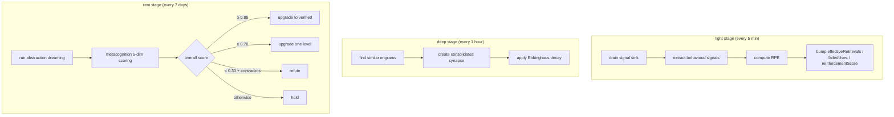

# 维护引擎

维护引擎让 Co-Engram 具备**自我纠错**能力。引擎无需依赖 agent 手动为记忆打分或加标签,而是观察记忆的使用情况并自动调整其强度。

灵感来源于大脑的睡眠周期 —— `light`(持续进行)、`deep`(巩固)、`rem`(抽象 + 验证)。

## 三个阶段



## 浅层阶段(Light Stage)

**目的:** 根据观察到的行为调整强化分数。

**触发:** 每隔 `lightIntervalMs`(默认 5 分钟)。

**流程:**

1. 从信号汇(位于 `.co-engram/signals.jsonl` 的 JSONL 文件)中取出待处理的 `ToolCallEvent`
2. 应用抽取规则(参见 [concepts.md → Signals](./concepts.zh-CN.md#signal))
3. 对每个 `(engramId, signalWeight)` 对,计算 RPE:
   ```
   actual = (signalWeight + 1) / 2
   rpe    = actual - expected    // expected = lastRetrievalScore
   ```
4. 应用更新:
   - `rpe > 0.05`:`effectiveRetrievals += 1`、`reinforcementScore += rpe * learningRate`
   - `rpe < -0.05`:`failedUses += 1`、`reinforcementScore += rpe * learningRate`
   - `|rpe| ≤ 0.05`:中性,不做调整
5. 清理信号汇中超过 7 天的旧事件

**不会做的事:** 创建/删除 engram、修改内容、提升 engram 版本号。

## 深度阶段(Deep Stage)

**目的:** 巩固相似记忆、按时间衰减,并将长期被遗忘的 engram 清理到回收站。

**触发:** 每隔 `deepIntervalMs`(默认 1 小时)。

**流程:**

1. 对每一对相似度高于阈值(可配置)的 engram:
   - 若不存在 `consolidates` synapse,则创建一个
2. 应用 Ebbinghaus 遗忘曲线:
   ```
   retention = e^(-t / halfLife)
   importance *= retention
   ```
   - `halfLife = decayHalfLifeDays`,按 engram 配置(默认 30 天)
3. 归档达到归档阈值的 engram(可配置)
4. **回收站清理**(可选启用):将 `status=forgotten` 且文件 mtime 超过 `afterDays`(默认 30)的 engram 移动到 `.trash/YYYY-MM/`。可选清除超过 `purgeAfterDays`(默认 365)的分区。

**不会做的事:** 提升版本号、修改内容、反驳 engram。

### 回收站清理细节

回收站是一个恢复窗口 —— 类似电脑的回收站,但由 Git 追踪。

**触发清理的条件:**

- Engram 状态为 `forgotten`(由衰减或显式调用 `engram_forget` 导致)
- Engram 文件的 mtime 早于 `afterDays`

**清理流程:**

- 计算当前月份分区(例如 `2026-06`)
- 将该 engram 对应的单一 `<domainTags>/<slug>.md` 文件移动到 `.trash/<partition>/<domainTags>/<slug>.md`
- 若数据根目录是 Git 仓库,使用 `git mv`(保留历史);否则回退为 `fs.rename`
- 不会级联处理 —— 来自其他 engram 的 synapse 引用会变为"悬空"状态,这是有意为之(目标被恢复时它们会自动愈合)

**从回收站恢复:**

- 调用 `engram_restore` 并传入 engram ID —— 工具会先检查活动区,然后回退到 `.trash/`
- 恢复时,文件会被移回,状态重置为 `active` / `fresh`
- 空的分区目录会被自动清理

**清除(物理删除):**

- 清理时也会检查现有的 `.trash/` 分区
- 目录 mtime 超过 `purgeAfterDays` 的分区将被整体删除(按月份粒度)
- `purgeAfterDays=0` 表示"永不清除" —— 回收站会无限增长,但这是安全的

**为什么用文件 mtime,而不是 `forgottenAt` 字段?**
将状态转移到 `forgotten` 的 `updateLifecycle` 调用并不会更新 `updatedAt`。我们以文件 mtime 作为近似值。对于之后很少再被触碰的遗忘型 engram,这种方式在 90% 以上的情况下都是准确的。如果将来对精度有更高需求,可能会增加专门的 `forgottenAt` 字段。

## REM 阶段(REM Stage)

**目的:** 通过元认知进行模式抽象和真值验证。

**触发:** 每隔 `remIntervalMs`(默认 7 天)。

**流程:**

1. 运行抽象梦境 —— 当配置了 LLM 客户端(通过插件配置中的 `necessityLlm`、Claude Code MCP 的 `ANTHROPIC_API_KEY`,或 OpenClaw 的 `~/.openclaw/openclaw.json`)时,cluster 由 `LlmPatternAbstraction` 进行语义综合(与 `engram_synthesize` 工具共享同一份 prompt);未配置 LLM 客户端时回退到 `LocalHeuristicPatternAbstraction`(基于 token 频率);LLM 调用失败也会回退到启发式,保证 REM 不会被阻塞。
2. 对每个 engram 运行元认知打分(参见 [concepts.md → Metacognition](./concepts.zh-CN.md#metacognition))
3. 应用决策:
   - `overall ≥ 0.85` + `ageDays ≥ 7` → 升级为 `verified`
   - `overall ≥ 0.70` → 升级一级
   - `overall < 0.30` + 含 `contradicts` synapse → 标记为 `refuted`
   - 其他 → 保持不变

**会做的事:** 修改 `verificationStatus`。这是唯一会修改此项的阶段。

## 配置

所有时间间隔均以毫秒为单位。通过环境变量(MCP)或 `maintenanceConfig`(OpenClaw)进行设置。

| 变量                                      | 默认值            | 作用                                                |
| ----------------------------------------- | ----------------- | --------------------------------------------------- |
| `CO_ENGRAM_MAINTENANCE`                   | `0`               | 总开关。设为 `1` 启用。                             |
| `CO_ENGRAM_MAINTENANCE_ENABLED_STAGES`    | `light,deep,rem`  | 逗号分隔的阶段子集                                  |
| `CO_ENGRAM_MAINTENANCE_LIGHT_INTERVAL_MS` | `300000`(5 分钟)  | 浅层阶段触发频率                                    |
| `CO_ENGRAM_MAINTENANCE_DEEP_INTERVAL_MS`  | `3600000`(1 小时) | 深度阶段触发频率                                    |
| `CO_ENGRAM_MAINTENANCE_REM_INTERVAL_MS`   | `604800000`(7 天) | REM 阶段触发频率                                    |
| `CO_ENGRAM_MAINTENANCE_LEARNING_RATE`     | `0.1`             | RPE 学习率                                          |
| `CO_ENGRAM_TRASH_ENABLED`                 | `0`               | 在深度阶段启用回收站清理。设为 `1` 启用。           |
| `CO_ENGRAM_TRASH_AFTER_DAYS`              | `30`              | engram 进入 `forgotten` 多少天后被移入 `.trash/`    |
| `CO_ENGRAM_TRASH_PURGE_AFTER_DAYS`        | `365`             | 进入 `.trash/` 多少天后被物理删除。`0` = 永不清除。 |

## 调优建议

### 保守模式(低误报风险)

```bash
CO_ENGRAM_MAINTENANCE_LEARNING_RATE=0.05
CO_ENGRAM_MAINTENANCE_REM_INTERVAL_MS=1209600000   # 14 days
```

适用于 engram 较多、希望避免过早升级为 `verified` 的场景。

### 激进模式(快速学习)

```bash
CO_ENGRAM_MAINTENANCE_LEARNING_RATE=0.2
CO_ENGRAM_MAINTENANCE_LIGHT_INTERVAL_MS=60000       # 1 min
CO_ENGRAM_MAINTENANCE_DEEP_INTERVAL_MS=900000       # 15 min
CO_ENGRAM_MAINTENANCE_REM_INTERVAL_MS=86400000      # 1 day
```

适用于活跃开发/测试场景。资源开销会增加。

### 仅禁用 REM

```bash
CO_ENGRAM_MAINTENANCE_ENABLED_STAGES=light,deep
```

保留强化 + 巩固,跳过元认知升级。适用于尚不信任五维度打分的情况。

## 信号汇

浅层阶段从 JSONL 文件中取出事件:

```
$DATA_ROOT/.co-engram/signals.jsonl
```

每行是一个 `ToolCallEvent`。信号汇无上限(不轮转),但每个浅层周期会清理一次,保留 7 天数据。对于典型负载(每天 100 个事件),文件规模可控制在 700 行以内。

如果事件量极大(每天 >10k),建议增加轮转策略。若遇到这种情况,请提一个 issue。

## 自托管引擎

如果你直接嵌入 `@co-engram/core`(不通过 MCP 或 OpenClaw),可以编程方式启动引擎:

```typescript
import { EngramRepository } from "@co-engram/core";
import { MaintenanceEngine } from "@co-engram/core";
import { FileSignalSink } from "@co-engram/core";
import { DreamingScheduler } from "@co-engram/core";

const repo = new EngramRepository({ rootPath: "/path/to/team-memory" });
const signalSink = new FileSignalSink("/path/to/team-memory");
const dreamingScheduler = new DreamingScheduler(repo);
const engine = new MaintenanceEngine(
  { repo, signalSink, dreamingScheduler },
  { learningRate: 0.1, lightIntervalMs: 300000 },
);
engine.start();
// ... later
engine.stop();
```

引擎内部使用 `setInterval` + `unref()` —— 如果没有其他东西保持进程存活,它不会阻止进程退出。

## 可观测性

引擎会输出到宿主的日志(MCP server 的 stderr、OpenClaw plugin 日志)。关注带有 `[maintenance]` 标记的行:

```
[maintenance] light: processed 12 signals, updated 5 engrams in 34ms
[maintenance] deep: consolidated 2 pairs, decayed 8 engrams in 120ms
[maintenance] rem: upgraded 1 engram to probable, refuted 0 in 2.1s
```

如果没有看到这些日志,请检查 `CO_ENGRAM_MAINTENANCE=1` 是否确实被设置。

## 记忆候选

除了维护的三个阶段(light/deep/rem),co-engram 还运行一个**隐式 proposal 引擎**,被动观察对话。当某个话题被多次提及但没有匹配的 engram 时,它会生成一个*候选提案*,供 LLM 或用户接受/驳回。

这是一种混合式的"主动候选"设计 —— 既非全自动(由你掌控记录什么),也非纯手动(引擎会主动浮现你本可能错过的模式)。

### 工作原理

1. **观察**:每条对话消息都会被向量化(默认:基于哈希的 128 维向量,L2 归一化 —— 无需调用 LLM)。
2. **聚类**:该向量通过余弦相似度与现有的话题聚类进行匹配(默认阈值 `0.75`)。高于阈值 → 加入聚类;低于阈值 → 新建聚类。
3. **晋升**:当一个聚类的出现次数达到阈值(默认 `3`)时,引擎会检查仓库中是否存在相似的 engram(标题关键词重叠)。若不存在,则创建一个 `status: pending` 的候选。
4. **提示**:会话开始时,宿主(MCP server 或 OpenClaw plugin)会向 agent 上下文注入一行提示:`[co-engram] N memory candidates pending ...`。
5. **决策**:LLM 调用 `engram_list_proposals` 查看样本,然后调用 `engram_accept_proposal`(创建真实 engram)或 `engram_dismiss_proposal`(在 N 天内静默)。

### 配置

**MCP server**(`~/.config/claude-code/config.json`):

```json
{
  "mcpServers": {
    "co-engram": {
      "command": "co-engram-mcp",
      "env": {
        "CO_ENGRAM_DATA_ROOT": "/home/you/team-memory",
        "CO_ENGRAM_PROPOSALS_ENABLED": "1",
        "CO_ENGRAM_PROPOSALS_THRESHOLD": "3",
        "CO_ENGRAM_PROPOSALS_SIMILARITY": "0.75"
      }
    }
  }
}
```

**OpenClaw plugin**(`plugins.entries.co-engram.config`):

```json
{
  "proposalEnabled": true,
  "proposalConfig": {
    "threshold": 3,
    "similarityThreshold": 0.75,
    "maxSamples": 3,
    "defaultDismissDays": 30,
    "minMessageLength": 20
  }
}
```

### 存储

候选项位于 `$DATA_ROOT/.co-engram/`:

- `topic-clusters.jsonl` —— 增量聚类状态(id、质心、出现次数、样本)
- `proposals.jsonl` —— pending/accepted/dismissed 的候选
- `audit.jsonl` —— 每次 propose/accept/dismiss 事件也都会记录到这里

这两个文件都被 gitignore(它们是派生状态,不是事实源)。删除它们是安全的 —— 引擎会从头开始重新观察。

### 调优建议

| 工作负载              | threshold | similarity | minMessageLength |
| --------------------- | --------- | ---------- | ---------------- |
| 个人开发者,简短笔记   | 2         | 0.70       | 15               |
| 团队,详细讨论(默认)   | 3         | 0.75       | 20               |
| 高噪声频道(Slack/IRC) | 5         | 0.80       | 40               |

`threshold` 越高 = 误报越少,但信号捕获更慢。`similarity` 越高 = 聚类越严格(聚类更多,更小)。`minMessageLength` 越高 = 过滤闲聊。

### 为什么用基于哈希的 embedder(而不是 LLM)

proposal 引擎内置了一个确定性的基于哈希的 embedder(128 维,L2 归一化)。它是零成本的,对于"精确词重叠比语义改写更重要"的简短技术片段来说已经足够好。

如果在生产环境中处理多语言或改写内容,请在 `createCoEngramContext` / `createCoEngramMcpServer` 中替换 embedder。其接口为 `(text: string) => Promise<readonly number[]>` —— 任何返回归一化向量的实现都可以(OpenAI、本地 sentence-transformers 等)。
