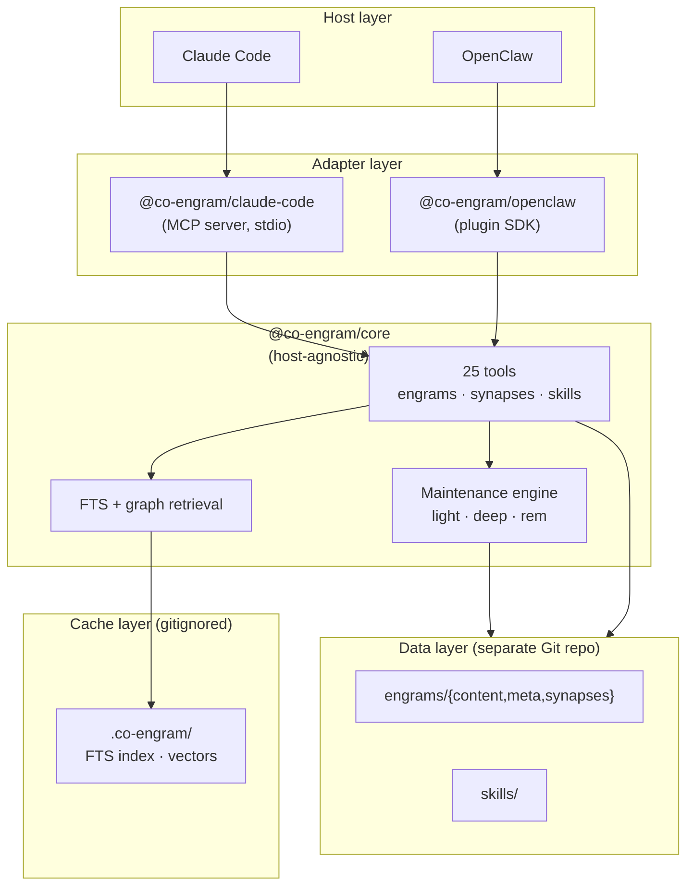

# Co-Engram

**Team memory with neuroscience-inspired plasticity.**
English | [中文](./README.zh-CN.md)

Co-Engram is a self-evolving memory system for AI agents and teams. Unlike traditional vector stores that only retrieve, Co-Engram models memory after the brain: engrams strengthen with use, weaken when they fail, consolidate during sleep, and verify themselves through metacognition.

Works with **Claude Code** (via MCP) and **OpenClaw** (via plugin SDK), with a host-agnostic TypeScript core you can embed anywhere.

## Why Co-Engram

| Differentiator            | What it means                                                                                                                                                                    |
| ------------------------- | -------------------------------------------------------------------------------------------------------------------------------------------------------------------------------- |
| **Three-file separation** | Every memory is split into `content.md` / `meta.yaml` / `synapses.yaml` so content diffs stay clean in Git while metadata evolves independently.                                 |
| **Self-maintaining**      | A maintenance engine runs `light` (RPE-based reinforcement), `deep` (consolidation), and `rem` (metacognition upgrade/refute) stages automatically — no manual tagging required. |
| **Host-agnostic core**    | `@co-engram/core` has zero host dependencies. Same memory, same tools, whether you use Claude Code, OpenClaw, or your own agent.                                                 |

## Quickstart

Three commands to get Co-Engram working inside Claude Code:

```bash
# 1. Install the MCP server globally
npm install -g @co-engram/claude-code

# 2. Initialize the data repo (a separate Git repo, not inside this project)
mkdir -p ~/team-memory && cd ~/team-memory && git init

# 3. Wire into Claude Code
claude mcp add co-engram \
  -e CO_ENGRAM_DATA_ROOT=$HOME/team-memory \
  -e CO_ENGRAM_MAINTENANCE=1 \
  --scope user \
  -- co-engram-mcp
```

Restart Claude Code, run `/mcp` in a new session, and you should see 25 `co-engram` tools loaded.

**Zero-install alternative** (skip step 1): replace `co-engram-mcp` in step 3 with `npx -y @co-engram/claude-code`.

For OpenClaw integration, see [docs/host-openclaw.md](./docs/host-openclaw.md).

## Architecture



## Packages

| Package                                                | What it does                                                | Install                              |
| ------------------------------------------------------ | ----------------------------------------------------------- | ------------------------------------ |
| [`@co-engram/core`](./packages/core)                   | Host-agnostic memory engine + 25 tools + maintenance engine | `npm install @co-engram/core`        |
| [`@co-engram/claude-code`](./packages/claude-code-mcp) | MCP server adapter for Claude Code                          | `npm install @co-engram/claude-code` |
| [`@co-engram/openclaw`](./packages/openclaw-plugin)    | Plugin SDK adapter for OpenClaw                             | `npm install @co-engram/openclaw`    |
| [`@co-engram/e2e`](./packages/e2e)                     | Cross-host end-to-end tests (private, not published)        | workspace only                       |

## Tool Catalog

Co-Engram exposes **25 native tools** grouped into five concerns, plus 2 OpenClaw-compatible `memory_*` wrappers (registered only under `@co-engram/openclaw`).

**Engrams** (12) — the core memory units
`engram_create` · `engram_get` · `engram_update` · `engram_delete` · `engram_search` · `engram_list` · `engram_reinforce` · `engram_report_failure` · `engram_archive` · `engram_restore` · `engram_forget` · `engram_recompute_importance`

**Synapses** (4) — typed connections between engrams
`synapse_create` · `synapse_get` · `synapse_list` · `synapse_delete`

**Skills** (2) — procedural memory
`skill_get` · `skill_invoke`

**Learning loop** (4) — verification, contradiction, evolution
`close_learning_loop` · `contradiction_resolve` · `upgrade_verification` · `get_evolution_lineage`

**Memory proposals** (3) — implicit capture from conversations
`engram_list_proposals` · `engram_accept_proposal` · `engram_dismiss_proposal`

**OpenClaw memory protocol** (2) — host-compatible wrappers, registered only under `@co-engram/openclaw`
`memory_search` · `memory_get`

> The `memory_*` tools declare `kind: "memory"` in `openclaw.plugin.json` so OpenClaw treats Co-Engram as the primary memory plugin (mutually exclusive with `memory-core`). They are thin adapters over `engram_search` / `engram_get` that hide Co-Engram internal terminology and inject a self-evolving prompt section via `registerMemoryCapability.promptBuilder`.

For full signatures, inputs, and examples, see [docs/tool-reference.md](./docs/tool-reference.md).

## Configuration

### Environment variables (Claude Code MCP server)

All optional. Set them in `claude mcp add -e KEY=value` or your shell.

| Variable                                  | Default              | Purpose                                                                                                                             |
| ----------------------------------------- | -------------------- | ----------------------------------------------------------------------------------------------------------------------------------- |
| `CO_ENGRAM_DATA_ROOT`                     | `$HOME/team-memory`  | Absolute path to the data Git repo                                                                                                  |
| `CO_ENGRAM_DEFAULT_CREATED_BY`            | `unknown`            | Default author for new engrams                                                                                                      |
| `CO_ENGRAM_LANGUAGE`                      | `en`                 | Language for tool descriptions / viewer UI / prompts (`en` \| `zh`). Falls back to `~/team-memory/.co-engram/config.json` if unset. |
| `CO_ENGRAM_MAINTENANCE`                   | `0`                  | Set to `1` to start the maintenance engine                                                                                          |
| `CO_ENGRAM_MAINTENANCE_ENABLED_STAGES`    | `light,deep,rem`     | Comma-separated stage list                                                                                                          |
| `CO_ENGRAM_MAINTENANCE_LIGHT_INTERVAL_MS` | `300000` (5 min)     | Light stage interval                                                                                                                |
| `CO_ENGRAM_MAINTENANCE_DEEP_INTERVAL_MS`  | `3600000` (1 hour)   | Deep stage interval                                                                                                                 |
| `CO_ENGRAM_MAINTENANCE_REM_INTERVAL_MS`   | `604800000` (7 days) | REM stage interval                                                                                                                  |
| `CO_ENGRAM_MAINTENANCE_LEARNING_RATE`     | `0.1`                | RPE learning rate                                                                                                                   |

### OpenClaw manifest config

For OpenClaw, configuration goes in the plugin manifest. See [docs/host-openclaw.md](./docs/host-openclaw.md) for the full schema.

## Comparisons

| Feature              | Co-Engram                 | mem0               | Letta            | LangChain Memory   |
| -------------------- | ------------------------- | ------------------ | ---------------- | ------------------ |
| Storage model        | 3-file Git-friendly       | Vector + graph     | Vector + state   | Vector / key-value |
| Plasticity (LTP/LTD) | Yes (RPE-driven)          | Manual API         | Manual API       | Manual API         |
| Auto maintenance     | Yes (light/deep/rem)      | No                 | No               | No                 |
| Metacognition        | Yes (5-dim truth score)   | No                 | No               | No                 |
| Host coupling        | None (host-agnostic core) | Tight (Python SDK) | Tight (REST API) | Tight (Python SDK) |
| License              | MIT                       | Apache-2.0         | Apache-2.0       | MIT                |

## Roadmap

See [GitHub Issues](https://github.com/co-engram/co-engram/issues) for the live roadmap. Highlights:

- **TypeDoc-generated tool reference** — replace hand-written `docs/tool-reference.md` with auto-generated API docs
- **Provider-backed abstraction layer** — LLM-driven REM stage for narrative abstraction
- **Web UI** — browse engrams, inspect synapse graph, trigger maintenance manually
- **More host adapters** — Continue.dev, Cursor, Aider
- **1.0 release** — once API is stable and we have real production users

## Contributing

Contributions are welcome. See [CONTRIBUTING.md](./CONTRIBUTING.md) for development setup, test commands, and PR conventions. For security reports, see [SECURITY.md](./SECURITY.md).

## License

[MIT](./LICENSE) — © 2026 Yang Yang
